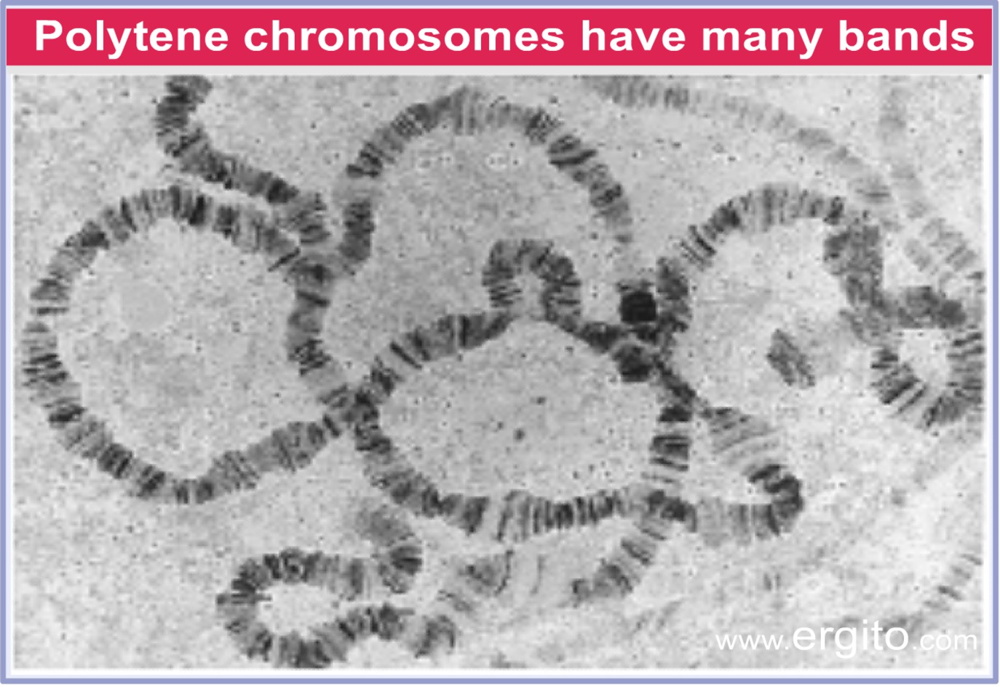

---
title: "这是标题"
subtitle: "副标题"
author: "签下大名"
institute: "单位"
date: \today{}
toc: true
...

# Hello World

This is written in markdown!

# Markdown 样式

* 基本内容[这本书](https://www.gitbook.com/book/gitbookio/markdown/details)讲得足够了, 正文仅十页.

* Pandoc 扩展部分[在此](http://pandoc.org/README.html#pandocs-markdown).

## 文字样式

Regular 普通

*Italic* *楷体*[^1]

**Bold** **加粗**[^2]

~~Strikethrough~~ ~~删除线~~

[^1]: 中文用 *楷体* 来代替 *Italic*
[^2]: 中文用 **黑体** 来代替 **Bold**

## Line blocks

| The limerick packs laughs anatomical
| In space that is quite economical.
|    But the good ones I've seen
|    So seldom are clean
| And the clean ones so seldom are comical

| 200 Main St.
| Berkeley, CA 94718

## 列表

* 普通
* 列表

* 这是
    * 一个多级
        * 列表的例子

* 这同样是
    + 多级
        - 列表

## 定义列表

Term 1

:   Definition 1

Term 2 with *inline markup*

:   Definition 2

        { some code, part of Definition 2 }

    Third paragraph of definition 2.

## 表格

| Right | Left | Default | Center |
|------:|:-----|---------|:------:|
|   12  |  12  |    12   |    12  |
|  123  |  123 |   123   |   123  |
|    1  |    1 |     1   |     1  |
: 表格说明

## 引用格式

> Markdown quotes.

> 吾爱吾师, 吾更爱真理.

# \LaTeX 样式

## 常用的符号

* Prime and arrow
    * $5^{\prime} \rightarrow 3^{\prime}$方向

* 乘号
    * $3.2 \times 10^9$ bp

* 人名中的点
    * 艾萨克$\cdot$牛顿
    * 艾萨克·牛顿

* 摄氏度
    + $90\,^{\circ}\text{C}$
    + 3.98°C

## 文字样式

下面是\LaTeX 文字样式的例子\footnote{注意latex的control sequence后不要紧接着写中文字符. 这也是通篇都用半角符号的原因之一.}.

* \textit{楷体}
    * `\textit{}`
* \textbf{粗体}
    * `\textbf{}`
* \underline{下划线}
    * `\underline{}`

还有\textsuperscript{上标}\textsubscript{下标}, 再加上脚注\footnote{中文使用\textit{楷体}代替 \textit{Italic}}.

## 更多文字样式

\begin{itemize}
    \item Regular
    \item \textit{Italic}
    \item \textbf{Bold}
    \item \textbf{\textit{Bold Italic}}
    \item \texttt{Monospace}
    \item \texttt{\textbf{Monospace Bold}}
\end{itemize}

## Math

\begin{equation*}
    e = \lim_{n\to \infty} \left(1 + \frac{1}{n}\right)^n
\end{equation*}

## 引用管理

所有原始的文献库在 zotero 中. 导出为 bibtex\footnote{不用 biblatex}, 再用 Jabref\footnote{不用 bibdesk}
打开修改.

一页里出现两个 `\footnotemark` 会导致脚注编号出错错误.

文件里如果只用 `\footnotemark`, 会让脚注始编号始终为 `1`. 若一页上有两个脚注, 则都为 `2`.

所以尽量用 `\footnote` 来引用.\footnotemark

\footnotetext{脚注内容}

# 图

\begin{figure}
    \includegraphics{../slides/ch-24.images/image39.jpg}
    \caption{无标题页面的图, LaTeX}
\end{figure}

## 有标题页面的图

\begin{figure}
    \includegraphics[height=0.75\textheight, keepaspectratio]{../slides/ch-24.images/image39.jpg}
    \caption{果蝇的多线染色体}
\end{figure}

## 不加 `\caption` 不会记入图的编号序列

\begin{figure}
    \includegraphics[height=0.75\textheight, keepaspectratio]{../slides/ch-24.images/image39.jpg}
\end{figure}

\begin{figure}
    \begin{minipage}[b]{.48\linewidth}
        \includegraphics{../slides/ch-24.images/image18.jpg}
        \subcaption{有自己独--}
    \end{minipage}
    \hfill
    \begin{minipage}[b]{.48\linewidth}
        \includegraphics{../slides/ch-24.images/image19.jpg}
        \subcaption{--立的图例}
    \end{minipage}
    \caption{两栏样式的图}
\end{figure}
