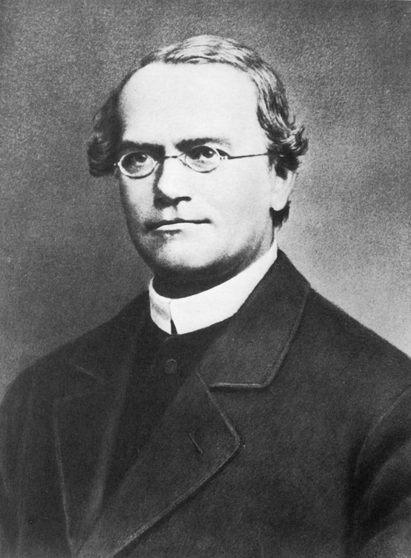

# 孟德尔的早年生平

---

\note{

格雷戈尔·约翰·孟德尔

现代遗传学的创始人

given name 约翰

}

---

\begin{figure}
    \begin{minipage}[b]{.48\linewidth}
        \begin{minipage}[b]{1\linewidth}
            \includegraphics{biostat-chisq.images/Hynčice.jpg}
            \subcaption{出生: 海因岑多夫 (亨奇采)}
        \end{minipage}\\
        \vfill
        \begin{minipage}[b]{1\linewidth}
            \includegraphics{biostat-chisq.images/Opava.jpg}
            \subcaption{中学: 特罗波 (奥帕瓦)}
        \end{minipage}
    \end{minipage}
    \hfill
    \begin{minipage}[b]{.48\linewidth}
        \begin{minipage}[b]{1\linewidth}
            \includegraphics{biostat-chisq.images/Olomouc.jpg}
            \subcaption{帕拉茨基大学: 奥洛穆茨}
        \end{minipage}\\
        \vfill
        \begin{minipage}[b]{1\linewidth}
            \includegraphics{biostat-chisq.images/Brno.jpg}
            \subcaption{教会工作: 布隆 (布尔诺)}
        \end{minipage}
    \end{minipage}
\end{figure}

\note{

维基上网页 300% 截图

除了 奥洛穆茨 外, 每个地名都有德语与捷克语两种名称, 中文文献中有些混乱, 括号中的是现在的捷克名字

出生: 奥地利帝国 西里西亚 海因岑多夫 Heinzendorf bei Odrau（今捷克 亨奇采 Hynčice), 农村环境

中学: 11岁时进入 特罗波 Troppau (今捷克 奥帕瓦 Opava) 的中学. 1840年, 他以优异的成绩毕业。

第一个大学: 中学毕业后, 孟德尔进入 奥洛穆茨 大学哲学研究所学习了两年的课程.
在业余时间做家教以维持生计, 尽管深受抑郁症的折磨, 不止一次导致他暂时放弃学业, 但孟德尔还是在1843年从该课程毕业。

同年, 孟德尔不顾父亲希望他接管家庭农场的意愿, 加入布隆城的圣奥古斯丁修会, 并被赐名为 Gregor.
他成为一名僧侣, 部分原因是这使他能够获得教育而不必自己支付学费.
作为一个挣扎的农民的儿子, 用他的话说, 僧侣生活使他免于 "永远为生计而焦虑".

逝世: 奥匈帝国 布隆 Brünn（今捷克 布尔诺 Brno）

}

---

\begin{columns}[onlytextwidth]
    \column{0.58\textwidth}
        \begin{itemize}
        \item 1851 年, 孟德尔前往 \alert{维也纳大学}
        \item 在多普勒的指导下学习数学和物理
        \item 在昂格尔的指导下学习植物学
        \item 昂格尔假设植物细胞内简单元素的组合决定了 \alert{植物的遗传}; 1852 年的著作中讨论了植物的进化问题
        \item 1853 年, 孟德尔完成学业, 回到圣托马斯修道院
        \end{itemize}
    \column{0.38\textwidth}
    \begin{figure}
        \includegraphics{biostat-chisq.images/Franz_Unger.jpg}
        \caption{Franz Unger, 1800--1870}
    \end{figure}
\end{columns}

\note{

由修道院出资, 继续他的科学研究

昂格尔使用显微镜进行植物学研究

在昂格尔的《植物世界史的尝试》（1852年）一书中, 他用了一章来讨论植物的进化问题

Attempt of a History of the Plant World

}

---

\begin{figure}
    \begin{minipage}[b]{.28\linewidth}
        \includegraphics{biostat-chisq.images/Gregor_Mendel_with_cross.jpg}
    \end{minipage}
    \hfill
    \begin{minipage}[b]{.68\linewidth}
        \includegraphics{biostat-chisq.images/Mendelovo_muzeum.jpg}
    \end{minipage}
    \caption{天主教 奥古斯丁会 圣托马斯修道院}
\end{figure}

\note{

1853年, 在完成维也纳大学的学业后, 回到了布尔诺的修道院, 并在一所中学得到了一个教职, 他在那里呆了十多年

1867年, 他取代纳普成为修道院的院长.

修道院的院长, 同时也是气象学家、数学家、奥古斯丁修士.

略提下 自然神学

从1856年到1863年, 他进行了8年的豌豆杂交实验, 这片绿地传说是孟德尔种豌豆的地方

孟德尔博物馆是在一些组织的国际合作下于2002年建立的, 自2007年起是捷克共和国布尔诺的马萨里克大学的一个机构.

}

# 孟德尔的研究

---

* 分离定律
* 自由组合定律

\note{

遗传的第一, 第二定律, 为人所熟知

但孟德尔的研究被世界忽略了三十多年, 这是个悲哀的事实, 可为什么会这样?

}

## 孟德尔的论文

\note{

原文是德语的, 我看的是英译本

\url{http://www.bshs.org.uk/bshs-translations/mendel/2016?page=1}

对这篇 45 页的论文, 进行基本完备地简要介绍, 整理其中的逻辑路线, 尽量保留所有的原始结果, 来看看他说理的完备性.

另一个全文翻译, 16 页

\url{https://academic.oup.com/genetics/article/204/2/407/6072056}

第一个版本有逐句地翻译注释, 故优先采用

}

## 1. Introductory remarks

* 对观赏植物进行的人工受精时, 同样的杂交形式总是重复出现
* _The Production of Hybrids in the Plant Kingdom_ 记录了很可观的观察结果
* 没有人为杂交本的形成和发展建立一个普遍有效的规律
* 没有实验能够确定, 在杂交后代中, 出现的不同形式的数量
* 本论文回顾了一个为期 8 年的实验

\note{

这里的小节用的都是孟德尔的原文

Introductions

Hybrids 杂交本, 翻译成杂种有点怪怪的, 杂合体也不好

部分翻译用了农学里的专业词汇, 如亲本, 父母本, 互交等

}

## 2. Selection of experimental plants

实验植物必须是

1. 有恒定的差异性状 (traits, characters)
2. 杂交本必须不受外来花粉的影响
3. 杂交本及其后代的生育能力不应有明显地变化

豌豆属充分地满足了这些要求

* 恒定的、容易和明确区分的性状
* 自花受粉
* 开花前受粉
* 容易栽培, 繁殖期相对较短

---

* 从种子商店采购了 34 个豌豆品种, 进行了两年的试验
* 基于性状的稳定性, 去除了一些品种
* 选取 22 个品种, 整个试验期间每年进行栽培

\note{

可能是种子来源地的错误混合

Joy 发表过一篇 PP, 说明了 拟南芥 1001 基因组项目中的种子采样与保存问题

这 22 个品种都应该是纯合体

}

## 3. Arrangement and order of the trials

两个植物通过受精结合在一起时:

* 相同的性状会毫无变化地转移到杂交本及其后代身上
* 不同的性状会在杂交本上结合起来, 形成一种新的性状, 通常会在其后代身上发生变化

前者已经被当时的很多实验所证实; 后者是本实验的研究对象

实验总体可以分成与新的杂合性状数量一样多的单项实验

---

豌豆形态:

* 茎的长度和颜色
* 叶子的大小和形状
* 花的位置、颜色和大小
* 花梗的长度
* 豆荚的颜色、形状和大小
* 种子的形状和大小
* 种皮和胚乳的颜色

部分性状不允许进行一定的、明确的区分, 因为区别往往在于 "更多或更少", 这样的性状不适合个体试验

\note{

胚乳 并不十分明确, 他用的是蛋白一词, 应该指的是子叶

孟德尔已经察觉到了数量性状与孟德尔性状的区别

}

---

七对性状:

1. 成熟种子的形状. 球形, 圆形, 浅凹陷; 不规则的角, 深皱纹
2. 种子胚乳的颜色. 淡黄色、浅黄色和橙色; 或多或少的浓绿色
3. 种皮颜色. 白色, 花一般为白色; 灰色、灰褐色、皮褐色, 花紫色
4. 成熟豆荚的形状. 简单的弧形; 在种子之间深深收缩
5. 未成熟豆荚的颜色.  浅绿色到深绿色; 鲜艳的黄色
6. 花的位置. 腋生, 即沿茎分布; 顶生, 积聚在茎的末端, 形成一个短的假伞形花序
7. 茎的长度. 6--7 英尺的长茎; 0.75--1.5英尺的短茎

\note{

这些试验必须局限于那些在植物中明确和决定性地出现的性状

2 种皮半透明, 可以识别出胚乳的颜色

5 茎杆、叶脉和花萼的颜色也是对应的.

7 选取了极端差异的

}

---

For the
\begin{center}
    \scriptsize
    \begin{tabular}{ c c r c r c }
        1st & experiment, & 60 & fertilisations were performed on & 15 & plants. \\
        2nd & "           & 58 & "                                & 10 & "       \\
        3th & "           & 35 & "                                & 10 & "       \\
        4th & "           & 40 & "                                & 10 & "       \\
        5th & "           & 23 & "                                &  5 & "       \\
        6th & "           & 34 & "                                & 10 & "       \\
        7th & "           & 37 & "                                & 10 & "
    \end{tabular}
\end{center}

* 最有活力的植物进行受精
* 所有的实验都进行了互交
* 植物种植在园圃中; 一小部分种在花盆中作为对照, 以防止昆虫的干扰
* 较罕见地, 龙骨瓣发育不全时, 花药和雌蕊部分暴露
* 在一万多株仔细检查的植物中, 外来花粉的干扰情况只发生过几次, 不会影响整个结果

\note{

互交, 父母本置换. 孟德尔并没有使用正交与反交这一对词汇

}

## 4. The conformation of the hybrids

* 杂交本的性状通常不会呈现为亲本的中间状态
    * 一些性状, 如叶子的形状和大小, 会呈现为中间状态
* 两个亲本中的一个占有很大的优势, 很难或完全不可能在杂交本上找到另一个亲本的性状
    * 豌豆的七对性状都呈现出这种现象
    * 在杂交本中完全或几乎没有变化的、本身代表杂交本性状的, 被定义为 \alert{显性} (dominant)
    * 在杂交本中隐藏的 (latent) 性状, 被定义为 \alert{隐性} (recessive)
* 显隐性与父母本无关

\note{

分离定律中的第一个概念出现了

之所以选择 "隐性" 一词, 是因为所谓的性状在杂交种中消退或完全消失, 但在其后代中, 如后面所示, 重新出现, 没有变化。

}

---

在本实验中引入的性状中, 以下是显性的:

1. 球形或有点圆形的种子
2. 黄色的种子胚乳
3. 灰色、灰褐色或皮褐色的种皮, 花呈紫红色, 叶腋有红色斑点
4. 简单的弧形豆荚
5. 未成熟的豆荚呈绿色
6. 花沿茎分布
7. 长的主茎

种子的形状与胚乳的颜色在实验的当年观察, 其它性状需第二年观察

---

两个亲本的茎的长度通常被杂交本的茎所超过

* 在反复的实验中, 长度为 1 英尺和 6 英尺的茎毫无例外地在杂交本中产生了长度在 6 英尺和 7.5 英尺之间的茎

\note{

孟德尔观察到了杂种优势! 但这个性状与前面的归类于数量性状的叶子大小一样, 没有详细讨论. 他也没有办法进行讨论

}

## 5. The first generation of the hybrids

* 在这一代中, 与显性性状一起, 隐性性状以其完全的 \alert{特异性} 重新出现
* 显性隐性的平均比例为 \alert{3:1}, 适用于实验中包括的所有性状
* 互交的杂交本具有完全相似的比例, 且在它们的后代中也没有明显的偏差, 因此将每个性状的实验结果合并起来

---

种子形状

* 253 个杂交本, 获得了 7324 粒种子, 圆形 5474 粒, 有角 1850, 比例为 2.96:1

胚乳颜色

* 258 个杂交本, 获得了 8023 粒种子, 黄色 6022 粒, 绿色 2001, 比例为 3.01:1

在发育良好的豆荚中, 平均含有 6 至 9 颗种子, 经常所有的种子都是圆形的或黄色的, 从未观察到超过 5 个有角的或 5 个绿色的种子.

\note{

在这里, 第一代指的是现在概念里的 F2 代. 前面的杂交本是 F1 代

特异性 这个词, 英文翻译就有多个对应的词, 也可以是 特殊性, 个性, 个体性 等等

我们熟知的 3:1 出现了

}

---

性状的分布在单个植物中也是不同的, 两个实验系列的前 10 个成员

\begin{center}
    \scriptsize
    \begin{tabular}{ r r r r r }
    \multicolumn{3}{c}{1st experiment} & \multicolumn{2}{c}{2nd experiment} \\
    \multicolumn{3}{c}{shape of the seeds} & \multicolumn{2}{c}{colour of the albumen} \\
    Plant & Round & Angular & Yellow & Green \\
    1     & 45    & 12      & 25     & 11 \\
    2     & 27    & 8       & 32     & 7  \\
    3     & 24    & 7       & 14     & 5  \\
    4     & 19    & 10      & 70     & 27 \\
    5     & 32    & 11      & 24     & 13 \\
    6     & 26    & 6       & 20     & 6  \\
    7     & 88    & 24      & 32     & 13 \\
    8     & 22    & 10      & 44     & 9  \\
    9     & 28    & 6       & 50     & 14 \\
    10    & 25    & 7       & 44     & 18
    \end{tabular}
\end{center}

极端状况, 43 个圆形和 2 个有角种子; 14 个圆形和 15 个有角种子

\note{

观察多个样本的重要性

}

---

\begin{center}
    \scriptsize
    \begin{tabular}{ c c c c c c }
    \hline
    \multicolumn{3}{c}{亲本} & F$_1$   & F$_2$                          & F$_2$ 比率 \\ \cline{1-3}
    性状    & 显性 & 隐性     &         &                                & 显性:隐性 \\ \hline
    种子形状 & 圆形 & 有角     & 全部圆形 & \makecell{5474 圆形\\1850 有角} & 2.96:1 \\
    胚乳颜色 & 黄色 & 绿色     & 全部黄色 & \makecell{6022 黄色\\2001 绿色} & 3.01:1 \\
    \makecell{种皮颜色\\(花的颜色)} & \makecell{褐色\\(紫色)} & \makecell{白色\\(白色)} &
        \makecell{全部褐色\\(全部紫色)} & \makecell{705 褐色\\224 白色}    & 3.15:1 \\
    豆荚形状 & 弧形 & 收缩     & 全部弧形 & \makecell{882 弧形\\299 收缩}   & 2.95:1 \\
    \makecell{未成熟\\豆荚颜色} & 绿色 & 黄色 & 全部绿色 & \makecell{428 绿色\\152 黄色} & 2.82:1 \\
    花的位置 & 腋生 & 顶生     & 全部腋生 & \makecell{651 腋生\\207 顶生}   & 3.14:1 \\
    茎的长度 & 长茎 & 短茎     & 全部长茎 & \makecell{787 长茎\\277 短茎}   & 2.84:1 \\
    \hline
    \end{tabular}
\end{center}

\note{

本页为重新总结, 孟德尔原来用的是文字描述

}

## 颗粒遗传学家对孟德尔结果的评价

\note{

孟德尔的研究支持了遗传的颗粒说, 他把研究结果送给提出颗粒说的耐格里. 但是耐格里对孟德尔的发现不予重视,
因为他认为这些发现是 "依靠经验的而不是依靠理智的".

1868年他被提升为住持后, 他的科学工作基本结束, 因为孟德尔被行政责任压得喘不过气来,
特别是与文官政府就其试图对宗教机构征收特别税而发生争执.

他死后, 继任的修道院院长烧掉了孟德尔收藏的所有文件, 标志着税收纠纷的结束.

}

## 孟德尔结果的重新发现

## 对孟德尔结果的统计分析

## Fisher 的质疑

## 对统计结果的重新统计

# 频数统计

## 卡方分布

## Gamma 分布

## 超几何分布

## 泊松分布

## 分布与检验

* $\chi^2$ 分布, *t* 分布, *F* 分布
    * https://www.youtube.com/watch?v=oI3hZJqXJuc
* 抽样
    *  https://www.youtube.com/watch?v=XLCWeSVzHUU

* SD & SE
    *  https://www.youtube.com/watch?v=A82brFpdr9g
* $P$ 值
    * https://www.youtube.com/watch?v=5Z9OIYA8He8
    * https://www.youtube.com/watch?v=bsZGt-caXO4
* 置信区间 (Confidence Interval)
    * https://www.youtube.com/watch?v=TqOeMYtOc1w
* FDR
    * https://www.youtube.com/watch?v=K8LQSvtjcEo

## 统计方法

* 线性回归与最小二乘法
    *  https://www.youtube.com/watch?v=PaFPbb66DxQ
* $R^2$ 值
    * https://www.youtube.com/watch?v=2AQKmw14mHM
* 主成分分析
    * https://www.youtube.com/watch?v=_UVHneBUBW0
* 聚类

# 总结

---

* 孟德尔的生平

*

* KM 曲线是最常用的对生存函数的估计
