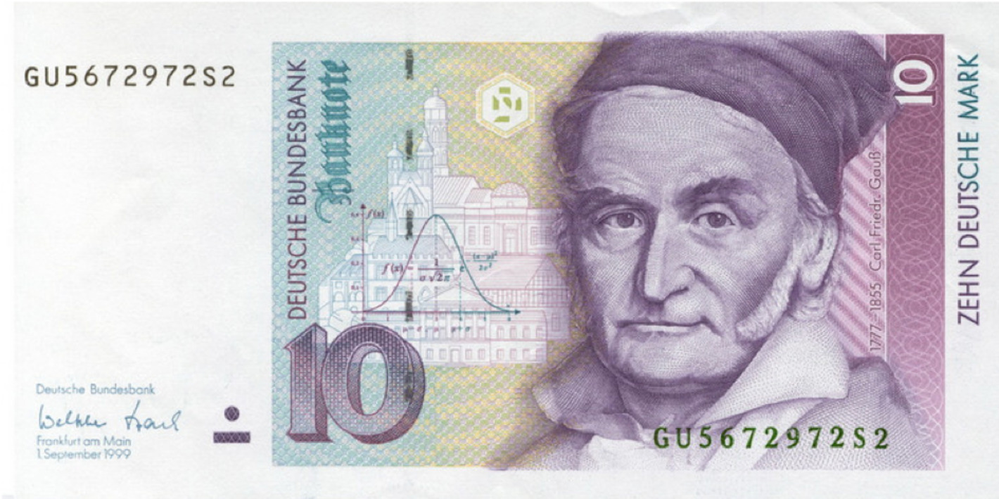

# 统计的科学基础

## 统计学是什么

\includegraphics{biostat.images/symbols.png}

---

* 数学家故弄玄虚的东西?
* 宣传者企图使我们信服, 有时就是欺骗我们的数值信息

---

\begin{exampleblock}{}
    {\large ``There are three kinds of lies: lies, damned lies, and statistics.''}
    \vskip5mm
    \hspace*\fill{\small--- Mark Twain}
\end{exampleblock}

\note{

谎言, 该死的谎言, 统计学.

}

## 逻辑思维的形式

* 科学方法
* 演绎
    * 提出一般的公理或假定
    * 推理, 得出命题
    * 确定的和绝对的 (?)
* 归纳
    * 从具体的经验和特殊的事实出发
    * 推理, 得出普遍结论的\alert{似真性}的评判
    * 不确定的

\note{

演绎, 古希腊人, 欧氏几何, 5个公理, 5个公设

牛顿力学, 三定律

哥德尔不完备定理

归纳, 18世纪末逐渐开始.1763年贝叶斯提出了第一个数学基础.

一个三段论就是一个包括有大前提、小前提和结论三个部分的论证.
凡人都有死（大前提）. 苏格拉底是人（小前提）. 所以：苏格拉底有死（结论）.

}

## 归纳推理的重要性

* 基本事实：自然界的事件和现象太多样, 太广泛或太不可及, 不能做出完全的观察.
    * "没有人能明白上帝从创世到末日的作为"
    * 不能在每一个人身上试验我们新的药物
* 在科学试验中得到的测量组构成一个样本
    * 无限重复试验, 得到测量的无限集合, 这个全集合被认作是总体
    * 样本的重要性在于它能透露有关它由之抽取的总体的某些事情

\note{

生物学, 医学, 药学都是归纳科学

}

## 统计学一词的意义

* 两层含义
    * 统计学意味着数值信息, 通常用表和图来表示.
    * 统计学是讨论\alert{不确切}推理的科学, 是\alert{归纳的科学方法}.

* 研究的对象是样本, 根据样本对母体的推断.

\note{

也是实验科学的基础

}

## 关于样本的主要问题

1. 如何有效地描述样本?
2. 由这个样本的证据如何推断有关总体的结论?
3. 这些结论有多可靠?
4. 如何取样本才能使它们尽可能说明问题并可信?

# 描述样本

---

* 初等统计学的主题
* 数据
    * 体重, 胆固醇水平, 微信里的朋友, 理发费用, 学生成绩
* 类别
    * 男/女, 可口可乐/百事, 遗传病, iPhone/Android
* 参数
    * 平均值 mean, $\mu$
    * 中位数 median
    * 方差 Var
    * 标准差 SD, $\sigma$

\note{

被平均了, 拖后腿了等

平均每个人有一个睾丸

}

---

## 描述组成

\note{

\url{http://r-statistics.co/Top50-Ggplot2-Visualizations-MasterList-R-Code.html}

}

---

---

## 描述分布

\note{

直方图 histogram

}

---

## 描述相关

---

## 时间序列

# 进入高级部分: 二项分布

---

\begin{exampleblock}{}
    {\large ``If you can't explain something to a six-year-old, you really don't understand it yourself.''}
    \vskip5mm
    \hspace*\fill{\small--- Albert Einstein}
\end{exampleblock}

\note{

Frequently attributed to Richard Feynman

爱因斯坦没说过, 费曼说爱因斯坦说过这些.

白居易

老杨统计讲得不好, 叫初学者死记硬背更没有用

有时候讲得深一点对初学者反而是有好处的

准备这下演讲的过程也是我自己加深理解的过程

}

## 帕斯卡三角

\begin{figure}
    \animategraphics[loop,controls]{1}{biostat.images/Pascal-}{0}{40}
    \caption{帕斯卡三角}
\end{figure}

\note{

每个数是它左上方和右上方的数的和

}

---

\note{

朱世杰《四元玉鉴》中的 "古法七乘方图"

}

## 抛硬币的概率

* 抛 4 次硬币, 两个正面的概率是多少?
* 包含 4 个对象的集合 $\{A, B, C, D\}$, 由两个对象组成的子集有多少?
* 一共 6 个 $\{AB, AC, AD, BC, BD, CD\}$
* 所有可能的序列总数也可以这样逐个数出来
    * 0 个对象: 1, 反反反反
    * 1 个对象: 4, 正反反反, 反正反反, 反反正反, 反反反正
    * 3 个对象: 4, 反正正正, 正反正正, 正正反正, 正正正反
    * 4 个对象: 1, 正正正正
    * $1+4+6+4+1=16$
* 概率是 $6 \div 16 = 0.375$

\note{

一个个数 AB, AC... 不用考虑顺序, 所以有这 6 种

$1+4+6+4+1=16$ 是不是有似曾相识的感觉?

}

---

\center\includegraphics[width=0.5\columnwidth]{biostat.images/Pascal_C_4_2.jpg}

\begin{equation*}
    \begin{split}
    16 & \rightarrow 2^4 \\
    1, 4, 6, 4, 1 & \rightarrow \text{帕斯卡三角的第五行} \\
    6 & \rightarrow \text{第五行的第三列}
    \end{split}
\end{equation*}

\note{

因为是丛空集开始的, 所以序数也从 0 开始

第五行的序数是 4, 第三列的序数是 2

}

## 帕斯卡三角里的概率

创建一个空白 Excel 工作薄

1. 在 `A1:A20` 中填上 1
2. 在 `B2` 里填 1
3. 在 `B3` 里填公式 `=A2+B2`
4. 拷贝这个公式到 `B3:T20`
5. 对 `A1:T20` 设置条件格式, 所有等于 0 的单元格, 前景设为白色, 背景也设为白色
6. 在 `U1` 里填公式 `=SUM(A1:T1)`, 拷贝这个公式到 `U1:U20`
7. 设置所有单元格列宽为 6
8. 将当前工作表全名为 `Triangle`

\note{

7 个里面取 4 个的概率, 等等

注意第二列是从 0 开始的序数, 第三列是三角形数, 毕达哥拉斯

跳棋是 10, 台球是 15

}

---

创建新工作表

1. 在 `A1` 填入公式 `=Triangle!A1/Triangle!$U1`
2. 拷贝这个公式到 `A1:T20`
3. 选择 `A2:T20`, 插入一个折线图

\note{

Excel 公式里, `Sheetname!A1` 表示其它工作表的单元格

`$U1` 里的 `$` 表示绝对单元格, 不会随当前单元格而变化

}

---

\note{

可以观察到, 随着 N 增大, 密度分布有点像一个似曾相识的钟形曲线

}

## 二项式系数

\begin{equation*}
    \begin{split}
    (x+y)^0 & = 1  \\
    (x+y)^1 & = x+y \\
    (x+y)^2 & = x^2 + 2xy + y^2 \\
    (x+y)^3 & = x^3 + 3 x^2 y + 3 x y^2 + y^3 \\
    (x+y)^n & = \sum_{k=0}^n {n \choose k} x^{n - k} y^k
    \end{split}
\end{equation*}

\note{

杨辉三角又与乘方有什么关系?

}

## 组合数

从 $n$ 个元素的集合中选取 $k$ 个元素组成的子集的个数

$$\text{ from } n \text{ choose } k$$

$$\binom{n}{k}=\frac{n!}{k!(n-k)!}$$

\center{ $C^{n}_{k} \quad C^{k}_{n} \quad _nC_k \quad ^nC_k \quad C(n,k)$ }

\note{

我高中学数学时, 是先讲排列再讲组合的, 但其实组合更基础些

\url{https://en.wikipedia.org/wiki/Binomial_theorem}

}

## 一些专业术语

抛硬币实验是一种

伯努利实验
: 只有两种可能结果的单次随机试验, 成功或失败, 是或非, 1 或 0. \alert{是/非实验}.

\bigskip

硬币正面或反面的概率服从

大数定律
: 描述相当多次数重复实验的结果的定律. 样本数量越多, 则其平均就越趋近期望值.

\bigskip

多次重复抛硬币实验, 得到的概率分布称为

二项分布
: $n$ 个独立的是/非实验中成功的次数的离散概率分布.

\note{

雅各布·伯努利 Jakob I. Bernoulli

伯努利家族有好多数学家

* 在重复试验中, 随着试验次数的增加, 事件发生的频率趋于一个稳定值

* 在对物理量的测量实践中, 测定值的算术平均也具有稳定性

如果大量抛硬币, 得到正面的概率不是 0.5, 那么这个硬币就不是一下公平的硬币

二项分布的名字来源于二项式系数

}

## 高尔顿板

\href{https://www.mathsisfun.com/data/quincunx.html}{模拟}

\href{run:./biostat.images/Galton_box.webm}{视频}

\note{

但这些只是些数字游戏罢了, 给真实世界里会不会有什么变化也说不定

\url{https://en.wikipedia.org/wiki/Bean_machine}

高尔顿板可以看作是伯努利试验的实验模型. 如果我们把小球碰到钉子看作一次实验, 而把从右边落下算是成功, 从左边落下看作失败,
就有了一次 p = 0.5 的伯努利试验. 小球从顶端到底层共需要经过 n 排钉子, 这就相当于一个 n 次伯努利试验.
小球的高度曲线也就可以看作二项分布随机变量的概率密度函数.

}

## 二项分布的例子

* 选举
    * 民意测验表明, 1218 位选民中, 516 位赞成某候选人. 你认为他能赢吗?
* 医学
    * 一个指标病人, 1995 年被诊断有肺结核. 对该指标病人的 232 个同事进行了肺结核的筛选检验.
      在检验中读数为阳性记录的同事的人数, 是不是要高于随机人群中的记数.
* 遗传
    * 孟德尔的豌豆, 子叶颜色有黄色与绿色两种性状, 8023 个 $F_2$ 代个体中, 6022 个个体为黄色. 这个结果符合 $3:1$
      的分离比吗?

\note{

1218 个独立是/非试验

232 个独立是/非试验

}

# 进入高级部分: 正态分布

---

\begin{figure}
    \begin{minipage}[b]{.48\linewidth}
        \includegraphics{biostat.images/pascal_density.jpg}
    \end{minipage}
    \hfill
    \begin{minipage}[b]{.48\linewidth}
        \includegraphics{biostat.images/Normal_Distribution_PDF.jpg}
    \end{minipage}
    \caption{当二项分布的 $n$ 极大时, 就近似为正态分布}
\end{figure}

\note{

为了防止迷惑, 怎么又来了一个分布? 先告诉大家结论

}

---

德国数学家高斯寻找随机误差分布的规律, 发现在率先将正态分布应用于科学研究, 计算出了该分布的方差,
故正态分布又叫\alert{高斯分布}.

---

概率密度函数为

\begin{equation*}
    f(x \mid \mu,\sigma)={\frac {1}{\sigma\sqrt {2\pi}}}\,e^{-{\frac {(x-\mu )^{2}}{2\sigma ^{2}}}}
\end{equation*}

标准化后

\begin{equation*}
    f(x)={\frac {1}{\sqrt {2\pi}}}\,e^{-{\frac {x^{2}}{2}}}
\end{equation*}

## 数学定理

德莫佛--拉普拉斯定理
: 参数为 $n, p$ 的二项分布以 $np$ 为均值, $np(1-p)$ 为方差的正态分布为极限 (de Moivre--Laplace).

\bigskip

林德伯格--列维定理
: 独立同分布的, 随机变量序列的标准化和, 以正态分布为极限 (Lindeberg-Levy).

\bigskip

林德伯格--费勒定理
: 满足一定条件时, 独立, 但不同分布的随机变量序列的标准化和, 以正态分布为极限 (Lindeberg-Feller).

\note{

陈希孺的《数理统计学简史》

正态分布的密度形式首次发现是在德莫弗--拉普拉斯的中心极限定理中

每个因素不能产生支配性的影响 (Lindeberg 条件)

}

## 中心极限定理

中心极限定理
: 在适当的条件下, 大量相互独立随机变量的均值经适当标准化后依分布收敛于正态分布.

\note{

且数学期望和方差有限的

}

---

\begin{figure}
    \begin{minipage}[b]{.48\linewidth}
        \includegraphics{biostat.images/Probability_Theory.jpg}
    \end{minipage}
    \hfill
    \begin{minipage}[b]{.48\linewidth}
        \includegraphics{biostat.images/Probability_Theory.cn.jpg}
    \end{minipage}
    \caption{概率论沉思录}
\end{figure}

\note{

天赋异禀, 我要纯数学的推导

}

# 生物表型特征

## 单基因

由\alert{单基因决定的表型}, 即孟德尔遗传的特征, 有显隐性的 3:1 的分离比

* 单/双眼皮
* 耳垂
* 美人尖
* 喝酒脸红
* ...

\note{

二项实验的检验

}

## 多基因

\alert{绝大多数生物学表型特征}, 都由多个基因及环境条件决定

* 身高
* 新生儿体重
* 药物对疾病的效果
* 种子的大小
* 光合作用的速率
* ...

多个二项实验的结果的叠加, 按前面所说的中心极限定理, 即\alert{服从正态分布或者可以转化为正态分布}

\note{

人有两万个基因, 大多数植物有四万个基因

}

## 其它一些概念

* $P$ 值
* $R^2$ 值
* 置信区间 (Confidence Interval)
* 泊松分布
    * 二项实验中的 $p$ 非常小
* $\chi^2$ 分布, *t* 分布, *F* 分布
    * 正态分布的衍生或推广

# 统计检验

## 正态群体

|         目标         |              方法               |
|:-------------------:|:------------------------------:|
|       描述数据        |            Mean, SD            |
|    一组数据与假定值    |      One-sample *t* test       |
|       两组数据        |            *t* test            |
|     成对的两组数据     |        Paired *t* test         |
|    三组或更多组数据    |         One-way ANOVA          |
|  成对的三组或更多组数据  |    Repeated-measures ANOVA     |
|  两个变量间的量化关系   |      Pearson correlation       |
| 从其它测定变量得到预测值 | Linear or nonlinear regression |

\note{

理论部分讲得很多了, 具体要处理数据了, 该用什么方法?

这里就是简单的总结表

同一个人口腔、胃部、肠道的微生物, 即成对的

十个基因, 每个基因的编码区与非翻译区, 也是成对的

ANOVA 方差分析

}

## 非正态群体

|                  目标                  |             方法             |
|:-------------------------------------:|:---------------------------:|
|                描述数据                 | Median, interquartile range |
|             一组数据与假定值             |        Wilcoxon test        |
|                两组数据                 |     Mann--Whitney test      |
|              成对的两组数据              |        Wilcoxon test        |
|    \textcolor{gray}{三组或更多组数据}    |    Kruskal--Wallis test     |
|  \textcolor{gray}{成对的三组或更多组数据}  |        Friedman test        |
|  \textcolor{gray}{两个变量间的量化关系}   |    Spearman correlation     |
| \textcolor{gray}{从其它测定变量得到预测值} |  Nonparametric regression   |

\note{

换句话说, 是一般性的群体

这里列出的方法都可以用于正态群体, 只是会不太显著一些

}

## 二项实验

|                 目标                 |            方法            |
|:------------------------------------:|:-------------------------:|
|               描述数据                |        Proportion         |
|            一组数据与假定值             |        Chi-square         |
|               两组数据                | Fisher test or Chi-square |
|    \textcolor{gray}{成对的两组数据}    |       McNemar test        |
|   \textcolor{gray}{三组或更多组数据}    |      Chi-square test      |
| \textcolor{gray}{成对的三组或更多组数据} |        Cochrane Q         |
|  \textcolor{gray}{两个变量间的量化关系}  | Contingency coefficients  |
|         从其它测定变量得到预测值         |    Logistic regression    |

\note{

Fisher's test (chi-square for large samples)

}

## 生存时间

|                目标                 |             方法              |
|:----------------------------------:|:----------------------------:|
|               描述数据               | Kaplan--Meier survival curve |
|  \textcolor{gray}{一组数据与假定值}   |                              |
|               两组数据               |        Log-rank test         |
|            成对的两组数据             |    Conditional regression    |
|           三组或更多组数据            |        Cox regression        |
|         成对的三组或更多组数据         |    Conditional regression    |
| \textcolor{gray}{两个变量间的量化关系} |                              |
|        从其它测定变量得到预测值         |        Cox regression        |

\note{

对数秩检验

}

# 样本偏差

## 瓦尔德与弹孔

场景:

* 二战中, 美军不希望飞机被德军的战斗机击落, 因此要为飞机披上装甲. 但是, 装甲会增加飞机的重量, 飞机的机动性就会减弱,
  还会消耗更多的燃油. 防御过度并不可取, 但是防御不足又会带来问题.
* 如果把装甲集中装在飞机最需要的部位, 那么即使减少装甲总量, 对飞机的防护作用也不会减弱.

\note{

瓦尔德是奥地利犹太裔数学家, 年轻时被纳粹迫害去了美国

Excerpt From: 美乔丹·艾伦伯格（Jordan Ellenberg）. “魔鬼数学：大数据时代, 数学思维的力量.”

}

---

| 飞机部位 | 每平方英尺平均弹孔数 |
|:------:|:----------------:|
|  引擎   |       1.11       |
|  机身   |       1.73       |
| 油料系统 |       1.55       |
| 其余部位 |       1.80       |

:   调查数据

\begin{itemize}
    \item \pause{军官们的观点: 受攻击概率最高的部位}
    \item \pause{亚伯拉罕·瓦尔德: 损坏的概率应该是均等的, 引擎被击中的飞机未能返航.}
\end{itemize}

\note{

1平方英尺 ≈ 0.093平方米

大量飞机在机身被打得千疮百孔的情况下仍能返回基地, 这个事实充分说明机身可以经受住打击, 因此无须加装装甲.

}

---

\begin{itemize}
    \item 军官们在不经意间做出了一个假设: 返航飞机是所有飞机的随机样本.
    \item \pause{这个假设成立有个前提: 无论飞机的哪个部位被击中, 幸存的可能性是一样的.}
    \item \pause{幸存者偏差 (Survivorship bias)}
\end{itemize}

\note{

在野战医院里, 腿部受创的病人比胸部中弹的病人多, 其原因不在于胸部中弹的人少, 而是胸部中弹后难以存活.

拿破仑时代, 骑兵如果装备盔甲, 除头部分外, 也只有胸甲.

现代军人是不穿盔甲的, 只带一顶头盔.

瓦尔德拥有的空战知识、对空战的理解都远不及美军军官, 但他却能看到军官们无法看到的问题, 这是为什么呢?

统计思维里, 第一个要问的问题就是: ``你的假设是什么? 这些假设合理吗?''

}

## 1948 年美国总统大选

\note{

罗斯福的副总统

}

---

* 密苏里农民, 没有大学学历
* 民主党分裂
    * 左翼民主党成立进步党
    * 南方民主党成立迪克西民主党
* 民主党大会, 出现不祥的兆头

\note{

\url{http://culture.dwnews.com/history/news/2016-11-10/59781201.html}

\url{http://www.thepaper.cn/baidu.jsp?contid=1401061}

最后一位没有大学学历的美国总统

左翼民主党因为冷战因素在费城成立进步党

南方民主党因为种族问题

当杜鲁门出现在民主党的会场时, 他的支持者们从一个用鲜花扎成的自由之钟里放出 50 只鸽子作为和平的象征,
但其中一只正撞到了阳台上, 坠地而死. "一只死鸽子!" 一位代表抬头看着杜鲁门大声嚷道.

}

---

* 三大民意调查机构
    * 盖洛普
    * 罗珀
    * 克罗斯利
* 媒体
    * 新闻周刊
    * 读者文摘
    * 纽约时报

\note{

民意调查机构从 1936 年总统大选开始, 进行有统计意义上的民意调查

}

---

---

\note{

相信民调就应该认输了

典型的杜鲁门式小站演讲是, 先谈谈当地的地理人文, 然后猛烈抨击共和党控制的国会, 接着介绍妻子女儿出场, 接受民众欢呼,
最后与民众互动.

}

---

\begin{figure}
    \begin{minipage}[b]{.48\linewidth}
        \includegraphics{biostat.images/whistle_stop_map.jpg}
    \end{minipage}
    \hfill
    \begin{minipage}[b]{.48\linewidth}
        \includegraphics{biostat.images/ElectoralCollege1948.jpg}
    \end{minipage}
    \caption{三万多公里的火车旅行}
\end{figure}

\note{

川普每天都进行 rally, 有时一天数场

}

---

---

以偏概全

* 民调样本只限于大中城市
* 富裕或中等家庭成员, 特别是家庭主妇, 才会购买报纸杂志并邮寄调查问卷
* 羞于表达政治观点

改进

* 调查方法上, 从不太精确的配额抽样转向随机概率抽样
* 为了把选民偏好在最后一刻的变化考虑进去, 民意调查几乎会一直持续到选举之夜
* 实名的电话民调与匿名的网络民调同时进行

\note{

Ascertainment bias

川普

}

# 总结

---

1. 如何有效地描述样本?
    * 数据, 类别, 参数, 图表
2. 由这个样本的证据如何推断有关总体的结论?
3. 这些结论有多可靠?
    * 二项分布, 正态分布等数学上的理论基础
4. 如何取样本才能使它们尽可能说明问题并可信?
    * 避免偏差

\bigskip

\tiny\url{https://github.com/wang-q/lecture-slides/blob/master/slides/biostat.slides.pdf}
