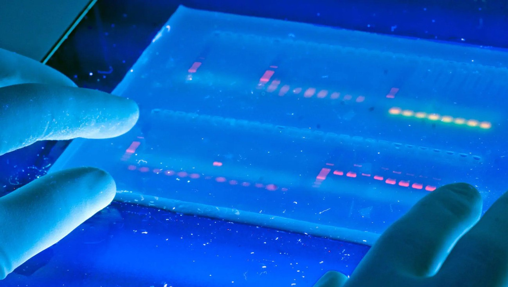

生物技术 (biotechnology)
: 是在生物学理论的基础上建立的多学科交叉的应用技术科学

\note{

前面学到的遗传学的基础理论已经很多了, 这一章主要来看理论用于实际生产生活

}

# 10.1 DNA 技术

## DNA 的变性与复性

* DNA 变性: 较高温度解链成单链.
* DNA 复性: 变性的 DNA 逐渐冷却, 分离的两条单链 $\rightarrow$ 双链的 DNA.
    * 短链容易精确复性, 长链复性较难.
* 杂交分子: 碱基序列大部分互补, 可以复性.
    * DNA 与 RNA 之间, 也一样.

\note{

第二版的节名为 23.1.1 核酸的分子杂交

}

## DNA 凝胶电泳

\note{

介绍核酸电泳

每个核苷酸的磷酸基团（-PO4）在生理 pH 条件下会失去一个或多个氢离子（H+），从而带上负电荷

在 DNA 的双螺旋结构中，磷酸基团位于外侧，形成了一个带负电的骨架

}

## 分子探针

* Southern 印迹和 Northern 印迹
    * Southern 印迹可以检测特定的 DNA 序列.
    * Northern 印迹可以检测特定基因的表达情况.

* 原位杂交

---

---

\note{

可以检测特定细胞中某一基因的表达情况

}

---

\note{

Pachetene stage germ cells stained using FISH. Red, DAPI; Green, 5S rDNA
FISH (Annette Chan and Barbara Meyer).

}

## 10.1.1 聚合酶链式反应

---

1. PCR 技术的基本原理. PCR 反应过程:
    * 双链 DNA 变性 ($90\text{--}95\,^{\circ}\text{C}$) 成为单链 DNA;
    * 引物复性 ($37\text{--}60\,^{\circ}\text{C}$) 同单链 DNA 互补序列结合;
    * DNA 聚合酶催化 ($70\text{--}75\,^{\circ}\text{C}$) 使引物延伸.

---

---

---

---

2. Taq DNA 聚合酶
3. 寡核苷酸引物
4. 反应体系: 缓冲液, 离子浓度
5. PCR 技术的应用

\note{

问题: 为什么用 Taq 来代替大肠杆菌的 DNA 聚合酶?

}

## 10.1.2 DNA 测序技术

\note{

四种 ddNTP 终止反应的平行电泳产生了一个 "梯子"，其中每个 "梯级" 比下面的一个片段长一个核苷酸，
可能在同一条或不同的泳道中。

通过用与加载的 ddNTP 反应互补的碱基字母标记凝胶的泳道，可以直接从底部到顶部读取原始 DNA 链的序列，方向为 5'→3'，
这可以通过移动自显影图的底部到顶部来实现。

}

# 10.2 生物信息学分析

## 10.2.1 序列分析

1. 序列比较
   * 双序列比对
   * 多序列比对
   * 构建系统发育树
2. 序列识别与基因组注释

\note{

~/Scripts/hnsm/tests/fasr/refine.fas

用 Mega 演示排序与构树

}

## 10.2.2 蛋白质序列和结构分析

* 基本性质
* 二级结构与结构域
* 三级结构

\note{

Evolution and function analysis of glycerol kinase GlpK in Pseudomonas aeruginosa

}

## 10.2.3 基因表达分析

* RNA-seq
* scRNA-seq
* 蛋白组

\note{

Identifying CNS-colonizing T cells as potential therapeutic targets to prevent progression of multiple sclerosis

}

## 10.2.4 在其他领域的应用

# 10.3 基因克隆技术

---

* 重组 DNA 技术, 也称基因工程或遗传工程.
* 基因工程是指将特定的基因 (即外源基因), 通过载体或其它手段送入受体细胞,
  使它们在受体细胞中与受体细胞的基因进行重组, 并能增殖表达, 这样的一种遗传学操作.
* 基因工程的目的: 通过与优良性状相关的基因的重组, 获得具有高度应用价值的新物种或新产品.

---

基因工程的优点

* 克服物种间的屏障;
* 有目的, 有计划, 有选择地加工制造各种生物制品;
* 遗传育种, 医学等研究和开发.

---

## 10.3.1 基因工程主要的工具酶

## 限制性内切核酸酶

1. 限制性内切酶的作用
    * 识别 DNA 中特定核苷酸序列, 使每条链的一个磷酸二酯键断开.
2. 限制性内切酶的类型
    * I 型
    * II 型 $\rightarrow$ 基因工程
    * III 型
3. 限制性内切酶的命名
    * 根据来源命名.
    * 如 \textit{Eco}RI $\rightarrow$ 大肠杆菌 (*E. coli*), R 株系, 第一种.

---

4. 限制性内切酶的识别序列
    * 能识别的特定核苷酸序列
    * 4--8 个碱基对组成, 且碱基互补对称
    * 只写单链的核苷酸序列
5. 限制性内切酶的切割位点
    * II 型酶切割位点在识别序列区内

---

6. 切割片段的末端
    * 粘性末端: 两条链末端交错对称.
        * $5^{\prime}$ 粘性末端
        * $3^{\prime}$ 粘性末端
    * 平头末端: 两条链末端平齐.

\note{

问题: 限制性内切酶在细菌内是做什么用的? 为什么不会切割自身的 DNA?

90% 的细菌物种被发现含有限制性内切酶

40% 的细菌物种含有 CRISPR

}

---

## DNA 连接酶

催化 \ce{-PO4} 和 \ce{-OH} 形成磷酸二酯键

1.  *E. coli* DNA连接酶
    * 大肠杆菌基因组编码;
    * 连接具互补粘性末端的 DNA 片段.
2. T4 DNA 连接酶
    * T4 噬菌体 DNA 编码;
    * 既连接具互补粘性末端的 DNA 片段, 也能连接平头末端.

## 逆转录酶

* 从反转录病毒中制备得到的.
* 该酶能以具有 \ce{$3^{\prime}$-OH} 的 DNA 或 RNA 为引物, 以 mRNA 为模板从 $5^{\prime}
  \rightarrow 3^{\prime}$ 聚合生成 cDNA.

## 10.3.2 基因克隆的载体

基因载体, 运送外源 DNA 片段进入受体细胞.

三个条件:

* 有插入位点
* 能在受体细胞内复制
* 有筛选标记基因

## 质粒

1. 存在于细菌, 蓝藻, 绿藻, 真菌等.
2. 染色体外裸露环状双链 DNA 分子, 小的不足 1500bp, 大的 100kb 以上.
3. 宿主细胞内能自主复制. 松弛型和严紧型复制质粒. 选用分子小和松弛型复制的质粒.

## 质粒载体 pBR322

1. 有复制起始点, 能在受体细胞内复制;
2. 有2种筛选标记基因;
3. 有允许外源 DNA 插入的位点;
4. 有高的拷贝数.

---

\note{

讲解书上的双标记筛选流程

}

## 10.3.3 重组 DNA 的基本步骤

## 获得目的 DNA 片段

1. 限制性内切酶酶切产生待克隆的 DNA 片段
2. 人工合成 DNA
3. 反转录酶酶促合成法
    * cDNA
4. PCR 扩增特定的基因片段

## DNA 分子的体外重组

酶切和连接.

## 引入宿主细胞和筛选鉴定

1. 重组 DNA 引入宿主细胞
    * 原核生物细胞是很好的受体细胞
        * 容易摄取外界的 DNA
        * 增殖快
        * 基因组简单
        * 便于培养和基因操作
    * 大肠杆菌, 蓝藻, 农杆菌等
2. 重组体克隆的筛选与鉴定

---

---

# 10.4 遗传工程的应用

---

1. 生产新型疫苗、胰岛素和生长激素

\note{

这几点书上写得已经挺不错了, 自己看书.

基因工程 $\alpha$ 干扰素, 人生长素, 人胰岛素, 乙肝疫苗, 红细胞生成素,
血纤维蛋白溶酶原激活剂 (溶栓药) 等.

}

---

2. 动物基因工程

    * 模式动物
        * 模式动物可用来揭示生物学困难领域中的许多奥妙, 像人脑, 免疫系统和胚胎发育等.
        * 在试验遗传病的新疗法中, 模式动物也很有用.
        * 癌鼠, 转基因猴.
    * 生物反应器动物
        * 生物反应器动物: 利用其乳腺分泌药用蛋白质来制药的转基因动物.
        * 羊 $\beta$-乳球蛋白启动子, $\alpha$-抗胰蛋白酶.
    * 供体动物
        * 英国科学家在 1992 年成功培育出转基因猪, 其心脏带有人类的成分; 猪心脏来代替人心脏用于移植手术.

---

\note{

1982

10 weeks

44g vs 29g

}

---

\begin{figure}
    \begin{minipage}[b]{.3\linewidth}
        \includegraphics{ch-23.images/image13.jpg}
        \subcaption{下村修}
    \end{minipage}
    \hfill
    \begin{minipage}[b]{.3\linewidth}
        \includegraphics{ch-23.images/image14.jpg}
        \subcaption{马丁·沙尔菲}
    \end{minipage}
    \hfill
    \begin{minipage}[b]{.3\linewidth}
        \includegraphics{ch-23.images/image15.jpg}
        \subcaption{钱永健}
    \end{minipage}
    \caption{2008 年诺贝尔化学奖, 绿色荧光蛋白 (GFP)}
\end{figure}

\note{
Osamu Shimomura
Martin Chalfie
Roger Y. Tsien

钱学森的堂侄, 台湾长大.

}

---

\note{

A San Diego beach scene drawn with an eight color palette of bacterial
colonies expressing fluorescent proteins derived from GFP and the
red-fluorescent coral protein dsRed. The colors include BFP, mTFP1,
Emerald, Citrine, mOrange, mApple, mCherry and mGrape. Artwork by Nathan
Shaner, photography by Paul Steinbach, created in the lab of Roger Tsien
in 2006.

}

---

\note{

Transgenic YFP piggy (left) and "normal" little piggy. (Photo courtesy
of Missouri University Extension and Agricultural Information)

}

---

---

3. 转基因植物
    * 抗虫植物
        * 苏云金杆菌, 毒蛋白.
    * 抗除草剂植物
        * 草甘磷是一种广谱除草剂. 它的靶位点在叶绿体中的 EPSP 合成酶.
          由于阻断芳香族氨基酸的合成, 植物最终会死亡.
    * 改良药用植物
        * 日本科学家用重组 DNA 技术提高了镇静药莨莞碱合成的效率.
    * 生产疫苗的植物
        * 土豆生产疫苗.

\note{

平常所说的转基因就是这些转基因植物.

基因工程农作物新品种也已在一些国家在大田种植, 如抗虫棉, 抗虫玉米, 耐储黄瓜等.

抗病, 抗虫, 抗除草剂, 抗逆, 作物的高产优质, 果蔬储存, 作物的固氮能力,
药物生产及环境美化等.

BT 蛋白

细菌中分离到的一个突变株有 EPSP 合成酶突变基因. 此基因抗草甘磷, 引入此基因后,
已得到抗性植物. 这样施用草甘磷, 可杀死除转基因植物外的所有植物.

}

---

4. 基因诊断和基因治疗
    * 1990 年, 首例应用基因治疗, 治愈一名四岁女孩的腺苷脱氨酶缺乏症.
      采用逆转录病毒转移腺苷脱氨酶基因.
    * 基因治疗基因: 单基因疾病基因
        * 导致腺苷脱氨酶缺乏症,镰刀形贫血病等; 肿瘤抑制物基因和肿瘤形成基因等.
    * 腺病毒和单疱疹病毒等
        * 囊性纤维化病, 帕金森氏病, 艾滋病和癌症.
    * 基因诊断
        * 精准医疗

\note{

病毒能感染人体细胞, 并不断在人体内复制, 导致症状. 而这些经过改造的病毒则能利用同样的方法,
在正确的细胞内产生大量健康的蛋白, 弥补患者的缺陷.

}

---

\note{

19名缺乏OTC（鸟氨酸氨基甲酰转移酶）的患者. 由于一个简单的基因突变, 他们的肝脏无法代谢氨类.

杰西·基辛格（Jesse Gelsinger）是这项研究里的倒数第二名患者. 许多缺乏OTC的患者会在幼年死去. 相比之下, 杰西可谓长寿.
这是由于他的体内出现了罕见的嵌合现象, 只有部分细胞里的OTC酶出现了突变. 在低蛋白饮食下, 他只要每天吃上32片药物,
就足以控制病情.

令人意外的是, 杰西最终成为了志愿者之一. 在外人看来, 接受这一疗法对他只有额外的风险, 没有明显的好处.

“最坏又能坏到什么程度呢？”在出发接受治疗前, 杰西对一个朋友这样说：“就算我死掉, 那也是为了孩子们而死. ”

1999年9月13日, 杰西接受了腺病毒载体的注射. 很快, 他的身体出现了不适, 开始发烧. 起初,
研究人员以为这与另一名患者一样, 只是类似流感的小症状, 不用多久就会消退. 杰西的父亲也来看望了他, 互相交换了几句“我爱你”.
这就是他们父子之间的最终道别.

研究人员没有预计到, 进入杰西体内的病毒引发了免疫系统的“链式反应”：黄疸、凝血问题、肾衰竭、肺衰竭……杰西的身体状况迅速恶化,
医生们回天乏术. 1999年9月17日下午2点30分, 医生宣告了杰西的死亡.

2017年, 美国FDA批准了三款基因疗法. 这宣告了基因治疗时代的正式到来. 这距离1999年的试验, 已经过去了18年.

基因兴奋剂

}

---

# 10.5 遗传工程的风险和伦理学问题

---

1. 对人的影响
    * 超级细菌
    * 对宗教, 习俗和生活方式的影响.
2. 对环境的影响
    * 转基因的逃逸
    * 超级细菌
    * 超级杂草
    * 对生物多样性的影响
3. 严格的释放规定
    * 生物安全实验室规则

\note{

公众对转基因产品的疑虑

03 年起诉雀巢

用抗菌素抗性基因整合的转基因食品的利用, 遭到一部分人的反对. 因为人们担心以后会有太多的抗抗菌素生物产生,
甚至产生无法对付的超级病菌.

利用抗除草剂基因筛选的办法, 也由于人们担心会产生超级杂草, 而遇到类似的情况.

}

---

罗马教廷公布 *新七宗罪*

* 滥用药物
* 有道德争议的科学实验
* 环境污染
* 制造贫困
* 社会不平等和不公义
* 基因改造
* 大肆聚敛财富

\note{

傲慢, 嫉妒, 暴怒, 懒惰, 贪婪, 色欲, 暴食

}
