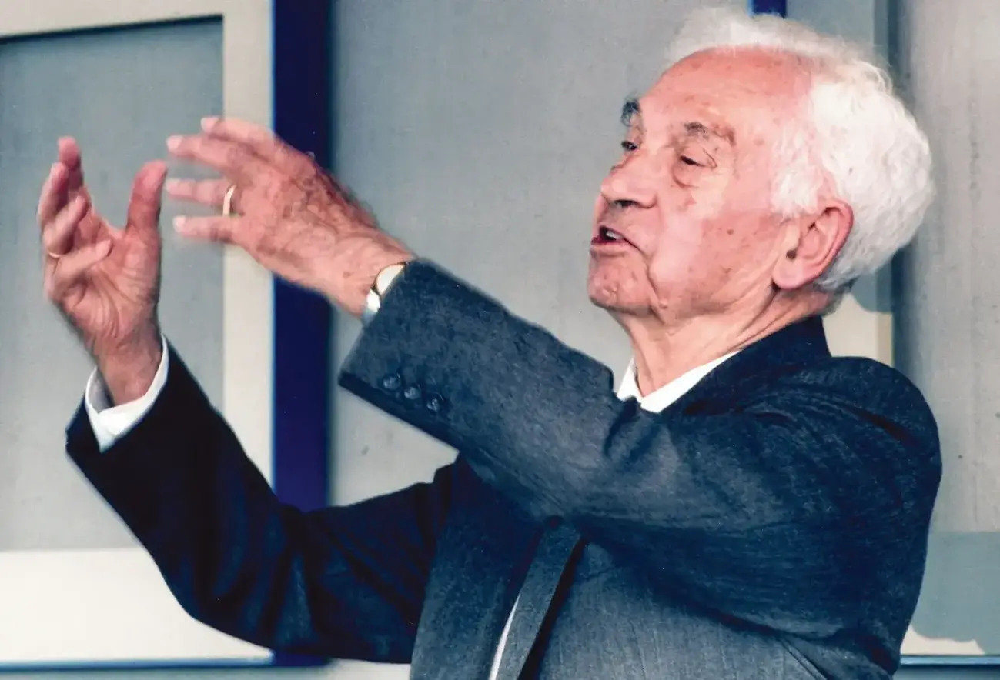
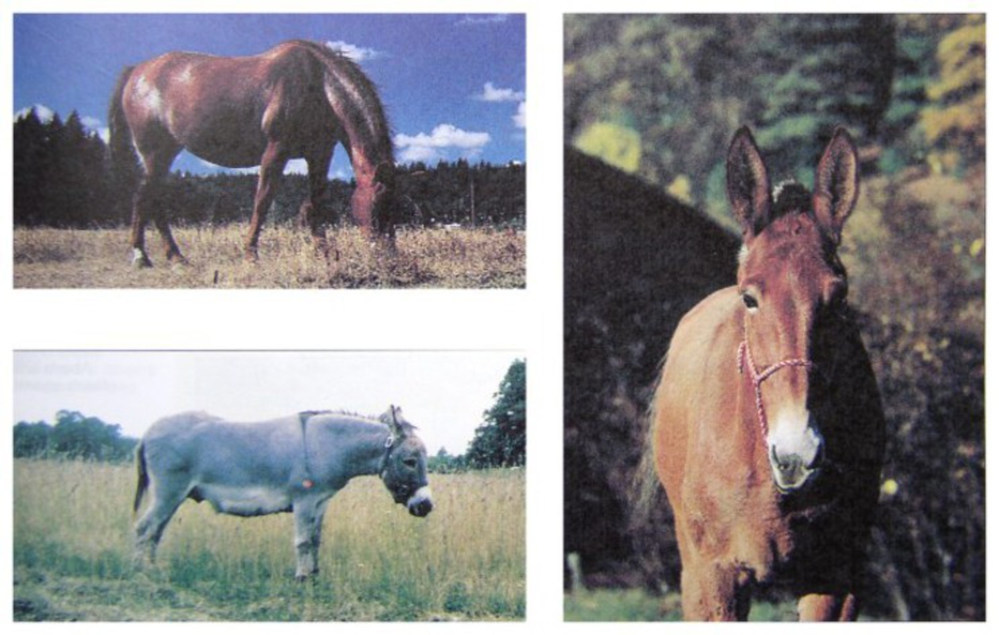
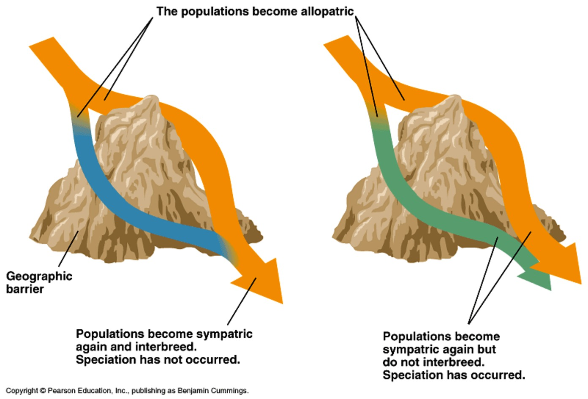
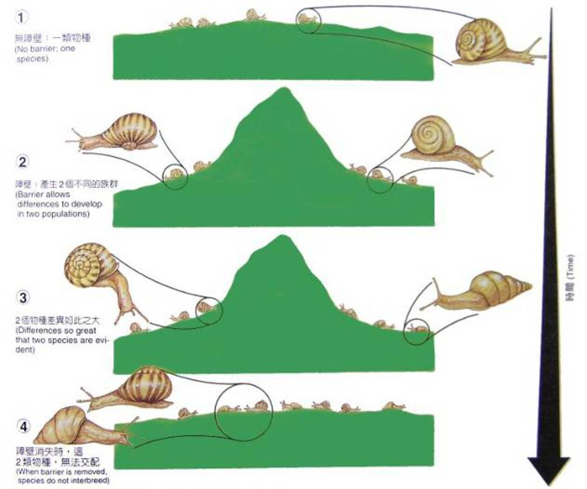
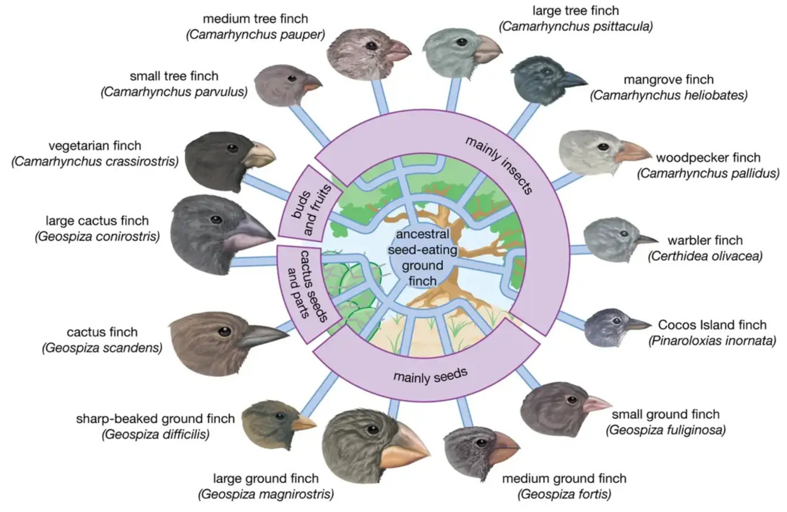
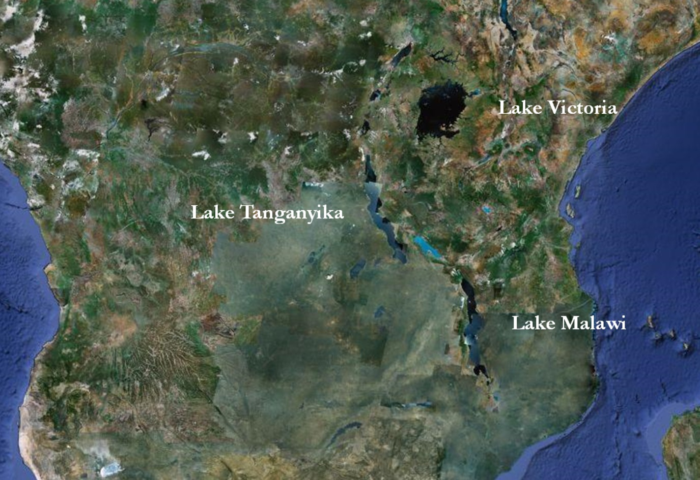
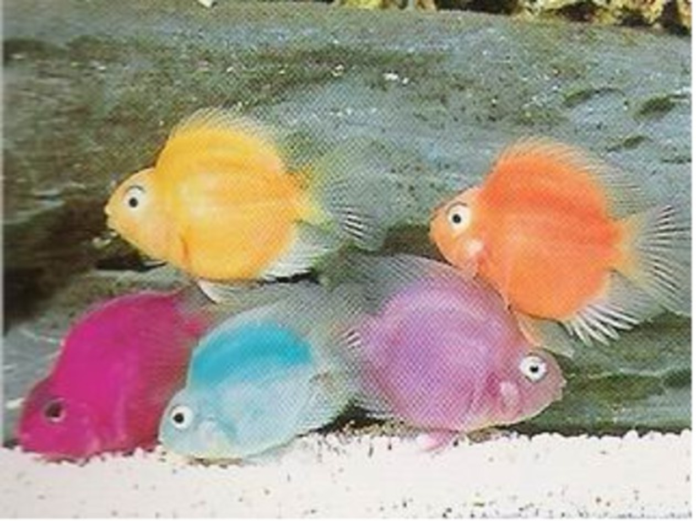

# 12.1 物种概念

## 12.1.1 什么是物种

> 迄今为止没有一个定义能够令所有的博物学家都满意; 然而每个博物学家在谈论物种时都隐约知道他所指的是什么.

\begin{exampleblock}{}
    \hspace*\fill{\small--- \textit{达尔文《物种起源》} }
\end{exampleblock}

---

\begin{figure}
    \includegraphics{ch-12.images/Aristotle.jpg}
    \caption{亚里士多德 (Aristotle), 384--322 BC, 分类学之父}
\end{figure}

---

亚里士多德的物种
:   物种是真实存在的事物, 具有其本质特征. 人们能够清楚地将一个物种与另一个物种区分开来, 不同物种相互之间不重叠并可进行比较.

1. 本质主义
2. 分类
3. 变化与不变
4. 目的论

《动物志》和《生物学》

\note{

1. 本质主义: 每种生物都有其特定的本质或"形式", 这种形式决定了生物的特征和行为. 他认为物种是由具有共同特征的个体组成的, 这些特征是由其本质所决定的.

2. 分类: 对生物进行分类, 依据的是它们的形态和生理特征. 他将动物分为不同的类别, 如血液动物 (脊椎动物) 和无血动物 (无脊椎动物) , 并进一步细分为不同的种类.

3. 变化与不变: 虽然亚里士多德承认生物会随着环境的变化而变化, 但他仍然认为物种的本质是相对不变的. 这种观点与后来的进化论形成了对比.

4. 目的论: 他认为生物的特征和行为是为了实现某种目的或功能. 这种观点强调了生物体的适应性和功能性.

}

---

\note{

\url{https://www.britannica.com/science/evolution-scientific-theory/Biogeography}

}

---

是分类单位, 也是客观存在.

物种
:   是互交繁殖的自然群体, 一个物种和其他物种在生殖上互相隔离.

* 同一物种的个体共有一个\alert{基因库}.

* 目前已识别的生物种类超过200万个, 预计还有1000万到3000万种待发现.

\note{

对物种的定义是经过漫长的演变而确定下来的.

迈尔在1942的著作《从动物学家的角度看系统学和物种起源》提到的定义

}

---

区分物种的主要根据是有无生殖隔离

* 但根据\alert{形态特征}进行物种鉴定不但有效, 而且方便.
* 无法判断有无生殖隔离的情况:
    * 化石 (古生物)
    * 只进行无性生殖的生物 (细菌等原核生物)

## 12.1.2 生殖障碍造成物种分化

生殖隔离的原因

\begin{columns}[onlytextwidth]
    \column{0.5\textwidth}
        \begin{itemize}
            \item 合子前障碍:
            \begin{itemize}
                \item 繁殖期不同
                \item 生境不同
                \item 表型差异
                \item 配子隔离
            \end{itemize}
        \end{itemize}
    \column{0.5\textwidth}
        \begin{itemize}
            \item 合子后障碍:
            \begin{itemize}
                \item 杂种不活性
                \item 杂种不育性
                \item 杂种崩溃
            \end{itemize}
        \end{itemize}
\end{columns}

\note{

与前面的基因表达调控类似, 生物活的很多复杂过程, 都是多步调节的

}

---

\note{

马和驴是不是一个物种?

不是, 因为马与驴交配产生的后代骡没有生殖能力

}

## 12.1.3 空间上不连续, 时间上是连续的

* 生殖隔离使物种与物种之间在空间上 (genetics) 是\alert{不连续}的

    * 物种间的不连续性使群体遗传结构保持**相对稳定**
    * 个体基因型在有性生殖情况下不能稳定地传递到后代 --- 个体基因型的**不稳定性**

生态位 (niche)
:   一个物种在生态系统中所处的位置, 作用和功能.

\alert{稳定与不稳定的辨证关系是生命及其系统生存和发展的重要基础.}

\note{

* 使进化不致**停滞**;

* 使已获得的适应不致因种间杂交而**丢失**.

有性生殖在进化上的巨大利益是增大变异量

不同物种在各自的生态位上行使不同的功能, 它们的\alert{协同作用}维持了: 物质, 能量, 信息的有序流动; 生态系统的稳定性.

所以, 没有物种的相对稳定就没有生态系统的稳定性.

}

---

* 物种之间的界限并非总是十分明确.
    * 亚种: 有遗传差异但无生殖隔离.
    * 山雀有 3 个亚种: 小山雀, 南山雀, 大山雀, 小山雀与大山雀之间已有生殖隔离,
      但由于南山雀的存在而使该生殖隔离不完全.
    * $\rightarrow$ 渐变群 (cline): \alert{形成中} (不完全) \alert{的种}

\note{

其存在说明一个物种通过长期遗传变异的积累, 达到生殖隔离, 向另一个物种演变.

}

---

* 每一个分类群的物种都有共同来源 --- 时间上的\alert{连续性}

亲缘关系的纽带将各个物种连接起来, 因此, 物种之间存在着历史的或时间上的连续性.

\alert{非常重要}: 对物种认识的时空观 (空间上的不连续和时间上连续性)

# 12.2 物种形成的方式

## 12.2.1 地理隔离条件下的物种形成

Porto Santo 岛上欧洲家兔的进化: 15--19 世纪.

* 迁徙地与原住地不尽相同, 由于自然选择的作用, 迁徙群体的遗传结构朝着适应地环境条件的方向变化.
* 群体间的遗传差异**积累**到物种间的遗传差异 --- **隔离**是重要条件.
* **遗传漂变** (genetic drift)

---

* 物种形成需要隔离
    * 迁徙群体的遗传结构, 表型性状, 生态位等方面在新环境条件下出现变化 --- 环境阻隔 --- 遗传差异积累 --- 生殖隔离
* 生殖隔离与自然选择
    * 生态位显著不同的 2 个种群, 其杂交后代的适应性发生变化将推动 2 个种群间产生生殖隔离
    * 地理隔离 --- 差异积累 --- **自然选择淘汰产生不能适应的杂种的个体** --- 生殖隔离

\note{

图26.5

Why? $\rightarrow$ 避免配子浪费 (淘汰浪费类型)

}

---

\note{

Mol. Ecology 9: 2109-2118 (2000)

}

---

\note{

物种的形成往往是经过长期的地理隔离将不同种群间的差异不断积累, 最后达到生殖隔离, 形成新物种

}

---

\note{

但分布区是否重叠往往很难区分.

例如人体寄生有3种虱:

阴虱寄生于腋毛和阴毛中; 人虱分布于躯体 (主要在衣服上); 头虱生于头发上.

若从整个人体看, 3种虱的分布区是重叠的, 但若从人体的局部部位看, 它们又是不重叠的.

分布区是否重叠一般应根据具体的生物对象的活动能力和行为等特点来判断

}

---

* 异地物种形成 (allopatric speciation)
    * **渐进的物种形成过程** (gradual speciation)
        * 自然选择使轻微变异汇集, 积累 --- 显著差异
        * 正是达尔文进化论提出的物种形成模式 --- 自然选择
    * 渐进的物种形成过程不是物种形成的唯一方式. **其它的物种形成模式有**:
        * 彼此独立发生的相似的物种形成
        * 多倍体植物产生新的物种

## 12.2.2 彼此独立发生的相似的物种形成

* 维多利亚湖, 马拉维湖, 坦葛尼喀湖 --- 丽鱼
* 维多利亚湖 14000 年前, 曾干涸
* 线粒体 DNA 比较研究
    * 维多利亚湖, 马拉维湖 --- 1 个谱系
    * 坦葛尼喀湖 --- 11 个谱系
* 三大湖中, 相同的适应性进化, 由于生境高度相似, 相互独立地发生过多次
* 生物变异是随机的, 而选择是有方向的

---

---

\note{

有些种类以口含卵孵化, 卵不是置于巢内, 而是含在亲鱼的口内直到孵化. 处于繁殖期的丽鱼, 产卵量不大,
但能用自己的大嘴容纳所有的受精卵.

雌鱼将卵含在口内, 迎着水流游动, 使卵既有一个安全的孵化场所, 又能获得充足的氧气. 在孵化期间,
亲鱼为了防止把快要出世的孩子咽到肚里, 连续十几天不吃不喝.

"传递式关系推理"是逻辑推理中的一个重要环节, 指通过已知的事物关系来推断未知的关系.

研究发现, 灵长类及鸟类具备这种能力, 但是鱼类是否具有这种能力, 一直是个谜.

美国加利福尼亚州斯坦福大学的科学家对水族箱里8条脸上长有黑色条纹的非洲丽鱼进行一系列的观察和试验后, 发现它也具备这种本领.

其雄性鱼能通过观察其他雄性成员之间的争斗而决定自己应该向谁发起攻击并能够胜出, 以提高自己在鱼群中的地位.

另外, 他们发现鱼是作为旁观者通过间接学习来获得这种能力的.

}

## 12.2.3 多倍体植物, 新的物种

* 渐进的物种形成 --- 进化的材料是结构基因点突变.
    * 突变, 重组, 选择和隔离等因素导致渐进的物种形成.
    * 发育调节基因的突变, 染色体畸变, 染色体数目非整倍性和整倍性的变化等, 比点突变和重组的影响大.

---

西瓜 (2n=22), 秋水仙素处理茎尖, 染色体加倍, 形成四倍体 (同源多倍体)

四倍体 $\times$ 二倍体 $\rightarrow$ 三倍体无籽西瓜

* 跳跃式物种形成: 只经过一, 两代就产生新的物种.
* \alert{同地物种形成}: 突变个体和野生型占据不同的生态位, 自然选择使他们间的杂种消除, 形成两个新种.

\note{

板书植物分裂时多了一个细胞板形成的过程, 这有可能会让分裂时更容易出错, 导致多倍体的形成

}

---

\begin{figure}
    \centering
    \includegraphics{../tikz/OriginOfWheat.pdf}
    \caption{小麦起源}
\end{figure}

---

\begin{figure}
    \centering
    \includegraphics{../tikz/triticale.pdf}
    \caption{小黑麦培育}
\end{figure}

## 12.2.4 物种形成可能是渐进的或是跳跃的

* 化石记录的疑问
* 渐进式
* 点断平衡式

\note{

达尔文认为生物的进化是渐变式的, 但渐变式的进化难以解释下面两个问题:

1. 生物化石的记录所显示的大多不是渐变式的进化, 而是跳跃式的进化.

2. 如果生物演变是渐进的, 那么各种适应性的器官结构在尚未发展完善之前,
   即在还没有发展到有适应功能之前是怎样逃脱自然选择的压力的?

所以跳跃式进化理论认为, 生物的进化起源于大突变 (特别是某些调节基因的突变).

}

# 12.3 物种的灭绝

## 12.3.1 物种灭绝的定义与分类

1. 谱系角度
2. 群体遗传角度
3. 物种角度

## 12.3.2 物种灭绝的原因

1. 奥陶纪--志留纪灭绝 (约4.4亿年前), 约85%的物种灭绝.
2. 晚泥盆纪灭绝 (约3.6亿年前), 约75%的物种灭绝, 主要是海洋生物.
3. 二叠纪--三叠纪灭绝 (约2.52亿年前), 最严重的灭绝事件, 约96%的海洋物种和70%的陆地物种灭绝.
4. 三叠纪--侏罗纪灭绝 (约2亿年前), 约80%的物种灭绝.
5. 白垩纪--第三纪灭绝 (约6600万年前), 约75%的物种灭绝, 包括恐龙.

* 现代灭绝: 当前地球正经历第六次大灭绝, 主要是由于人类活动 (如栖息地破坏、气候变化、污染和过度捕猎) 导致的物种灭绝速度加快.

\note{

显生宙之前也应该有大灭绝, 但微生物化石记录不明显

1. 超新星释出的伽马射线暴摧毁了地球一半的臭氧层, 使得太阳释出的紫外线袭击地球, 导致地面及近海面的大量生物死亡, 从而破坏食物链.
2. 泥盆纪陆生植物大量繁育, 导致地球大气中氧含量的增加、二氧化碳的大幅减少, 地球进入卡鲁冰河时期所致. 根系深入地表土之下数米, 加速了陆地岩石土壤的风化, 大量铁等元素释放进入地表水, 造成了水系的富营养化大爆发, 导致了海底缺氧事件. 海洋表层繁盛的有机物的沉降, 使得全球碳循环中大气层的二氧化碳大量进入海底沉积层, 也加强了地球冷化.
3. 西伯利亚大规模火山喷发, 形成巨大火成玄武岩区. 造成的附近浅海区可燃冰融化大量释放温室气体甲烷. 盘古大陆形成后改变了地球环流与洋流系统等等.
4. 原因不明. 使得恐龙失去了许多陆地上的竞争者
5. 墨西哥尤卡坦半岛的陨石撞击

这些大灭绝事件对地球的生物多样性和生态系统产生了深远的影响, 导致了新的物种和生态系统的演化. 每次灭绝后, 生物界都经历了重建和适应的过程, 最终形成了我们今天所看到的生物多样性.

}
