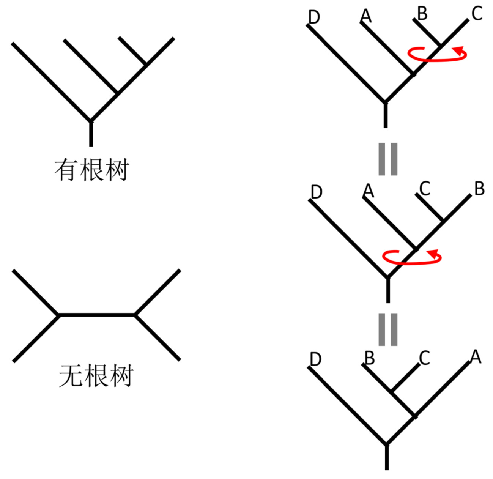
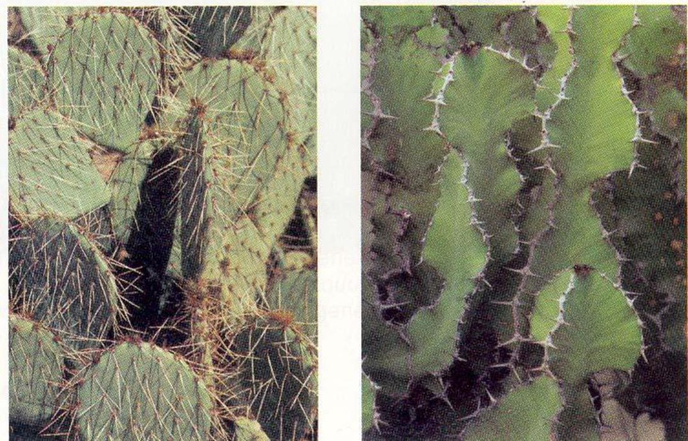
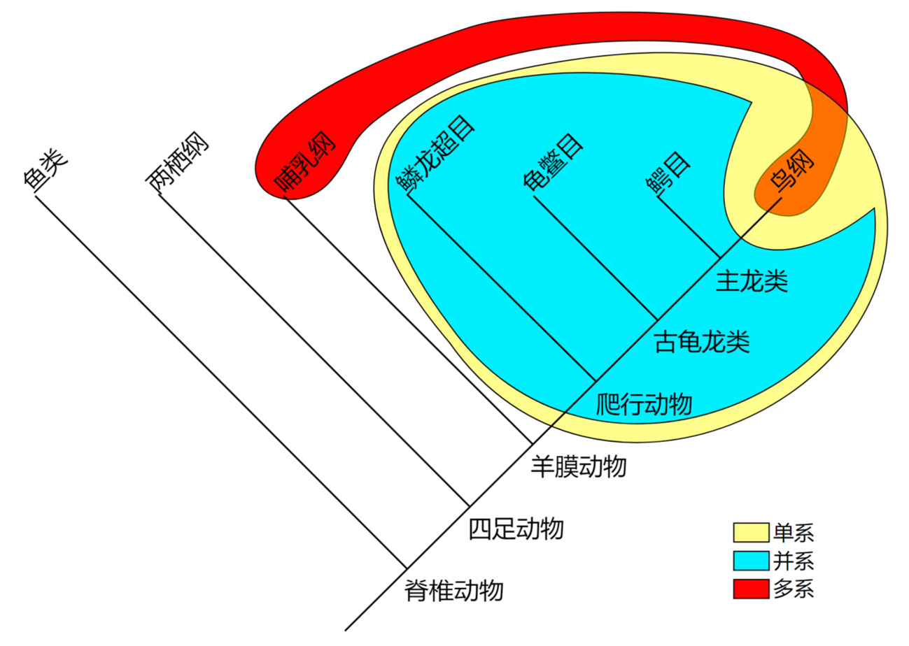

# 14.1 演化理论赋予分类学新的目标

## 分类学

* taxonomy
* 基于共有的相似性, 例如体型或骨骼特征
* 是分等级体系的, 相容性的组

---

\begin{figure}
    \includegraphics{ch-14.images/image20.jpg}
    \caption{亚里士多德 (Aristotle), 384--322 BC, 分类学之父}
\end{figure}

\note{

相对于狗, 猫与狮同组

相对于鸟, 猫, 狮和狗同组

他根据生物的相似性对生物类型进行了分类: 有血动物和无血动物、生活在水中的动物和生活在陆地上的动物.

亚里士多德的生命观是等级性的. 他认为生物可以按照从低到高的顺序进行分组, 人类是最高级的物种.

}

---

\begin{figure}
    \includegraphics{ch-14.images/image50.jpg}
\end{figure}

---

\begin{figure}
    \includegraphics{ch-14.images/image51.jpg}
\end{figure}

---

\begin{figure}
    \includegraphics{ch-14.images/image52.jpg}
\end{figure}

---

\begin{figure}
    \includegraphics{ch-14.images/image53.jpg}
\end{figure}

---

\begin{figure}
    \includegraphics{ch-14.images/image54.jpg}
\end{figure}

---

\begin{figure}
    \includegraphics{ch-14.images/image55.jpg}
\end{figure}

---


---

\begin{figure}
    \includegraphics{ch-14.images/image29.jpg}
    \caption{林奈 (Carl Linnaeus), 1707--1778, 现代分类学之父}
\end{figure}

---

* 精心挑选的特征
* 双名命名法, 属名 + 种加词
* 植物种志, *Species Plantarum*
* 自然系统, *Systema Naturae*

人为分类系统

* 物种的识别与命名
* 归类与建立分类系统

\note{

没反映物种间的进化历史

板书如下的植物特征:

叶 互生, 对生

叶脉 网, 平行, 银杏

直根, 须根

花 三出, 四出, 五出等

}

## 分类学新的目标

* 共同祖先学说
  * Galapagos 群岛各岛屿上的不同地雀由来自南美大陆的共同祖先演变而来 $\rightarrow$
  进而推断: 所有动 (植) 物有一个共同祖先, 所有生物有一个单一起源.
* 建立起可以反映生物类群演化历史的分类系统
* \alert{系统学}, Systematics

# 14.2 系统发生树的构建

---

: 脊椎动物表型特征

|     | 颚 | 四肢 | 毛发 | 肺 | 尾巴 |
|:---:|:-:|:--:|:--:|:-:|:--:|
| 八目鳗 | - | -  | -  | - | +  |
| 鳟鱼  | + | -  | -  | - | +  |
| 肺鱼  | + | -  | -  | + | +  |
|  龟  | + | +  | -  | + | +  |
|  猫  | + | +  | +  | + | +  |
| 大猩猩 | + | +  | +  | + | -  |
|  人  | + | +  | +  | + | -  |

---

\begin{figure}
    \centering
    \includegraphics{ch-14.images/Vertebrate.pdf}
    \caption{脊椎动物系统发生树}
\end{figure}

---

\begin{figure}
    \centering
    \includegraphics[height=3cm, keepaspectratio]{ch-14.images/Vertebrate.pdf}
    \includegraphics{ch-14.images/cladogram.jpg}
    \caption{系统发生树}
\end{figure}

---



---

|    | 水生 | 径向对称 | 肛门 | 内骨骼 |
|:--:|:--:|:----:|:--:|:---:|
| 水母 | +  |  +   | -  |  -  |
| 海星 | +  |  +   | +  |  +  |
| 人  | -  |  -   | +  |  +  |

* 表型分类学, Phenetics
* 支序分类学, Cladistics

\note{

表型分类学: 只包括结构和形态作为分类的主要组成部分, 不包括进化特征

支序分类学: 生物体的进化历史或关系以对其进行分类

}

---

\begin{figure}
    \includegraphics{ch-14.images/image30.jpg}
    \caption{维利·亨尼希 (Willi Hennig), 1913--1976, 支序分类学之父}
\end{figure}

\note{

phylogenetic systematics

}

---

* 同源相似性
* 同功相似性

---


---


---


---



---

排除同功相似性 (趋同演化) 后, 所有可用的特征都是等价的吗?

支序分类学的三个基本假设:

1. 任何一组生物都通过共同祖先关系而相关联
2. 系统发育分支具有二分模式
3. 生物特征会随着时间在谱系中发生变化

\note{

\url{https://ucmp.berkeley.edu/clad/clad1.html}

系统分类学的基本思想是, 一个类群的成员享有共同的进化历史, 它们之间的关系密切, 而与其他不同类群的生物的关系较远.
一个类群的成员通过共享一些独特的特征而被识别出来, 这些特征在远祖中并不存在. 这些共享的衍生特征被称为共同衍征.

第一个假设是所有进化生物学的通用假设.
它本质上意味着地球上的生命仅起源过一次, 因此所有生物在某种程度上都彼此相关.
基于这一点, 我们可以利用适当的信息, 从任何生物集合中确定有意义的关系模式.

第二个假设或许是最具争议性的, 即新的生物种类可能在现有物种或种群精确分裂为两个群体时产生.
然而, 有许多生物学家认为, 从单一的起源种群中可以同时或在极短时间内产生多个新的谱系, 这种情况可能与二分模式无法区分.
尽管这种模型在理论上可能发生, 但目前尚不清楚这种情况实际发生的频率.
对此假设的另一个反对意见是, 不同群体之间可能存在杂交.
然而, 这也是重建进化历史的普遍问题, 尽管目前系统分类学方法无法很好地处理这一问题, 但尚未有其他系统能够更好地解决它.

第三个假设, 即生物特征会随着时间发生变化, 是系统分类学中最重要的假设.
只有当特征发生变化时, 我们才能识别出不同的谱系或群体.
惯例是将特征的"原始"状态称为祖征, 而将"变化"后的状态称为衍征性状.
虽然"原始"和"衍生"这两个术语也被用来描述这些状态, 但由于过去的滥用, 系统分类学家通常避免使用这些术语.

}

---

* 祖征 (primitive character)
* 衍征 (derived character)
    * 共同衍征 (shared derived character)
* 独征 (自衍征)

## 如何构建系统树

1. 选择感兴趣的分类单元
2. 确定特征并分析性状状态
3. 确定特征的极性
4. 通过 _共同衍征_ 而非 _祖征_ 对分类单元进行分组
5. 通过明确的方法解决冲突
6. 构建系统树

---

```text
>Lamprey
00001
>Trout
10001
>Lungfish
10011
>Turtle
11011
>Cat
11111
>Gorilla
11110
>Human
11110
```

---

\begin{figure}
    \centering
    \includegraphics{ch-14.images/vet.fa.pdf}
    \caption{基于形态学特征的脊椎动物系统发生树}
\end{figure}

## 系统学有什么用?

* 建立分类系统
* 预测生物的特性
* 阐明进化机制

\note{

这种能力在寻找特定基因或生物化合物时尤为重要.
公司经常寻找能够提高作物产量或抗病性的基因和化合物, 也在寻找新的药物.
只有基于进化理论的假设 (如系统分类学的假设) 才能用于这些研究.

我们可以研究性状在群体中随时间的变化方式——例如性状变化的方向以及变化的相对频率.
我们还可以比较同一个祖先的后代, 研究这些群体的起源与灭绝模式, 或比较群体的相对规模和多样性

长期以来人们认为织圆网的蜘蛛 (它们的网精致而有序) 是从织乱网的蜘蛛进化而来的.
然而, 系统分类学对这些蜘蛛的分析表明, 实际上, 织圆网是原始状态, 而乱网是从网更有序的蜘蛛中进化而来的.

}

# 14.3 单系类群, 并系类群和多系类群



\note{

单系: 爬行类与鸟类
并系: 爬行类
多系: 温血动物

}

# 14.4 重建系统发生面临的挑战

|  Labeled leaves |  Binary unrooted trees |  Binary rooted trees |
|----------------:|-----------------------:|---------------------:|
|               1 |                      1 |                    1 |
|               2 |                      1 |                    1 |
|               3 |                      1 |                    3 |
|               4 |                      3 |                   15 |
|               5 |                     15 |                  105 |
|               6 |                    105 |                  945 |
|               7 |                    945 |               10,395 |
|               8 |                 10,395 |              135,135 |
|               9 |                135,135 |            2,027,025 |
|              10 |              2,027,025 |           34,459,425 |
