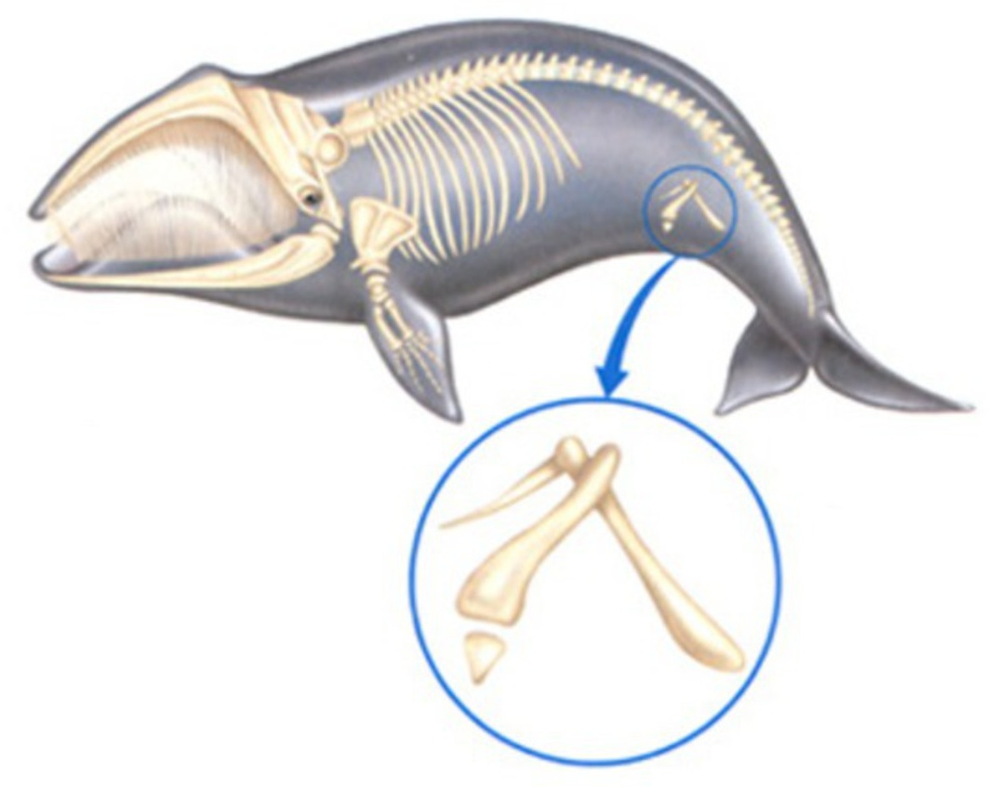

# 14.1 演化理论赋予分类学新的目标

---

* 分类学
* 系统学

---

\begin{figure}
    \includegraphics{ch-14.images/image20.jpg}
    \caption{亚里士多德 (Aristotle), 384--322 BC, 分类学之父}
\end{figure}

\note{

“ladder of nature” and taxonomy

He grouped the types of creatures according to their similarities: \underline{animals with blood and
animals without blood}, animals that live on water and animals that live on land.

Aristotle's view of life was hierarchical. He assumed that creatures could be grouped in order from
lowest to highest, with the human species being the highest.

}

---

\begin{figure}
    \includegraphics{ch-14.images/image50.jpg}
\end{figure}

---

\begin{figure}
    \includegraphics{ch-14.images/image51.jpg}
\end{figure}

---

\begin{figure}
    \includegraphics{ch-14.images/image52.jpg}
\end{figure}

---

\begin{figure}
    \includegraphics{ch-14.images/image53.jpg}
\end{figure}

---

\begin{figure}
    \includegraphics{ch-14.images/image54.jpg}
\end{figure}

---

\begin{figure}
    \includegraphics{ch-14.images/image55.jpg}
\end{figure}

\note{

1. It is based on \underline{shared similarities}, such as skeletal features and body type.

2. It is \underline{hierarchical}, meaning that we have more and less inclusive groupings; for
   example, the cat and the lion are grouped together compared to the dog, but the dog, cat, and
   lion are all grouped together compared to the birds.

}

---

\begin{figure}
    \includegraphics{ch-14.images/image29.jpg}
    \caption{林奈 (Carl Linnaeus), 1707--1778, 现代分类学之父}
\end{figure}

\note{

Species Plantarum, 植物种志

Systema Naturae, 自然系统

精心挑选的特征. 人为分类系统, 没反映物种间的进化历史

板书如下的植物特征:

叶 互生, 对生

叶脉 网, 平行, 银杏

直根, 须根

花 三出, 四出, 五出等

}

---

\begin{figure}
    \includegraphics{ch-14.images/image30.jpg}
    \caption{维利·亨尼希 (Willi Hennig), 1913--1976}
\end{figure}

\note{

phylogenetic systematics

}

# 14.2 系统发生树的构建

* 同源相似性
* 同功相似性
* 祖征 (primitive character)
* 衍征 (derived character)
    * 共同衍征 (shared derived character)
* 独征

---

---

---

---

: 脊椎动物表型特征

|       | 颚 | 四肢 | 毛发 | 肺 | 尾巴 |
|:-----:|:-:|:----:|:---:|:-:|:----:|
| 八目鳗 | - |  -   |  -  | - |  +   |
|  鳟鱼  | + |  -   |  -  | - |  +   |
|  肺鱼  | + |  -   |  -  | + |  +   |
|  龟   | + |  +   |  -  | + |  +   |
|  猫   | + |  +   |  +  | + |  +   |
| 大猩猩 | + |  +   |  +  | + |  -   |
|  人   | + |  +   |  +  | + |  -   |

---

# 14.3 单系类群, 并系类群和多系类群

# 14.4 重建系统发生面临的挑战
