---

## 20.1.2 一对性状的遗传分析

分离定律:

1. 遗传性状由遗传因子决定;
2. 每个植株有一对遗传因子控制花(冠)颜色;
3. 每一生殖细胞(花粉或卵细胞)只含有每对遗传因子中的一个;
4. 每个植株的每对遗传因子中, 一个来自父本雄性生殖细胞, 一个来自母本雌性生殖细胞;
5. 植株形成生殖细胞时, 每对遗传因子相互分开(即分离), 分别进入生殖细胞中;
6. 生殖细胞的结合(形成一个新个体或合子)是随机的;
7. 紫花因子和白花因子是同一遗传因子的两种形式, 其中紫花因子对白花因子为显性, 反之, 白花因子对紫花因子为隐性.

---

# 20.2 遗传的第二定律

## 20.2.1 两对性状的遗传分析

* 决定不同对相对性状的遗传因子, 在遗传传递过程中, 各对因子间的分离和组合互不干扰, 各自独立分配到配子中.

---

## 20.2.2 人类简单的孟德尔式遗传

---

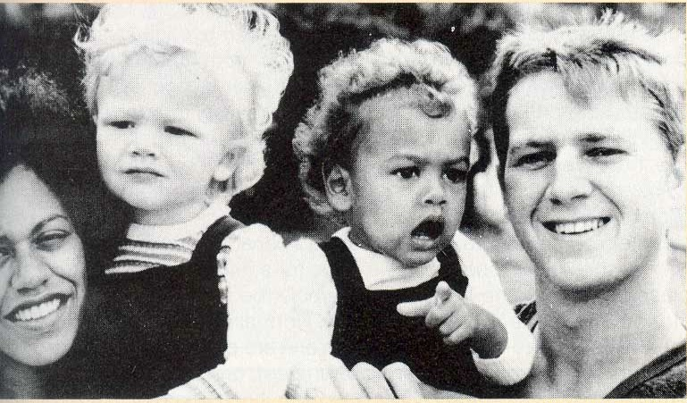

---

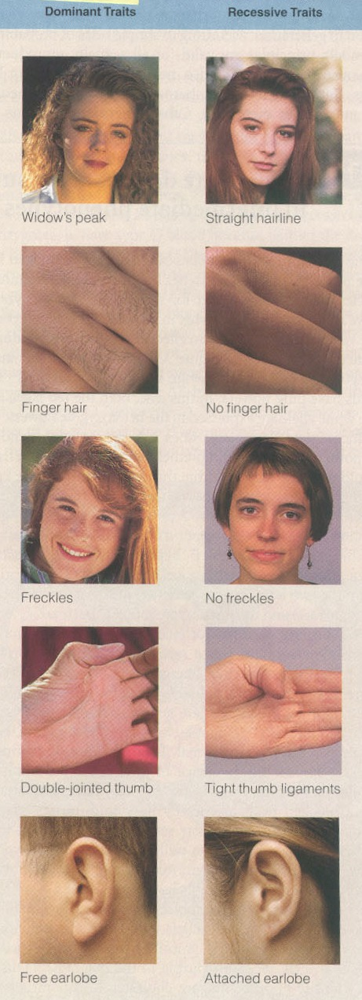

\note{
额头发际

指背毛发

雀斑

大拇指指节

耳垂

}

## 20.2.3 颗粒遗传理论

孟德尔定律的精髓
:   代表一对相对性状(如红花对白花)的遗传因子在同一体内各别存在, 互不沾染, 不相混合的遗传方式.

# 20.3 孟德尔定律的扩展简介

## 20.3.1 不完全显性的中间表型

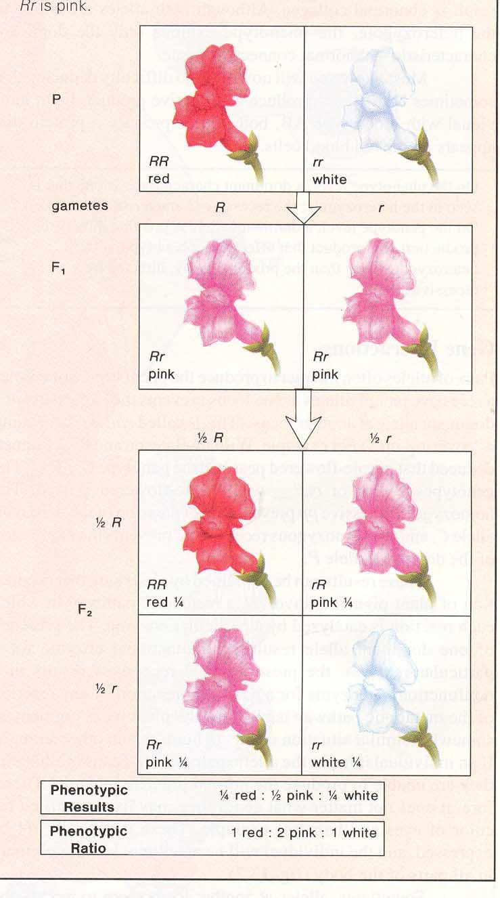

## 20.3.2 复等位基因的遗传

指一个基因有两个以上的等位形式, 如人类ABO血型就是由复等位基因\textit{I\textsuperscript{A}}, \textit{I\textsuperscript{B}}和\textit{i}决定.

---

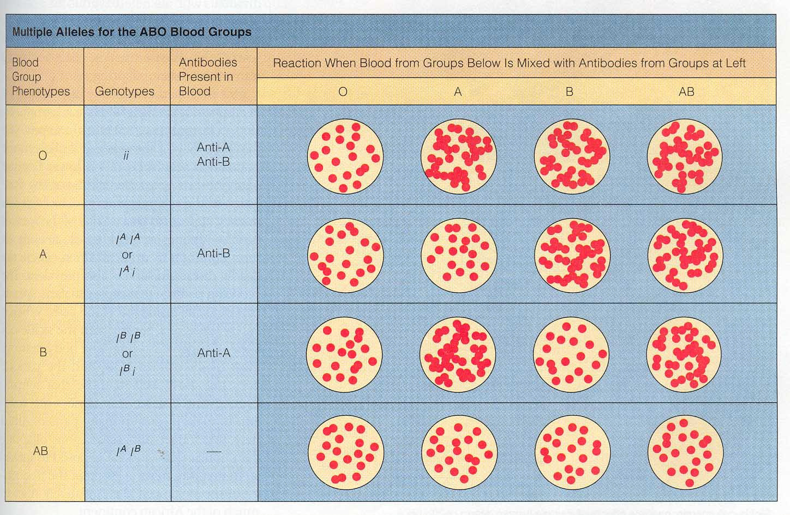

---

## 20.3.3 单个基因影响多种表型

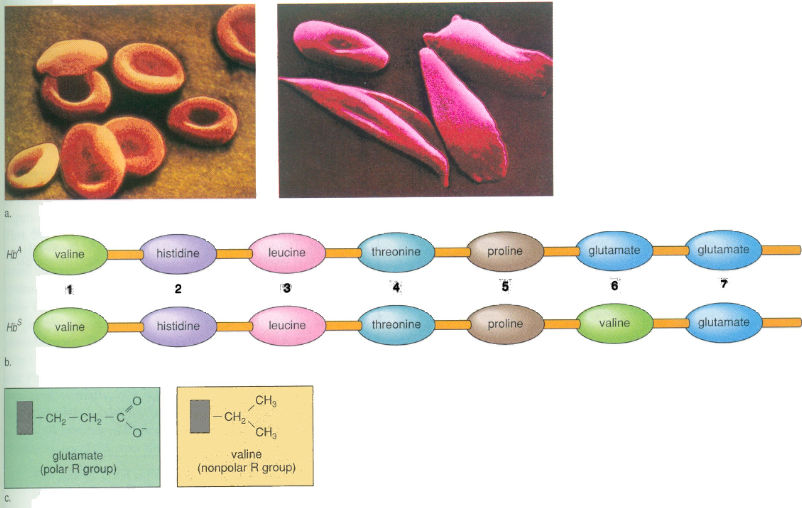

---

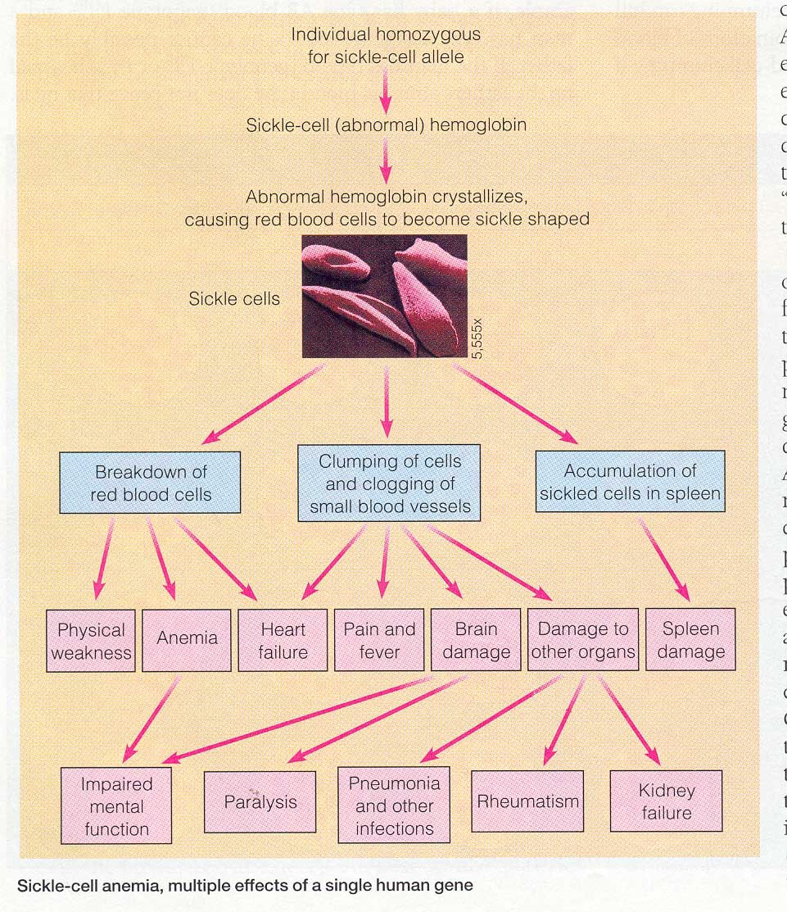

# 20.4 多基因决定的数量性状

# 20.5 遗传的染色体学说

## 20.5.1 萨顿和博韦里的假说

* Sutton和Boveri提出.
* 孟德尔的遗传因子(基因)与性细胞在减数分裂过程中的染色体行为有着平行关系.

---

1. 过程（略）
2. 特点
    * DNA复制一次, 细胞连续分裂两次, 形成的细胞是单倍体的;
    * 有联会, 因而有交叉, 重组等.^[联会: 同源染色体配对成四分体, 发生在前期I.]

---

---

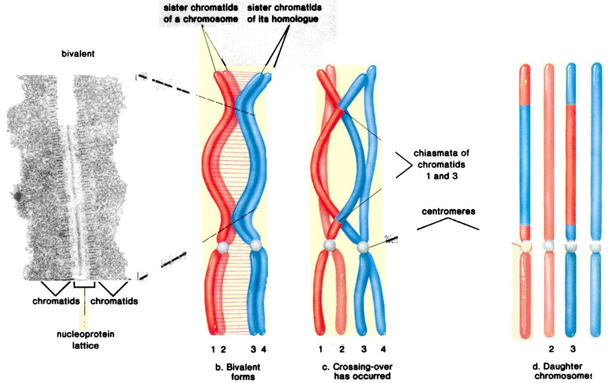

---

## 20.5.2 性染色体与性别决定

---

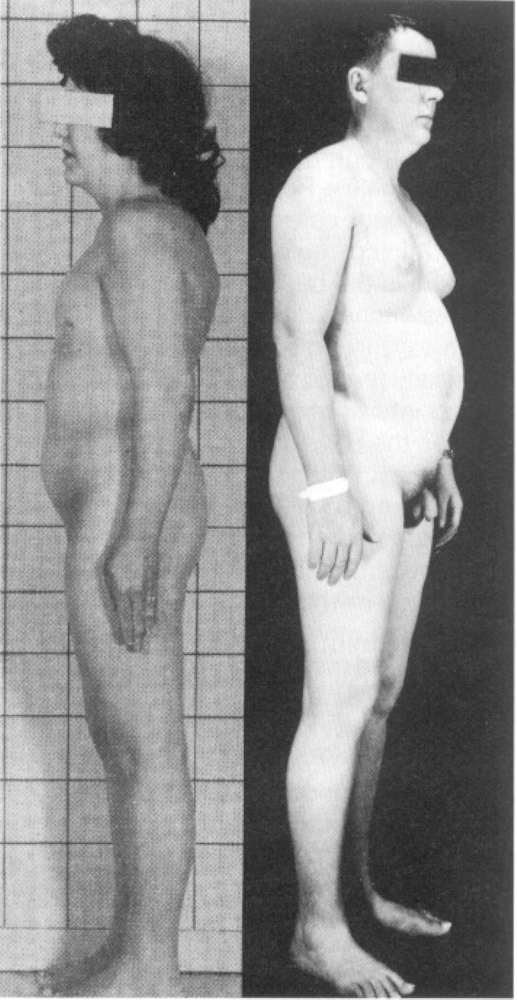

\note{
XO

XXY

}

## 20.5.3 黑腹果蝇的伴性遗传

* 摩尔根
* 果蝇
    + 生活周期短;
    + 易培养;
    + 繁殖力强;
    + 染色体数目少且形态特点十分分明.

---

---

---

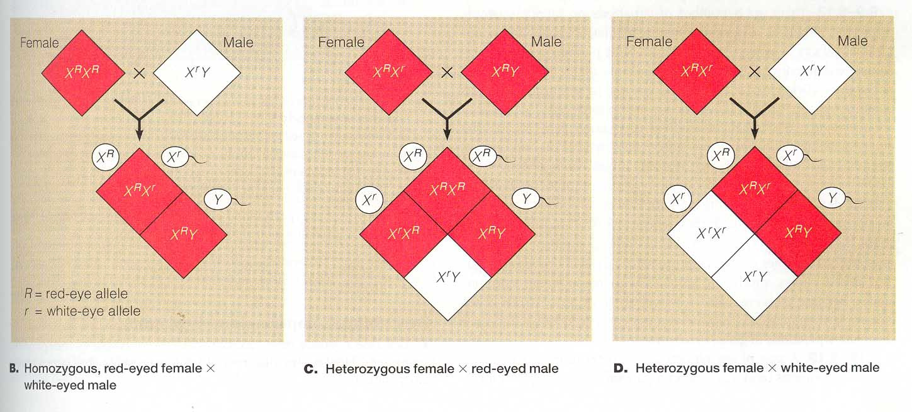

## 20.5.4 人类的性连锁遗传

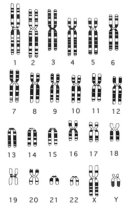

---

---

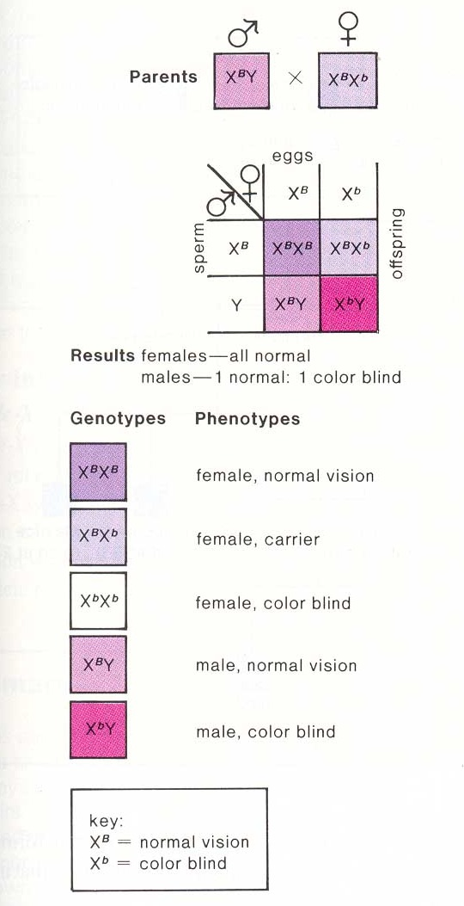

# 20.6 遗传的第三定律——连锁交换定律

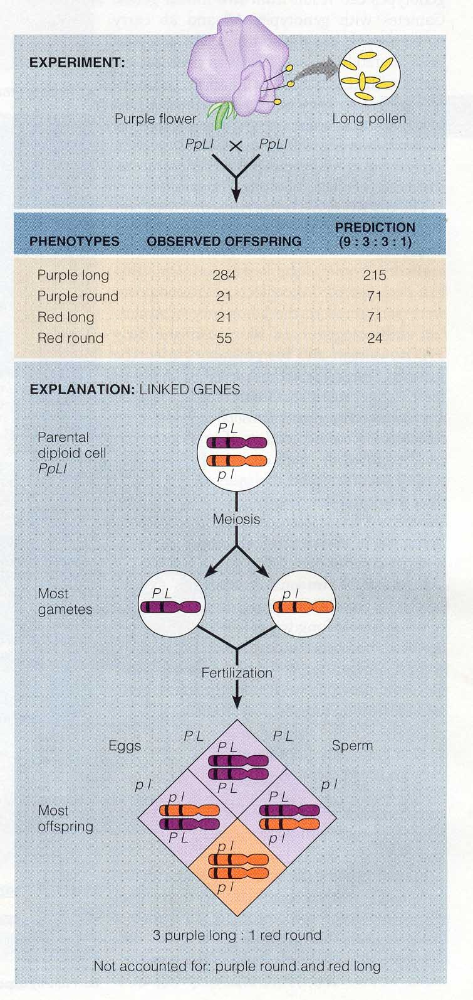

\note{
1908年, 香豌豆花色和花粉形状两对性状的遗传不符合孟德尔的自由组合定律.

}

## 20.6.1 摩尔根与遗传的第三定律

* 1912年, 摩尔根与他的学生提出连锁交换定律.
* 同一染色体上的两对或两对以上的基因遗传时, 联合在一起共同出现的频率大于重新组合的频率,
重组类型的产生是由于配子形成过程中, 同源染色体的非姐妹染色单体间发生局部交换的结果.
* 重组频率的大小与连锁基因在染色体上的位置有关.

---

## 20.6.2 利用重组率进行基因定位

## 20.7 高等植物的细胞质遗传

* 细胞质中的遗传物质控制的遗传, 质体和线粒体.
* 非孟德尔式.
* 母本贡献遗传物质, 而且是随机分配给子细胞.
* F1通常只表现母本的性状, 后代一般不出现一定比例的分离.

---

: 紫茉莉绿白斑植株的细胞质遗传

|母本枝条的类型 |父本枝条的类型  | 子代的类型     |
|:-------------:|:--------------:|:--------------:|
|白             | 白             | 白             |
|绿             | 白             | 绿             |
|绿白斑         | 白             | 绿, 白或绿白斑 |
|白             | 绿             | 白             |
|绿             | 绿             | 绿             |
|绿白斑         | 绿             | 绿, 白或绿白斑 |
|白             | 绿白斑         | 白             |
|绿             | 绿白斑         | 绿             |
|绿白斑         | 绿白斑         | 绿, 白或绿白斑 |
