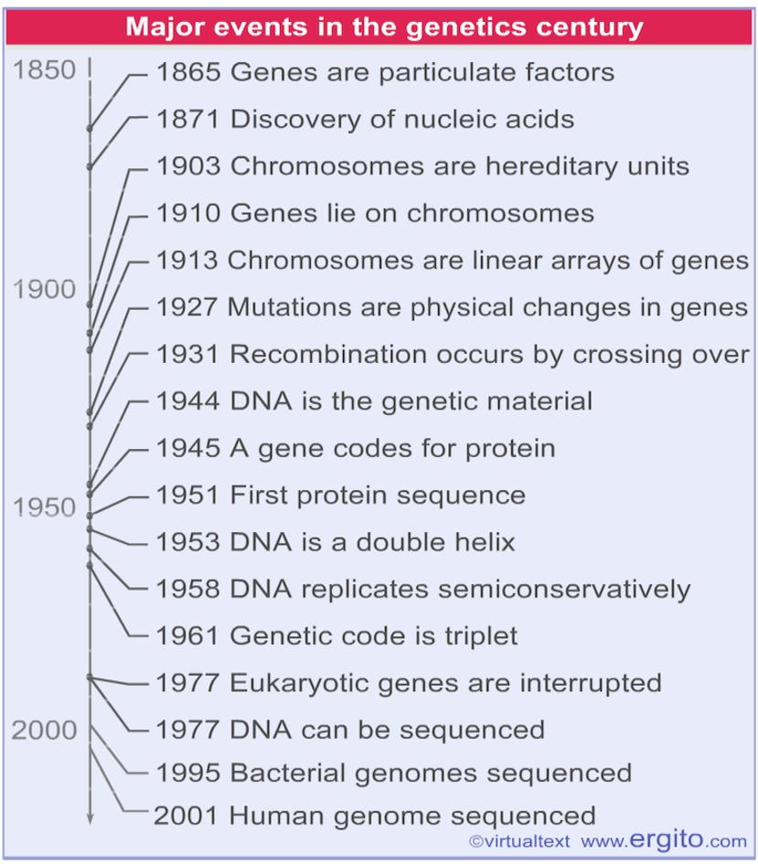

# 21.1 遗传物质是DNA(或RNA)的证明

## 21.1.1 肺炎链球菌转化实验

---

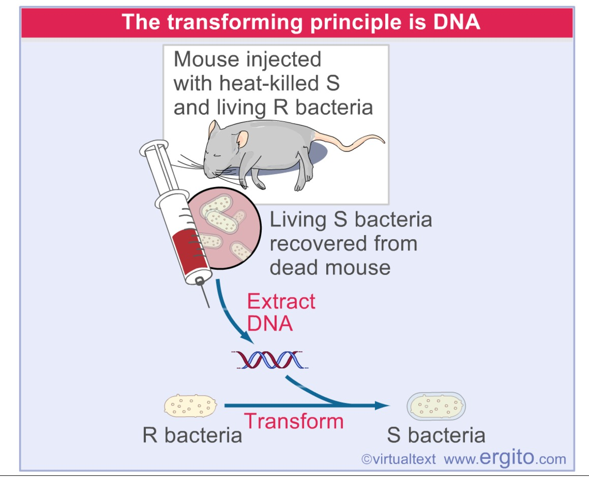

---

## 21.1.2 T2噬菌体感染实验

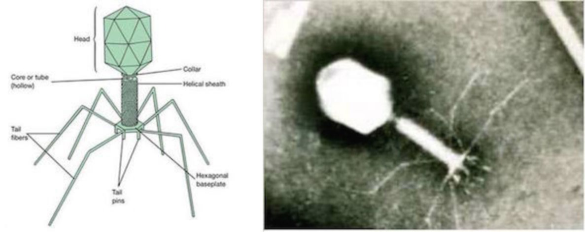

---

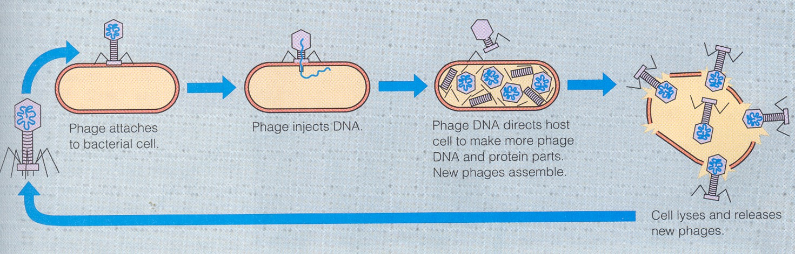

---

---

## 21.1.3 DNA与RNA是多核苷酸的聚合体

1. Chargaff法则
    * **[A]=[T] [G]=[C]**
2. DNA与RNA是多核苷酸的聚合体
    * 核苷
    * 核苷酸
    * DNA分子的**一级**结构

---

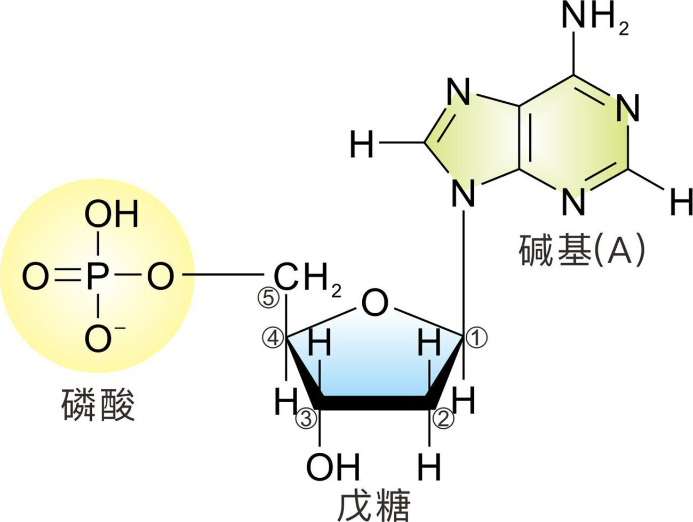

---

\note{
30 min

}

## 21.1.4 DNA--不朽的双螺旋

* Watson和Crick.
* DNA分子由两条\alert{互补}核苷酸单链组成; 两条核苷酸链总是按碱基A与T, G与C互补配对, 成\alert{反向平行}, 通过氢键形成稳定的双螺旋结构.

---

---

---

\begin{figure}
    \begin{minipage}[b]{.48\linewidth}
        \includegraphics{ch-21.images/image13.jpg}
        \subcaption{Rosalind Franklin}
    \end{minipage}
    \hfill
    \begin{minipage}[b]{.48\linewidth}
        \includegraphics{ch-21.images/image14.jpg}
        \subcaption{Maurice Wilkins}
    \end{minipage}
    \caption{研究DNA晶体的科学家}
\end{figure}

---

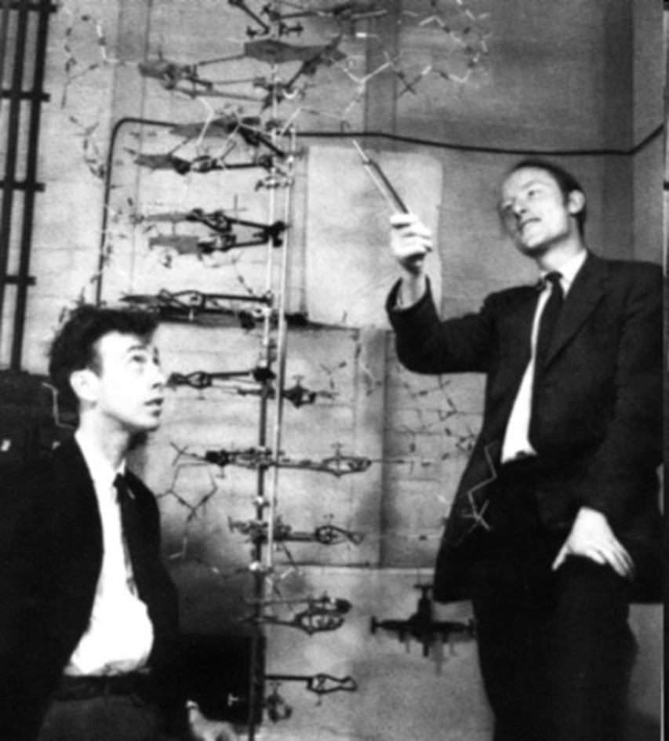

\note{
Crick已经去世.

Waston还在, 曾经是哈佛生物系的主任, 同是是CSHL的主任.

}

---

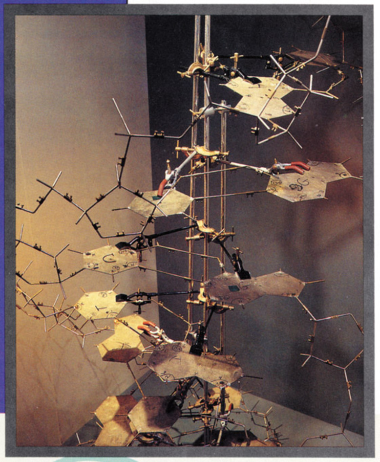

---

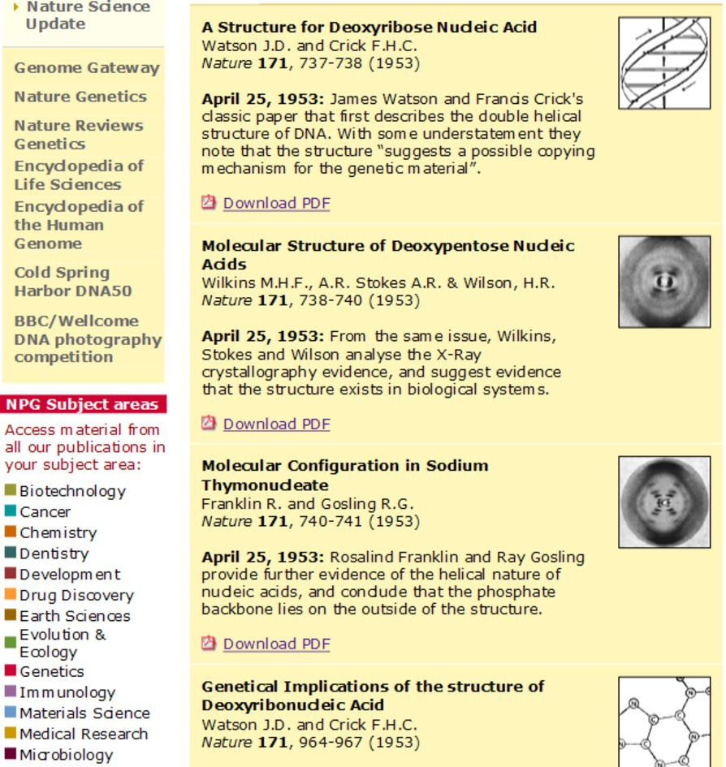

---

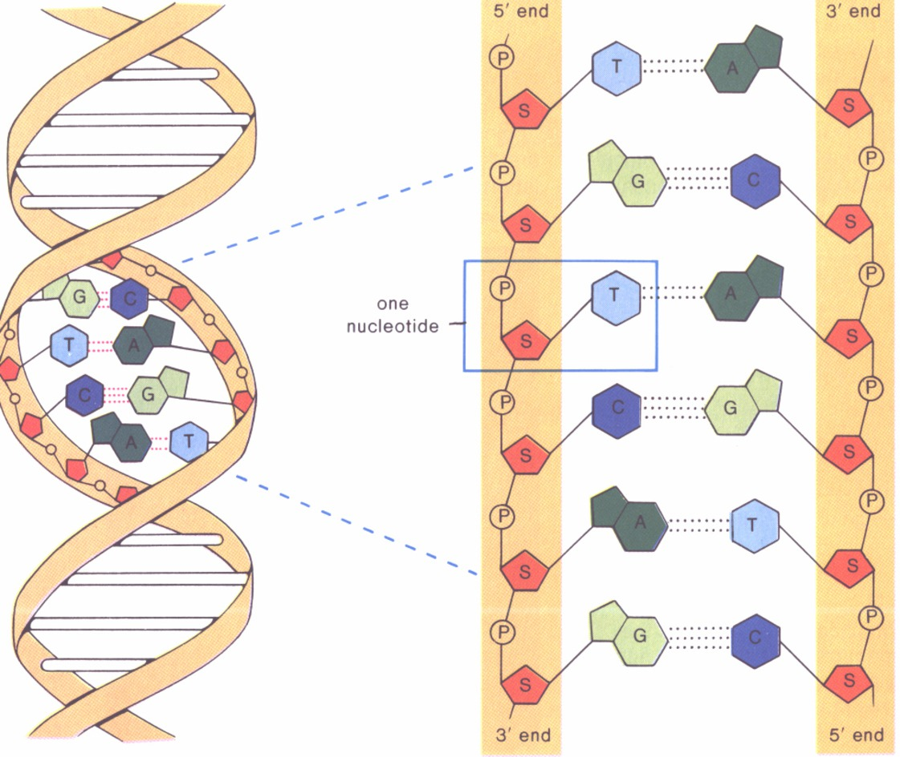

---

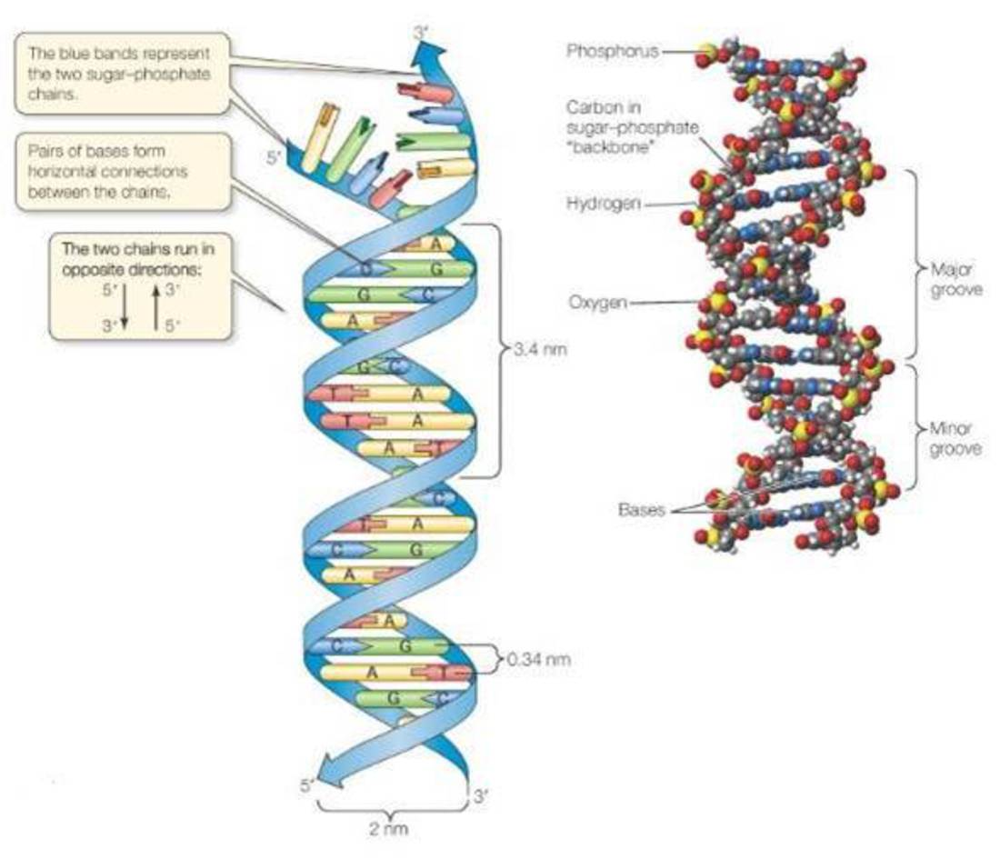

\note{
60 min

}

# 21.2 DNA复制

## 21.2.1 DNA复制依赖于碱基配对

A与T, G与C配对.

## 21.2.2 DNA复制是半保留式的

DNA复制形成的两个DNA分子, 每个都由一条新链和一条旧链组成.

---

---

\note{
EB, 溴化乙锭, 嵌入到DNA链中, 在紫外线的辐射下发出红光.

}

---

\begin{figure}
    \includegraphics[height=0.75\textheight, keepaspectratio]{ch-21.images/image22.jpg}
    \caption{大肠杆菌中的DNA复制\footnotemark}
\end{figure}

\footnotetext{\fullcite{Meselson1958}}

---

---

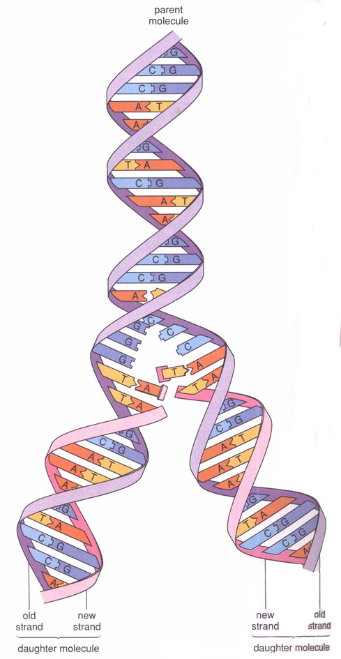

---

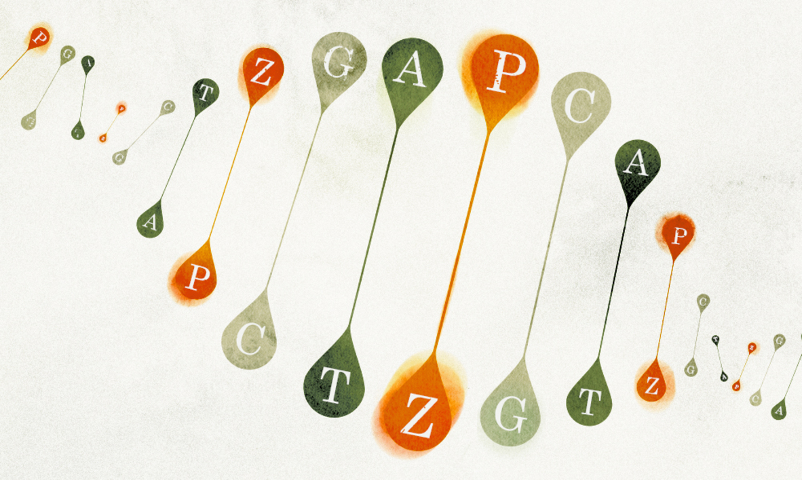

\note{

人工合成DNA加入新的遗传编码(New Letters Added to the Genetic Alphabet)

两种合成的核苷酸P和Z能无缝的整合到DNA的螺旋结构中，维持DNA的自然形态。

人工增强的DNA序列能像传统的DNA那样演化。新的核苷酸甚至在某些方面比天然的核苷酸表现的更出色。

在外星球上未必需要类似地球的DNA、RNA和蛋白质的标准生物基本组件系统。

DOI:10.1021/jacs.5b03482 

DOI:10.1021/jacs.5b02251

}

## 21.2.3 复制的半不连续性

* DNA聚合酶**只能**使核苷酸按\alert{$5^{\prime} \rightarrow 3^{\prime}$方向}连接成链
* 而DNA的两条链的方向相反, 这相反的一条链, DNA聚合酶是通过\alert{冈崎片段}来合成它的互补链的.

---

---

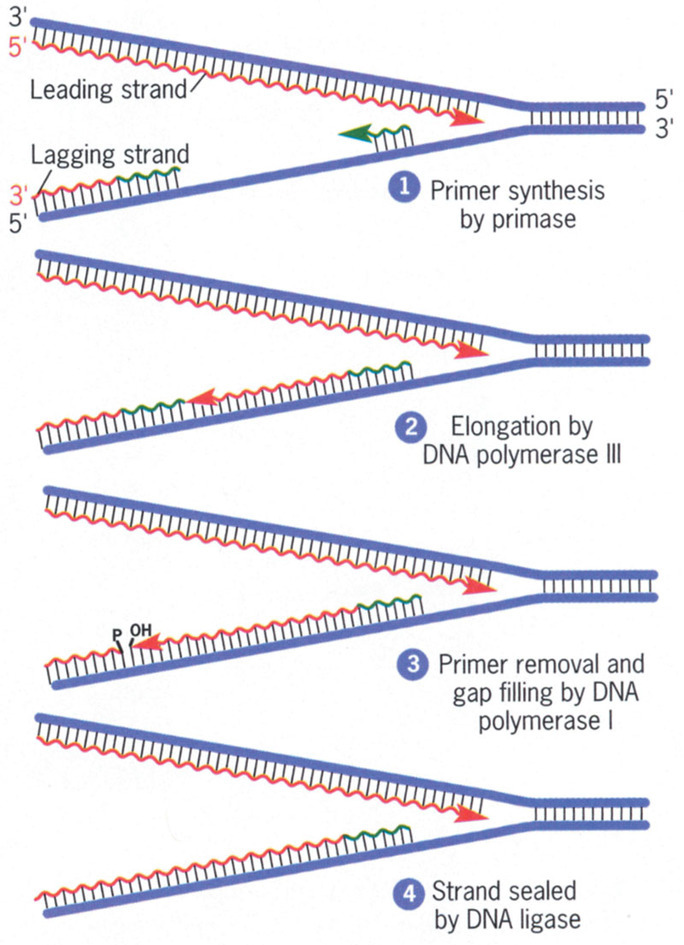

---

\note {
90 min

}

# 21.3 遗传信息流是从DNA到RNA到蛋白质

## 21.3.1 蛋白质是表型特征的分子基础

* 1909年, A. Garrod尿黑酸症
    * 黑色尿(性状) --- 酶 --- 基因
* 1940年代, George Beadle和Edward Taturm
    * 一个基因一个酶
    * 一个基因一条多肽

---

: 粗糙脉孢菌3种精氨酸依赖型

|突变型|生长所需氨基酸|
|:---:|:---:|
|1 | 精氨酸或瓜氨酸或鸟氨酸 |
|2 | 精氨酸或瓜氨酸 |
|3 | 精氨酸 |

\begin{tikzpicture}[node distance=1cm, auto,]
  %nodes
  \node[punkt] (0) {前体};
  \node[punkt, right=1.2cm of 0] (1) {鸟氨酸};
  \node[punkt, right=1.2cm of 1] (2) {瓜氨酸};
  \node[punkt, right=1.2cm of 2] (3) {精氨酸};

  \path
    (0) edge [pil, right] node[auto, align=center] {酶I\\(\textit{arg1})} (1)
    (1) edge [pil, right] node[auto, align=center] {酶II\\(\textit{arg2})} (2)
    (2) edge [pil, right] node[auto, align=center] {酶III\\(\textit{arg3})} (3);
\end{tikzpicture}

## 21.3.2 DNA与蛋白质的合成

1. RNA的结构与功能
    * 与DNA相比较, 其结构特点:
        * 单链
        * 戊糖是核糖
        * 尿嘧啶代替胸腺嘧啶
    * 功能
        * 信使RNA (mRNA)
        * 核糖体RNA (rRNA)
        * 转运RNA (tRNA)
        * ...

\note{
已经发现多达10余种的RNA

}

---

---

2. 转录 --- 从DNA到RNA
    * 以DNA为模板, 通过RNA聚合酶使碱基互补配对合成RNA的过程.
    * 过程: 转录启始, 延伸和终止.

---

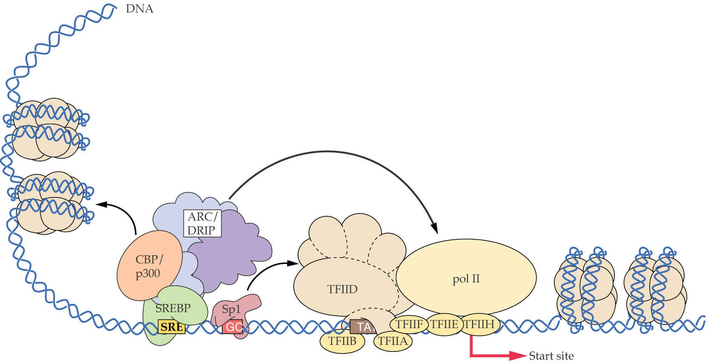

---

---

3. 遗传密码
    * 三联体密码子
    * 密码是连续的
    * 密码的简并性

---

---

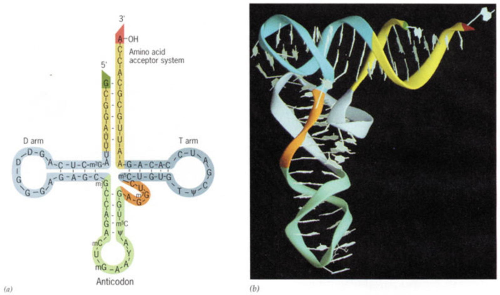

---

---

## 21.3.3 遗传信息在细胞质中被翻译

1. tRNA携带氨基酸
2. 核糖体"阅读"密码子, 氨基酸连成多肽
    * 核糖体
    * 翻译的起始和连接
    * 翻译的终止

---

---

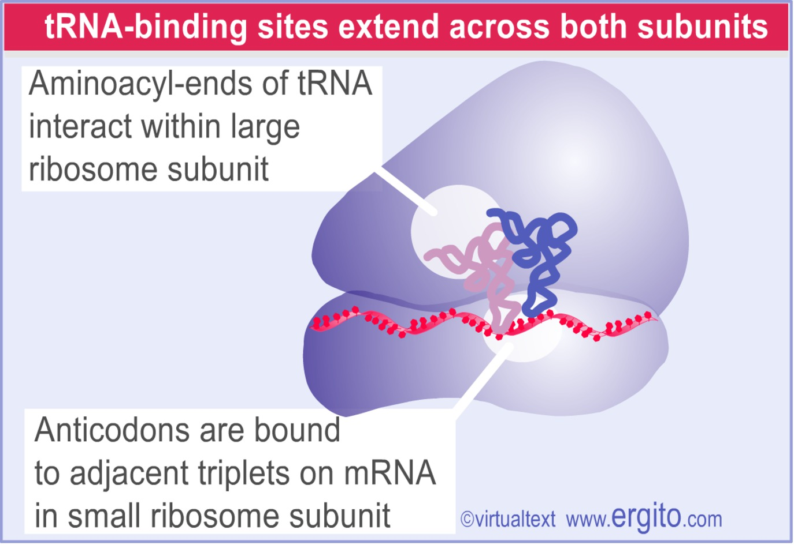

---

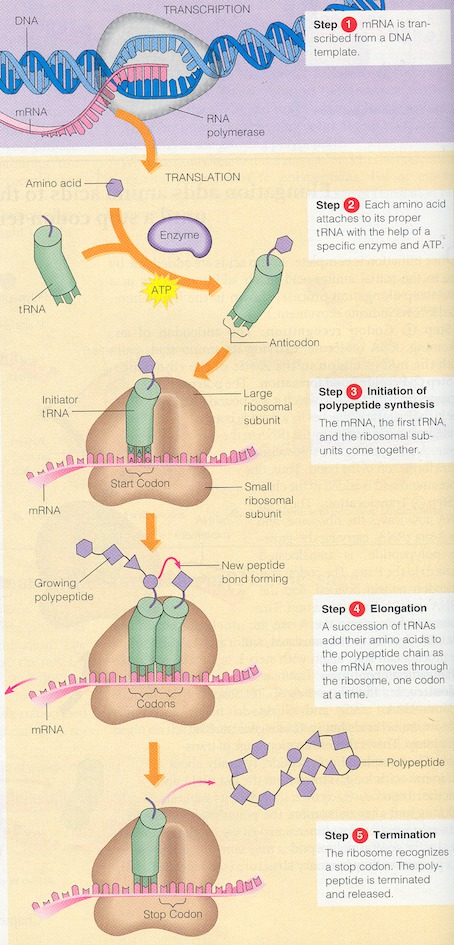

---

## 21.3.4 中心法则

1. 遗传信息从DNA到RNA到蛋白质

\begin{tikzpicture}[node distance=1cm, auto,]
  %nodes
  \node[punkt] (dna) {DNA};
  \node[punkt, right=1.2cm of dna] (rna) {RNA};
  \node[punkt, right=1.2cm of rna] (pro) {PROTEIN};

  \path
    (dna) edge [pil, loop left] node[auto, align=center] {复制} (dna)
          edge [pil, right] node[auto, align=center] {转录} (rna)
    (rna) edge [pil, right] node[auto, align=center] {翻译} (pro);
\end{tikzpicture}

---

\begin{tikzpicture}[node distance=1cm, auto,]
  %nodes
  \node[punkt] (pro) {PROTEIN};
  \node[punkt] (dna) [above left=0.8cm of pro] {DNA};
  \node[punkt] (rna) [above right=0.8cm of pro] {RNA};

  \path
    (dna) edge [pil, loop left] node {} (dna)
          edge [pil, right] node {} (rna)
          edge [pil, dashed, below] node {} (pro)
    (rna) edge [pil, loop right] node {} (rna)
          edge [pil, out=165, in=15] node {} (dna)
          edge [pil, below] node {} (pro);
\end{tikzpicture}

\note{
1. 反转录酶的发现
2. DNA翻译

}

---

2. 朊粒与中心法则
    * 新型克-雅氏病(nv-CJD), 库鲁病(Kuru), 牛海绵状脑病(BSE), 羊摩擦症(scrapie）
    * 朊粒(prion)
    * *PrP*
    * PrP\textsuperscript{c}, PrP\textsuperscript{sc}

# 21.4 基因突变

## 21.4.1 碱基置换

* 置换(substitution)
    * 转换(transition)
    * 颠换(transversion)
* 镰刀形贫血症(GAG $\rightarrow$ GUG)

---

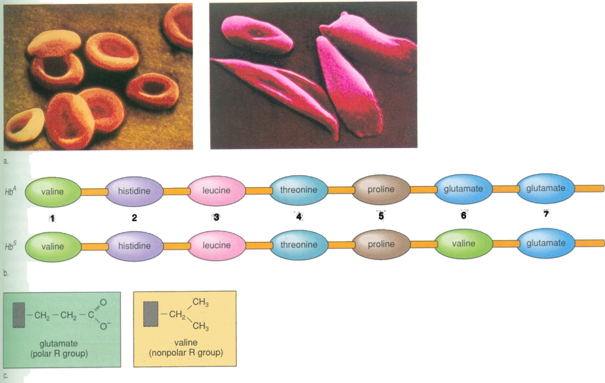

## 21.4.2 移码突变

* 插入(insertion)
* 缺失(deletion)
* 基因的编码区非3的倍数, 称为移码突变

## 21.4.3 DNA损伤修复

* 突变的诱发
    * 辐射
    * 化学诱变剂
    * 其他诱变因素
        * 温度
        * DNA修复系统发生错误
* 损伤修复
    * 切除修复
    * 同源重组修复

---

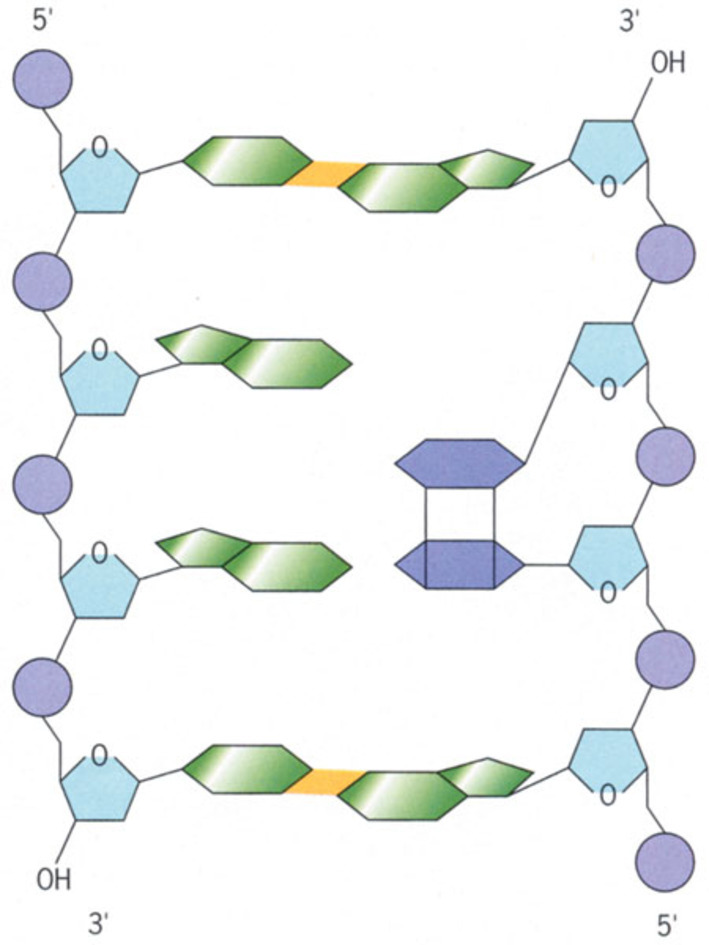

\note{
A pyrimidine dimer that has formed within a DNA duplex following UV irradiation.

}
