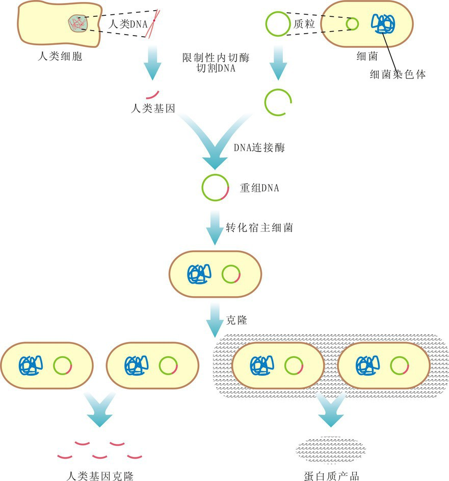
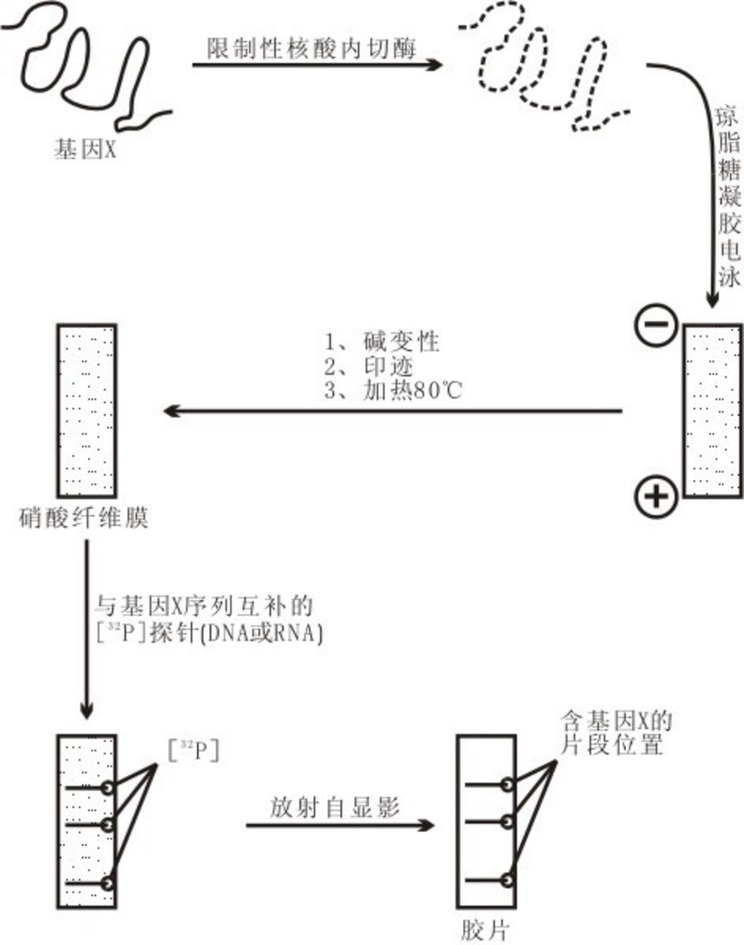
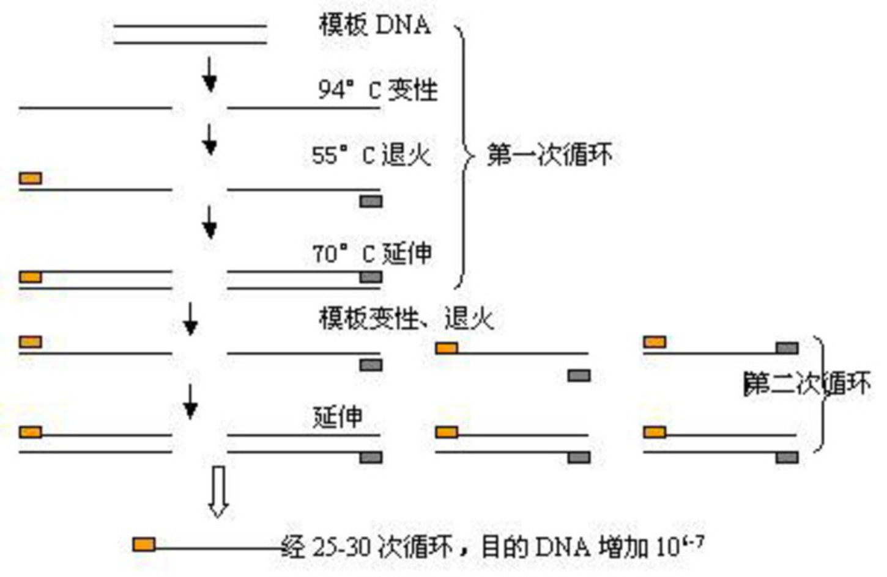
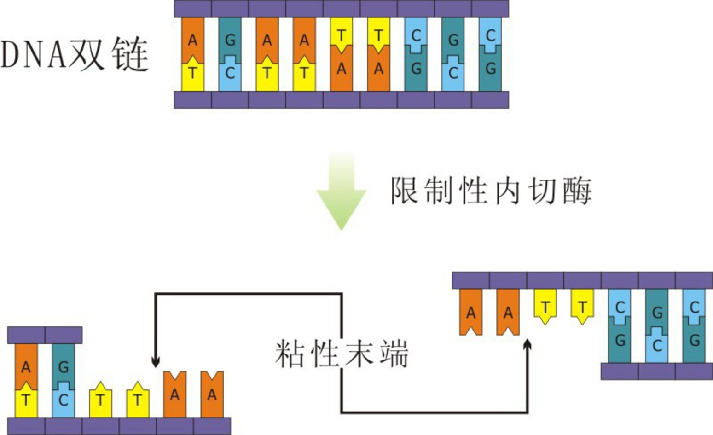
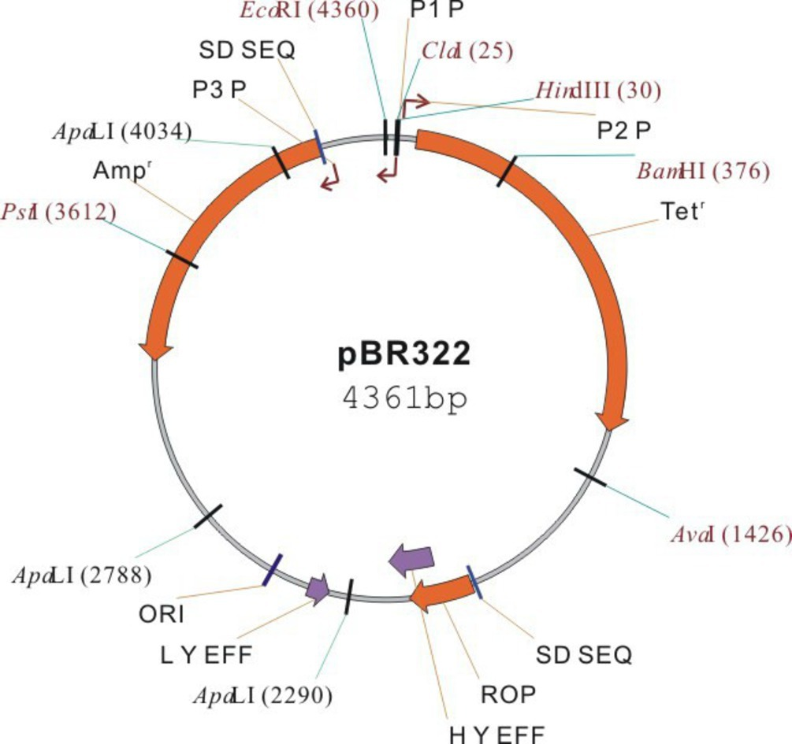
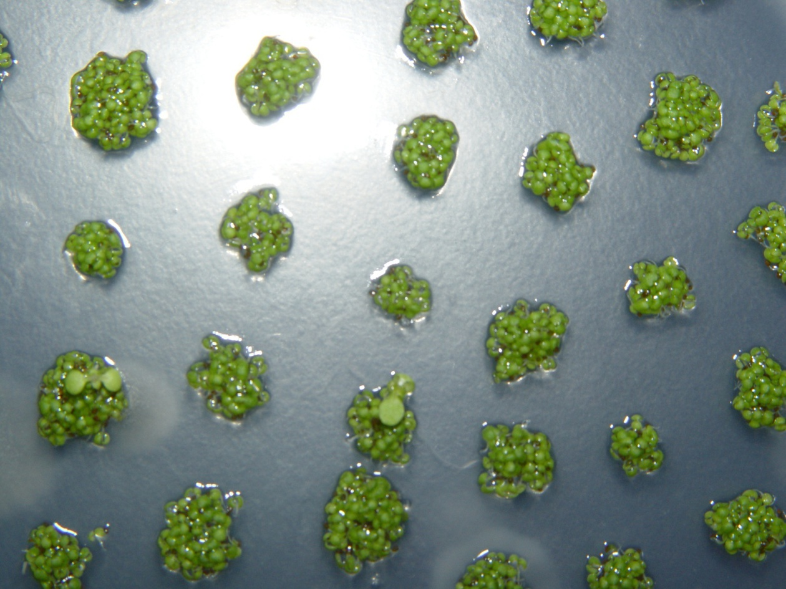
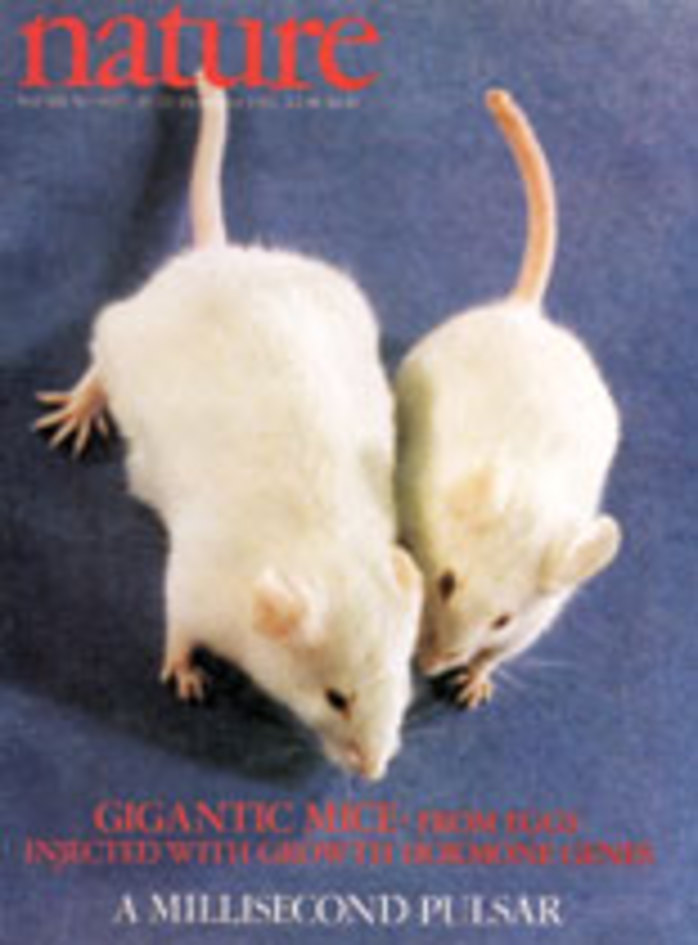
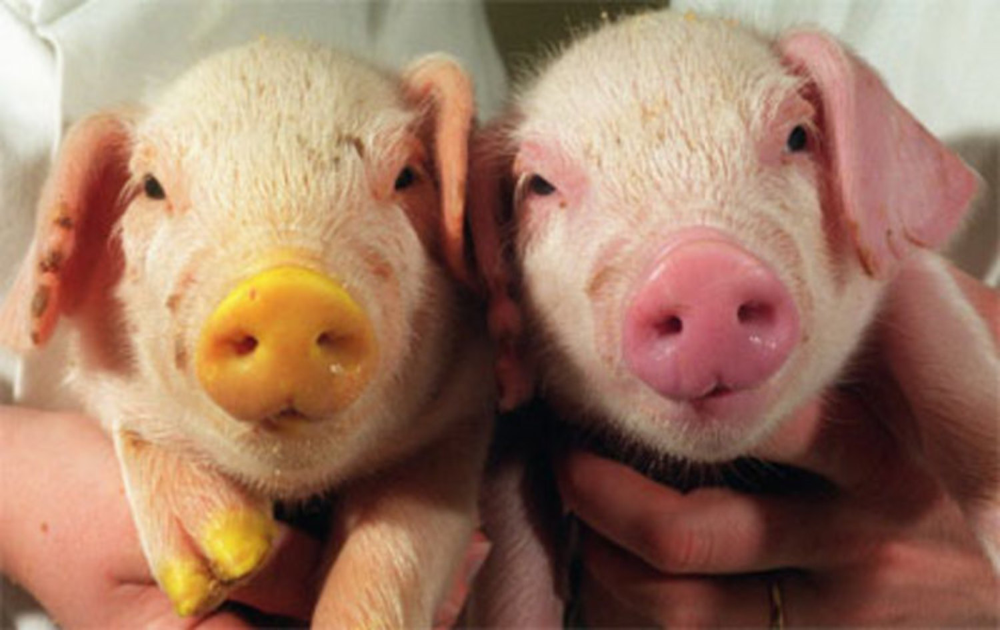
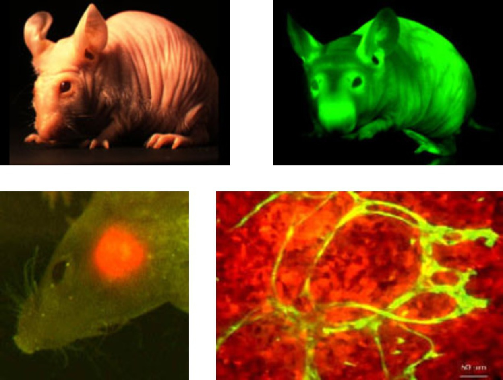
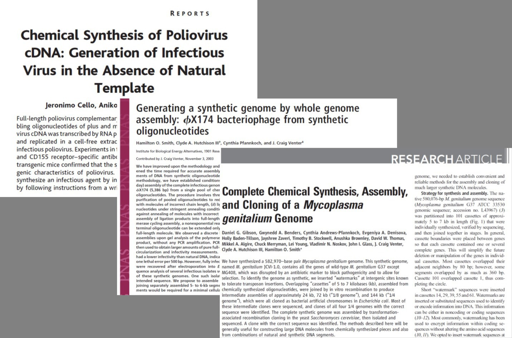

* 重组DNA技术, 也称基因工程或遗传工程.
* 基因工程是指将特定的基因(即外源基因), 通过载体或其它手段送入受体细胞,
使它们在受体细胞中与受体细胞的基因进行重组, 并能增殖表达, 这样的一种遗传学操作.
* 基因工程的目的: 通过与优良性状相关的基因的重组, 获得具有高度应用价值的新物种或新产品.

---

基因工程的优点

* 克服物种间的屏障;
* 有目的, 有计划, 有选择地加工制造各种生物制品;
* 遗传育种, 医学等研究和开发.

---

# 23.1 基因工程的相关技术

## 1. DNA的变性与复性

* DNA变性: 较高温度解链成单链.
* DNA复性: 变性的DNA逐渐冷却, 分离的两条单链$\rightarrow$双链的DNA.
    * 短链容易精确复性, 长链复性较难.
* 杂交分子: 碱基序列大部分互补, 可以复性.
    * DNA与RNA之间, 也一样.

\note{
第二版的节名为 23.1.1 核酸的分子杂交

}

---

2. 分子探针寻找特定基因
3. Southern印迹和Northern印迹
    * Southern印迹可以检测特定的DNA序列.
    * Northern印迹可以检测特定基因的表达情况.

---

## 4. 原位杂交

可以检测特定细胞中某一基因的表达情况.

---

---

\note{
Pachetene stage germ cells stained using FISH. Red, DAPI; Green, 5S rDNA FISH (Annette Chan and Barbara Meyer).

}

## 5. 聚合酶链反应

1. PCR技术的基本原理. PCR反应过程:
    * 双链DNA变性($90\text{--}95\,^{\circ}\mathrm{C}$)成为单链DNA;
    * 引物复性($37\text{--}60\,^{\circ}\mathrm{C}$)同单链DNA互补序列结合;
    * DNA聚合酶催化($70\text{--}75\,^{\circ}\mathrm{C}$)使引物延伸.

---

---

2. Taq DNA聚合酶
3. 寡核苷酸引物
4. PCR技术的应用

---

---

# 23.2 基因工程主要的工具酶

## 23.2.1 限制性内切核酸酶

1. 限制性内切酶的作用
    * 识别DNA中特定核苷酸序列, 使每条链的一个磷酸二酯键断开.
2. 限制性内切酶的类型
    * I型
    * II型 $\rightarrow$ 基因工程
    * III型
3. 限制性内切酶的命名
    * 根据来源命名.
    * 如\textit{Eco}RI $\rightarrow$ 大肠杆菌(*E. coli*), R株系, 第一种.

---

4. 限制性内切酶的识别序列
    * 能识别的特定核苷酸序列
    * 4--8个碱基对组成, 且碱基互补对称
    * 只写单链的核苷酸序列
5. 限制性内切酶的切割位点
    * II型酶切割位点在识别序列区内

---

6. 切割片段的末端
    * 粘性末端: 两条链末端交错对称.
        * $5^{\prime}$粘性末端
        * $3^{\prime}$粘性末端
    * 平头末端: 两条链末端平齐.

---

## 23.2.2 DNA连接酶

催化\ce{-PO4}和\ce{-OH}形成磷酸二酯键

1.  *E. coli* DNA连接酶
    * 大肠杆菌基因组编码;
    * 连接具互补粘性末端的DNA片段.
2. T4 DNA连接酶
    * T4噬菌体DNA编码;
    * 既连接具互补粘性末端的DNA片段, 也能连接平头末端.

## 23.2.3 反转录酶

* 从反转录病毒中制备得到的.
* 该酶能以具有\ce{$3^{\prime}$-OH}的DNA或RNA为引物, 以mRNA为模板从$5^{\prime} \rightarrow 3^{\prime}$聚合生成cDNA.

# 23.3 基因克隆的质粒载体

---

基因载体, 运送外源DNA片段进入受体细胞.

三个条件:

* 有插入位点
* 能在受体细胞内复制
* 有筛选标记基因

## 质粒

1. 存在于细菌, 蓝藻, 绿藻, 真菌等.
2. 染色体外裸露环状双链DNA分子, 小的不足1500bp, 大的100kb以上.
3. 宿主细胞内能自主复制. 松弛型和严紧型复制质粒. 选用分子小和松弛型复制的质粒.

## 质粒载体pBR322

1. 有复制起始点, 能在受体细胞内复制;
2. 有2种筛选标记基因;
3. 有允许外源DNA插入的位点;
4. 有高的拷贝数.

---

# 23.4 重组DNA的基本步骤

## 23.4.1 获得目的基因

1. 限制性内切酶酶切产生待克隆的DNA片段
2. 人工合成DNA
3. 反转录酶酶促合成法
    * cDNA
4. PCR扩增特定的基因片段

## 23.4.2 DNA分子的体外重组

酶切和连接.

## 23.4.3 引入宿主细胞和筛选鉴定

1. 重组DNA引入宿主细胞
    * 原核生物细胞是很好的受体细胞
        * 容易摄取外界的DNA
        * 增殖快
        * 基因组简单
        * 便于培养和基因操作
    * 大肠杆菌, 蓝藻, 农杆菌等
2. 重组体克隆的筛选与鉴定

---

---

# 23.5 基因工程的应用及其成果简介

---

1. 生产新型疫苗
2. 生产人胰岛素
3. 生产人生长激素
4. 生产干扰素

\note{
基因工程$\alpha$干扰素, 人生长素, 人胰岛素, 乙肝疫苗, 红细胞生成素, 血纤维蛋白溶酶原激活剂(溶栓药)等.
基因工程农作物新品种也已在一些国家在大田种植, 如抗虫棉, 抗虫玉米, 耐储黄瓜等.

}

---

5. 动植物基因工程

* 转基因动物
    a. 模式动物
        * 模式动物可用来揭示生物学困难领域中的许多奥妙, 像人脑, 免疫系统和胚胎发育等.
        * 在试验遗传病的新疗法中, 模式动物也很有用.
        * 癌鼠, 转基因猴.

---

\note{
1982

10 weeks

44g vs 29g

}

---

\begin{figure}
    \begin{minipage}[b]{.3\linewidth}
        \includegraphics{ch-23.images/image13.jpg}
        \subcaption{下村修}
    \end{minipage}
    \hfill
    \begin{minipage}[b]{.3\linewidth}
        \includegraphics{ch-23.images/image14.jpg}
        \subcaption{马丁·沙尔菲}
    \end{minipage}
    \hfill
    \begin{minipage}[b]{.3\linewidth}
        \includegraphics{ch-23.images/image15.jpg}
        \subcaption{钱永健}
    \end{minipage}
    \caption{2008年诺贝尔化学奖, 绿色荧光蛋白(GFP)}
\end{figure}

\note{
Osamu Shimomura
Martin Chalfie
Roger Y. Tsien

钱学森的堂侄, 台湾长大.

}

---

\note{
A San Diego beach scene drawn with an eight color palette of bacterial colonies expressing fluorescent proteins derived from GFP and the red-fluorescent coral protein dsRed. The colors include BFP, mTFP1, Emerald, Citrine, mOrange, mApple, mCherry and mGrape. Artwork by Nathan Shaner, photography by Paul Steinbach, created in the lab of Roger Tsien in 2006.

}

---

\note{
Transgenic YFP piggy (left) and "normal" little piggy. (Photo courtesy of Missouri University Extension and Agricultural Information)

}

---

---

* 转基因动物
    b. 生物反应器动物
        * 生物反应器动物: 利用其乳腺分泌药用蛋白质来制药的转基因动物.
        * 羊$\beta$-乳球蛋白启动子, $\alpha$-抗胰蛋白酶.
    b. 供体动物
        * 英国科学家在1992年12月成功培育出转基因猪, 其心脏带有人类的成分; 猪心脏来代替人心脏用于移植手术.

---

* 转基因植物
    a. 抗虫植物
        * 苏云金杆菌, 毒蛋白.
    b. 抗除草剂植物
        * 草甘磷是一种广谱除草剂. 它的靶位点在叶绿体中的EPSP合成酶. 由于阻断芳香族氨基酸的合成, 植物最终会死亡.
    c. 改良药用植物
        * 日本科学家用重组DNA技术提高了镇静药莨莞碱合成的效率.
    d. 生产疫苗的植物
        * 土豆生产疫苗.

\note{
抗病, 抗虫, 抗除草剂, 抗逆, 作物的高产优质, 果蔬储存, 作物的固氮能力, 药物生产及环境美化等.

细菌中分离到的一个突变株有EPSP合成酶突变基因. 此基因抗草甘磷, 引入此基因后, 已得到抗性植物.
这样施用草甘磷, 可杀死除转基因植物外的所有植物.

}

---

6. 基因诊断和基因治疗
    * 1990年, 首例应用基因治疗, 治愈一名四岁女孩的腺苷脱氨酶缺乏症. 采用逆转录病毒转移腺苷脱氨酶基因.
    * 基因治疗基因: 单基因疾病基因
        * 导致腺苷脱氨酶缺乏症,镰刀形贫血病等; 肿瘤抑制物基因和肿瘤形成基因等.
    * 腺病毒, 脂质体和单疱疹病毒等
        * 囊性纤维化病, 帕金森氏病, 爱滋病和癌症.

---

# 23.6 遗传工程的风险和伦理学问题

---

1. 对人的影响
    * 超级细菌
    * 对宗教, 习俗和生活方式的影响.
2. 对环境的影响
    * 转基因的逃逸
    * 超级细菌
    * 超级杂草
    * 对生物多样性的影响
3. 严格的释放规定
    * 生物安全实验室规则

\note{
用抗菌素抗性基因整合的转基因食品的利用,遭到一部分人的反对. 因为人们担心以后会有太多的抗抗菌素生物产生, 甚至产生无法对付的超级病菌.

利用抗除草剂基因筛选的办法, 也由于人们担心会产生超级杂草, 而遇到类似的情况.

}

---

罗马教廷公布``新七宗罪''

* 滥用药物
* 有道德争议的科学实验
* 环境污染
* 制造贫困
* 社会不平等和不公义
* 基因改造
* 大肆聚敛财富

\note{
傲慢、嫉妒、暴怒、懒惰、贪婪、色欲、暴食。
}
