## 例子: 持久性的害虫

* 1960s, 疟疾每年杀死约3百万人, WHO发起DDT灭蚊运动: 开始时成效显著, 不久以失败告终.
* 过去数十年中, 这种情况已发生数十次;
* 自化学杀虫剂1940s开始广泛使用后, 已记录到>500种抗药性昆虫.
* 原因何在? ---遗传, 变异与演化

\note{

严复翻译了英国生物学家赫胥黎(Thomas Henry Huxley)的《天演论》

}

---

* 对生物演化的了解是对生物学每个领域(从微观到宏观)所必备的基础知识,
  演化生物学的应用正改变着医学, 农学, 生物技术和保护生物学等众多领域;
* 演化整合了全部生物学, 它是贯穿本课程的主线;
* 本篇各章论述演化及其机制的特点, 并追踪地球上的生命史.

\note{

生命的统一性和多样性这一双重特性划定了现代生物学的范围.

杜布赞斯基, 俄国出生的美国生物学家, 现代综合进化论的奠基人之一.

Nothing in Biology Makes Sense Except in the Light of Evolution.

}

# 25.1 进化理论的创立: 历史和证据

---

* 生物演化的基本概念可追溯到2500年前的古希腊
    * 希腊哲学家阿那克西曼德 (Anaximander): 生命起源于水, 较简单生命形式出现于较复杂生命形式之前;
    * 希腊哲学家亚里士多德 (Aristotle): 物种不变, 永存, 并且不会出现新物种.
    * 亚里士多德的观点对西方文化教育有重大影响, 而犹太--基督文化又以对圣经中创世纪的字面解释强调了这一概念.

\note{

阿那克西曼德认为, 人类是从海鱼生出来的

亚里士多德多方面的贡献

}

---

\note{

拉斐尔 (1483--1520) 名画《雅典学院》

}

---

* 神创论:
    * Special creation: 生物在某一时刻一次被创造出来的, 一旦形成就永远不变了.
    * Continuous creation: 生物是被一次又一次地创造出来, 因此, 地球上的物种是有变化的.
* 进化的思想: 即一个物种是从另一个物种演化而来的思想.

\note{

阿奎那跟从亚里士多德的哲学方法论, 要建构一种兼具信仰与理性的知识体系, 自然神学.

神学也不是固步自封的, 它也随着时代而进步. 但它的证据要远远少于科学.

年轻地球创造论者主要是极端保守的犹太教徒或福音派, 基要派基督徒.
他们视《创世纪》里面的记载为准确史实或者起码是绝对无误的客观记述.

这种观点有别于其他派别创造论的特别之处在于, 它相信地球形成年代距今并不久远,
约在6000至10000年前, 地球是年轻的(与之比较, 当前科学普遍认同的地球的年龄有45亿年),
此"年龄"主要根据《圣经·创世纪》里面的谱系和其他章节的记载推算而来.

该推算传承了爱尔兰总主教詹姆斯·阿什尔(1581--1656)的计算系统,
阿什尔曾算出上帝创世的准确时间在公元前4004年.

}

## 25.1.1 达尔文是进化理论的主要创立者

\begin{columns}[onlytextwidth]
    \column{0.6\textwidth}
        \begin{itemize}
            \item 在达尔文以前, 法国的博物学家布丰, 拉马克和英国的 E. Darwin (C. Darwin的祖父) 都考虑过生物进化的可能性, 但提不出令人信服的证据.
            \item 1859年 ``Origin of Species'' 使生物学摆脱了神学的羁绊, 创立了生物演化理论 --- 生物学的一个重要的统一理论.
        \end{itemize}
    \column{0.4\textwidth}
        \begin{figure}
            \includegraphics{ch-25.images/image24.jpg}
            \caption{G.L. de Buffon, 1707--1788}
        \end{figure}
\end{columns}

\note{

布丰不相信地球像《创世记》所讲的那样只有6000年历史, 他估计地球的历史至少是7万年;
在未发表的著作中, 他估计地球的年龄是50万年. 地层累积的速度.

布丰 自然史

}

---

\begin{columns}[onlytextwidth]
    \column{0.6\textwidth}
        \begin{itemize}
            \item 拉马克, 第一个坚定的进化论者
            \item 发现软体动物(从早期化石到第三纪化石再到现存生物标本)排列成连续的种系序列.
            \item 由此得出结论: 许多动物种系经历了缓慢而逐渐的变化.
        \end{itemize}
    \column{0.4\textwidth}
        \begin{figure}
            \includegraphics{ch-25.images/image25.jpg}
            \caption{J.B. Lamarck, 1744--1829}
        \end{figure}
\end{columns}

---

* 拉马克认为生物演化有两个原因:
    * 自然 ``赋予动物生命不断使其结构复杂化的力量'';
    * 动物对环境中特殊条件反应的能力.
        * 行为引起的生理过程 (用进废退)
        * 获得性遗传
        * 上述两者结合, 推动了生物的演化
* 动物学哲学, Philosophie Zoologique, 1809, J. B. Lamarck

\note{

表观遗传

小鼠, 五代稳定遗传

}

---

\begin{figure}
    \begin{minipage}[b]{.48\linewidth}
        \includegraphics{ch-25.images/image22.jpg}
        \subcaption{Charles Darwin, 1809--1882}
    \end{minipage}
    \hfill
    \begin{minipage}[b]{.48\linewidth}
        \includegraphics{ch-25.images/image26.jpg}
        \subcaption{贝格尔号}
    \end{minipage}
\end{figure}

\note{

1831--1836年, 达尔文(22岁)乘 "Beagle" 军舰作了5年环球探险航行. 观察采集动, 植物和化石标本.

战列舰, 将大炮换成科学仪器

博物学, 自然神学

无薪博物学家

}

---

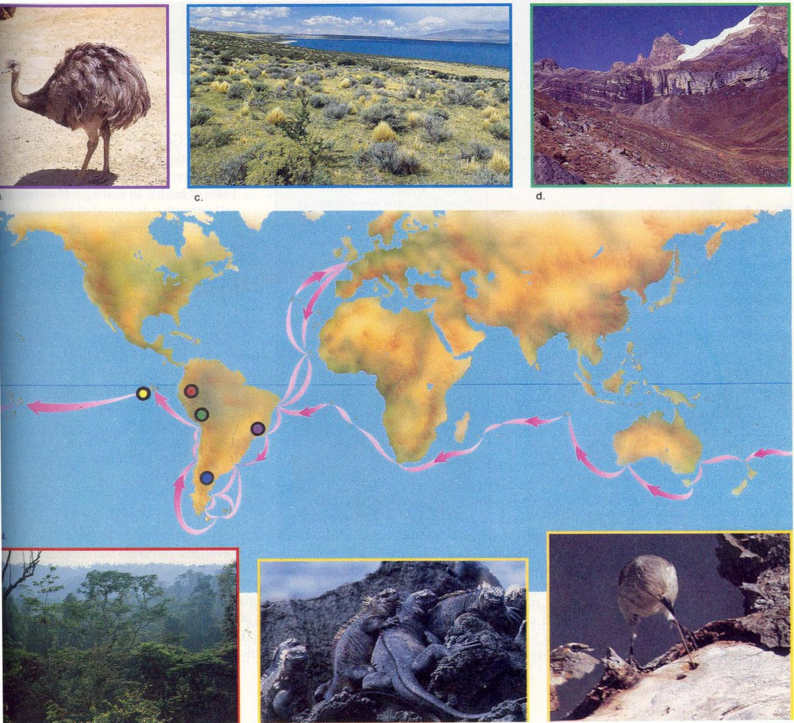

---

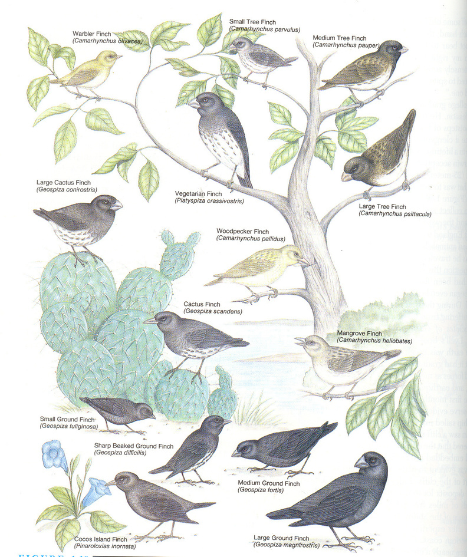

---

## Darwin看到的现象, 如何解释?

* 南美与非洲, 澳洲气候相似但动物区系差别很大;
* Galapagos群岛等岛屿上的动物区系与临近的南美大陆的动物区系很近,
  而与其他气候条件相似的岛屿(如非洲相应位置的佛德角群岛)的动物区系关系甚远;
* 与其他大陆相比, 南美大陆的化石与现生的南美物种更为相似.

---

* 从马尔萨斯 (Thomas Malthus)《人口论》得到启发: 生物虽繁殖力极强但数量稳定 $\rightarrow$ 原因: 食物有限
  $\rightarrow$ 生存竞争 $\rightarrow$ 适者生存, 不适者淘汰. 1844年前达尔文已整理好一篇含进化论主要论点的论文.

\note{

1, 2, 3, 4, 5

1, 2, 4, 8, 16

1, 1, 1, 1, 1

生存竞争并不太重要

}

---

* 1850’, 华莱士 (A.R. Wallace, 1823--1913) 通过在 Indonesia, Malaysia 的动植物考察提出了生物进化的见解.
  1858年6月达尔文收到了华莱士的信和论文手稿, 并转交 C.Lyell (1797--1875).
* 1858.7.1赖尔和胡克 (J.D. Hooker, 1817--1911) 在林奈学会公布了华莱士论文和达尔文1844年的论文摘要,
  1858.8.20两文在《会刊》出版.

---

* 1859年11月, 达尔文的《物种起源》(On the Origin Species by Means of Natural Selection) 出版,
  提出了生物进化的见解.

* Darwin《物种起源》提出了两个主要概念:
    * 从几个方面的证据令人信服地论证了现代物种是通过 ``有饰变的传代'' (descent with
      modification, 他对演化的说法), 并由一代代祖先发展而来;
    * 物种起源 (Origin Species), 即生物如何出现之学说
    * 该机制称为自然选择 (natural selection )

\note{

英文原版共6版

}

---

* 自然选择 (natural selection): 如果具有某种可遗传性状的个体能够比其他个体留下更多的后代,
  那么生物的种群就会一代一代地发生变化.
* 自然选择的结果就是演化性适应 (evolutionary adaptation), 既种群中适合于环境的性状出现的频率增加.
* 种群的遗传组成随时间而改变即为演化 (evolution)
* Darwin在进化论方面有很多贡献, 其中最重要的两个理论突破为:
    * 共同由来学说 (theory of common descent)
    * 自然选择学说 (theory of natural selection)

---

* 圣经旧约中说, 上帝在创造世界的第六天用泥土捏出第一个男人亚当 (Adam), 再用亚当的一个肋骨造出第一个女人夏娃 (Eve),
  而人类则是这两个人的后代.

* 走出非洲 (Out of Africa)

## 25.1.2 多重证据支持共同由来学说

地雀 (finch) 喙的形状和大小显示: Galapagos 群岛各岛屿上的不同地雀由来自南美大陆的共同祖先演变而来 $\rightarrow$
进而推断: 所有动(植)物有一个共同祖先, 所有生物有一个单一起源.

共同由来学说的提出和发展, 不仅仅是慎密而深入思考的产物, 而且得到大量证据的支持.

证据与推论:

---

## 1. Galapagos地雀(finch)与共同由来学说

(Evidence of evolution from biogeography )

问题:

1.  喙的差异从何而来?
2.  海岛上的特有生物, 其祖先是否来自临近大陆的迁移者?
3.  一个岛屿特有的物种和临近岛屿上非常相似而又不同的物种之间是否有关系?

\note{

1835年9月到10月间, 达尔文随皇家海军“贝格尔”号勘探船造访了加拉帕戈斯群岛.

在5周的停留时间里他和同伴游历了伊莎贝拉岛, 圣萨尔瓦多岛, 圣克里斯托巴尔岛和圣玛丽亚岛, 其间共采集了近70号“达尔文雀”标本.

}

---

## 问题1

Galapagos Islands的历史

* 由火山喷发形成
* 仅100万年历史
* 从未与大陆相连

---

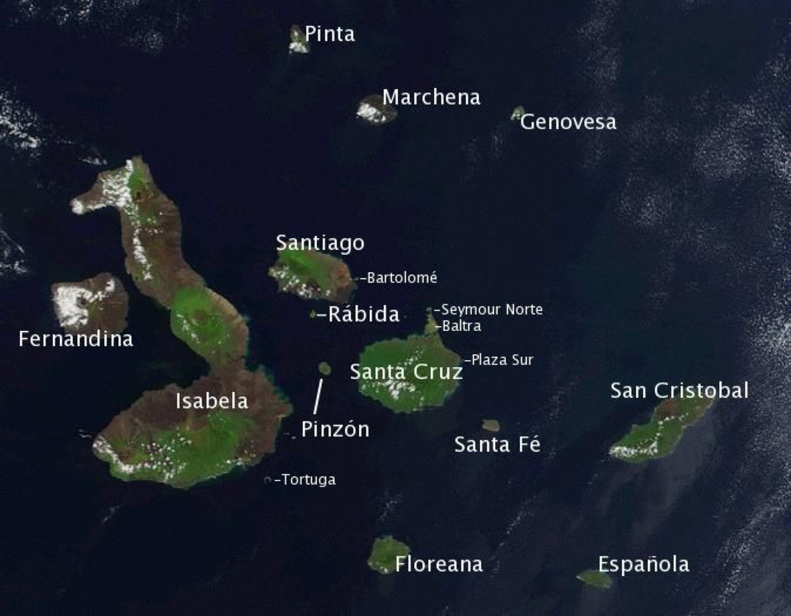

---

Galapagos Islands的生物

* 种类很少
* 特有物种比例高, 如13种地雀
* Galapagos finch间的主要区别:
    * 喙的形状和大小

---

\begin{figure}
    \includegraphics[height=0.75\textheight, keepaspectratio]{ch-25.images/finch.jpg}
    \caption{喙的形状和大小的差异}
\end{figure}

那么, Galapagos finch \alert{喙的差异从何而来?}

\note{

不同的喙适合取食不同的食物

那么, Galapagos finch 喙的差异从何而来?

}

## 问题2

南美, 非洲, 澳洲自然条件相似, 生物区系迥异, 分属不同生物地理区:

* Galapagos Islands 动物属南美大陆类型
* Cape verde (佛德角群岛, 临近非洲西海岸) 动物属非洲大陆类型

即: 自然条件相似的岛屿 (如 Galapagos Islands 与 cape verde 均为热带火山岛), 但生物区系关系甚远,
而与各自临近的大陆生物区系相似.

\alert{海岛上的特有生物, 其祖先是否来自临近大陆的迁移者?}

## 问题3

* Galapagos Islands 的嘲鸫 (mockingbird) 在群岛的不同岛之间有明显差异;
* C. Darwin 从中看出海岛与临近大陆间的动物关系以有趣的形式在群岛内部表现出来.

那么, \alert{一个岛屿独有的物种和临近岛屿上非常相似而又不同的物种之间有没有什么关系?}

共同由来学说能够很好解释上述现象

---

\begin{figure}
    \includegraphics{ch-25.images/image28.jpg}
\end{figure}

\note{

1977年, 一场始料未及的严重干旱降临到大达夫尼岛, 整个雨季降水量仅24 mm, 只相当于正常年份的1/5. 由于食物的匮乏,
当年岛上没有地雀繁殖. 而1976年标记的388只中地雀幼鸟里竟然仅有1只活到了1978年的繁殖季,
对于任何试图开展长期野外研究的人而言, 一下子失去了这么多研究对象无疑都是一场灾难,
然而格兰特和他的学生很快就发现这其实是个千载难逢的机会 (Birkhead et al 2014).

当干旱造成食物短缺时, 较小也较软的种子最先被消耗光, 导致那些没法取食较大较硬种子的个体被饿死. 由于喙型是可遗传的,
幸存下来的地雀就会将帮助它们熬过干旱的特征传给下一代, 而测量数据表明到了1979年中地雀喙的厚度确实增加了!
来到大达夫尼岛上仅仅6年时间, 格兰特就有幸见证了自然选择发生在中地雀上的一次鲜活案例.

}

---

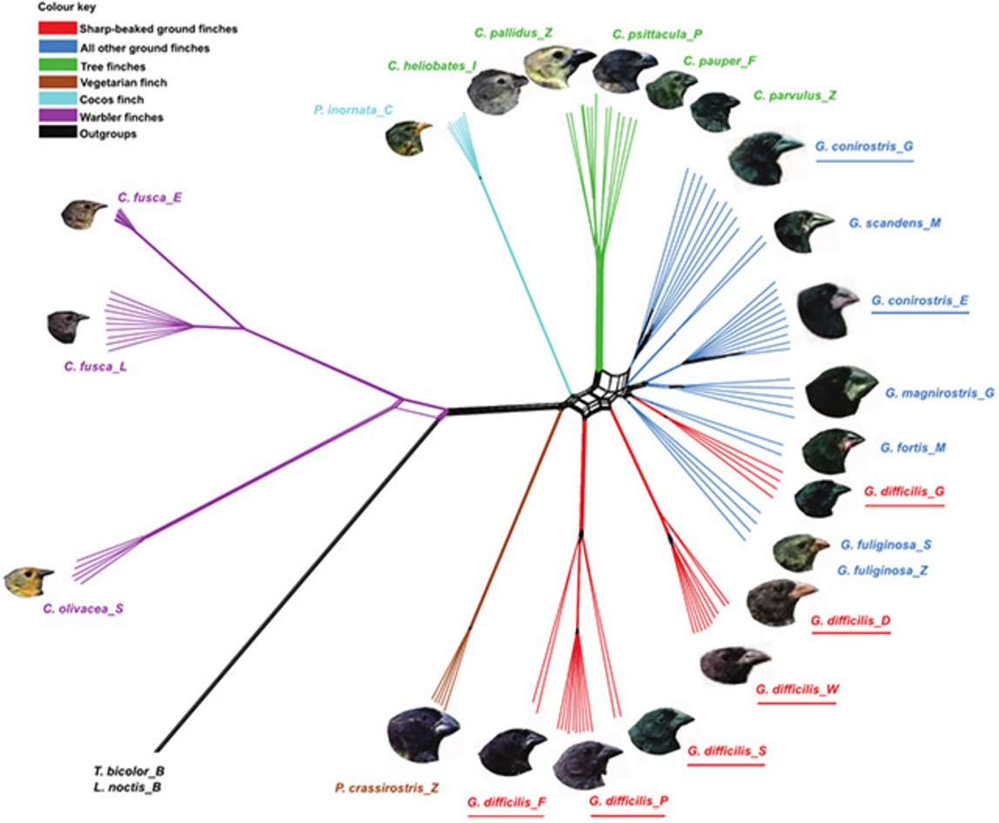

---

\begin{figure}
    \begin{minipage}[b]{.45\linewidth}
        \includegraphics{ch-25.images/image32.jpg}
        \subcaption{大彗星兰}
    \end{minipage}
    \hfill
    \begin{minipage}[b]{.45\linewidth}
        \includegraphics{ch-25.images/image33.jpg}
        \subcaption{马岛长喙天蛾}
    \end{minipage}
    \caption{达尔文的预言}
\end{figure}

\note{

大彗星兰 ~30cm

马岛长喙天蛾 (Xanthopan morgani)

协同进化, arm race

}

---

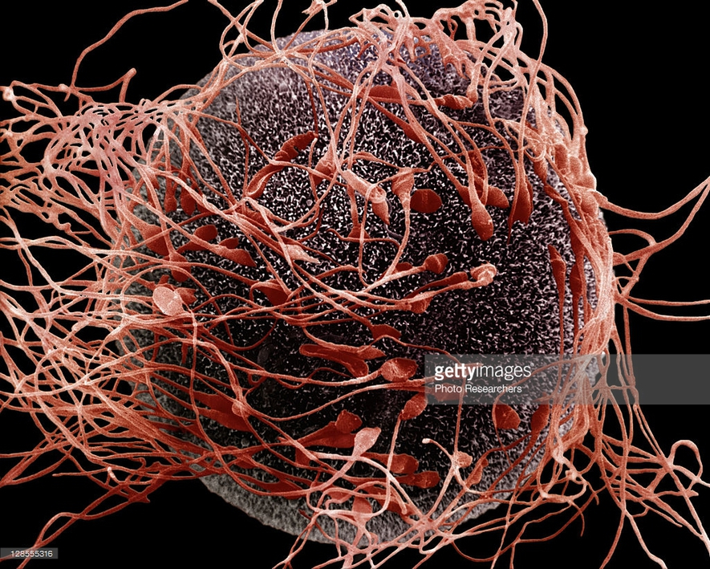

\note{

一大堆小精子争着钻进卵子中

多数性选择理论的构建都基于同一种遍在的模式——-雄性产生大量低投入的精子, 而雌性产生少量高投入的卵子.

}

---

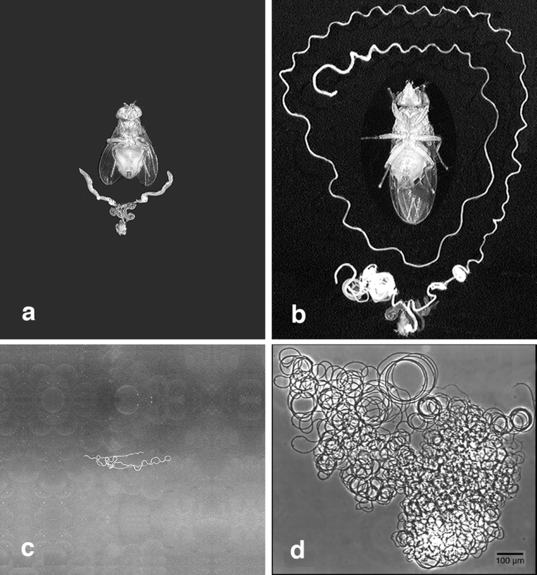

\note{

长达5.8厘米的精子

Drosophila arizonae (a, c) and D. bifurca (b, d)

让演化青睐这些'例外'的条件.

受性选择的雄性性状, 比如雄鹿的角、蜥蜴下颚垂皮等

雌性的性选择推动了精子的进化, 但我们不知道为什么雌性会有这样的偏爱.

一个可能的线索可能就藏在雌性果蝇贮存精子的纳精囊上. 这是一种可以长期保存精子的器官,
雌性可以决定何时从中取出精子完成受精.

“其实, 在大部分体内受精的物种中, 雌性都有长期储存精子的器官, 哺乳类是为数不多的例外之一.
只有一些雌性蝙蝠具备让精子活力维持数月的能力. ”

皮特尼克告诉科学人, “储精器官最大的好处在于,
雌性可以借助它控制何时何地产出后代——它把授精和受精的两个阶段分隔开来了.
她们还可以选择是否保存不同雄性的精子, 再通过各种手段控制产下其中谁的后代. ”

研究者发现：雌性果蝇的纳精囊的长度与精子的长度在演化上存在一个显著的正相关性,
也就是说随着纳精囊的进化变长, 精子也逐渐变长, 反之亦然. 两者可能是彼此促进,
协同进化的关系.

另一项很有趣的结果在于, 纳精囊的长度与雌性进行交配的频率是负相关的,
也就是说有了越多的精子储备时, 雌性就越不会去进行新的交配活动. 在这种趋势下,
巨大精子既能凭借体型优势去排挤那些个头小的对手,
又可能通过尽可能多地“占地方”而减少外来竞争. 这样一来,
巨大精子对雄性来说就成了值得的投资.

这些结果共同提出了一个解释：果蝇的巨大精子,
是在精子长度、雌性纳精囊特征及果蝇交配系统这三者的相互关系的驱使下, 发生协同进化的结果.

}

## 2. 形态学的比较研究

* 比较解剖学(Comparative Anatomy)
    * 前肢骨骼
* 比较胚胎学(Comparative Embryology)
    * 所有脊椎动物都有一个彼此相似的早期胚胎发育阶段 $\rightarrow$ 由共同祖先进化而来的证据

\note{

形态学的比较研究为共同由来学说提供重要证据

}

---

## 3. 化石证据

雕齿兽, 犰狳; 始祖鸟; 人类.

生物进化的总趋势: 简单到复杂; 原核生物到真核生物; 单细胞生物到多细胞生物.

\note{

化石证据为共同由来学说和生物进化提供了直接的证据

}

---

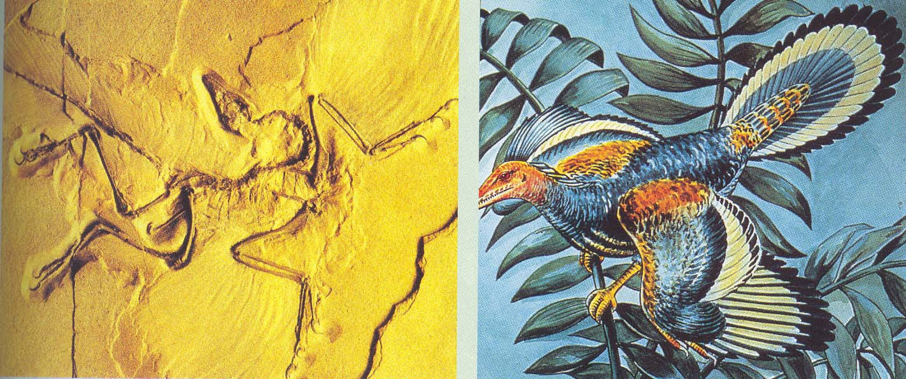

---

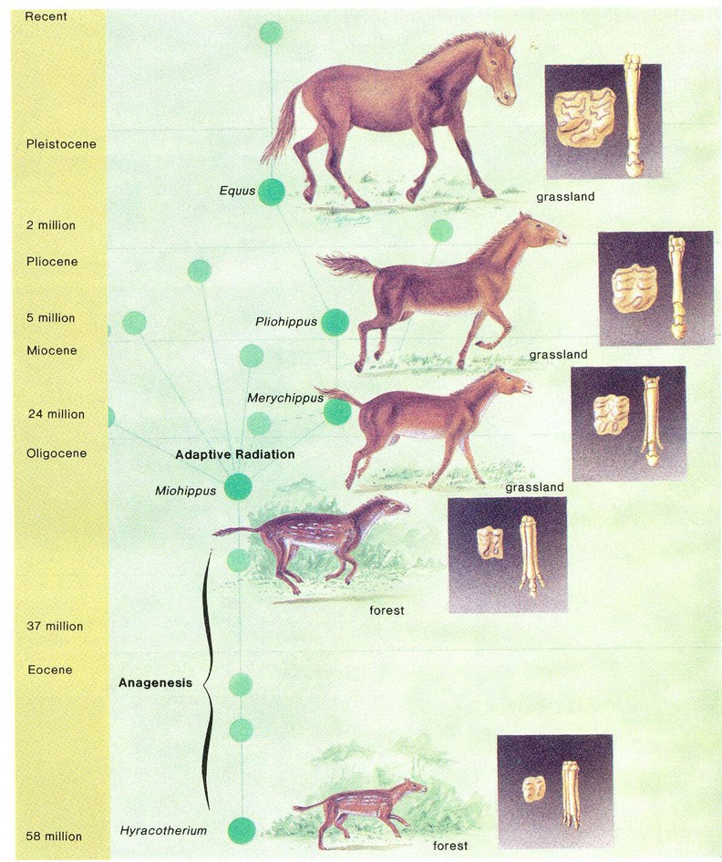

## 25.1.3 人工选择的效应

* 没有2个生物个体是完全相同的.
* 繁殖力极强 $\rightarrow$ 而数量稳定 $\rightarrow$ 食物有限 $\rightarrow$ 生存斗争 $\rightarrow$ 适者生存,
  不适者淘汰.
* 有"有益的"性状的个体获得更多的存活和生殖的机会.

\note{

人工选择的效应是自然选择的一个有用的佐证

}

---

* 达尔文学说中, 自然选择来自繁殖过剩和生存斗争.
* 而现代进化论将自然选择归结为不同基因型有差异的延续, 只要引起种群基因频率的改变, 都能导致进化, 可以没有生存斗争.

---

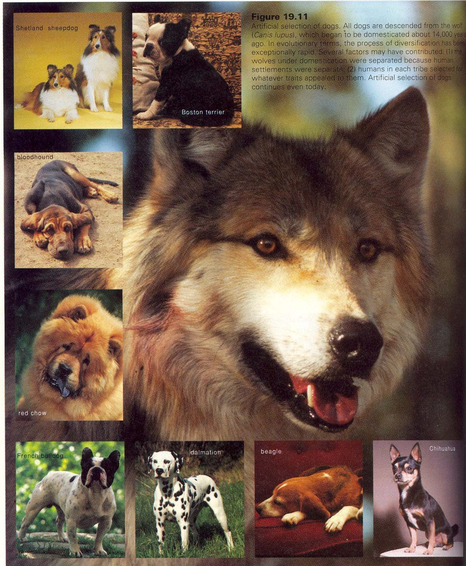

---

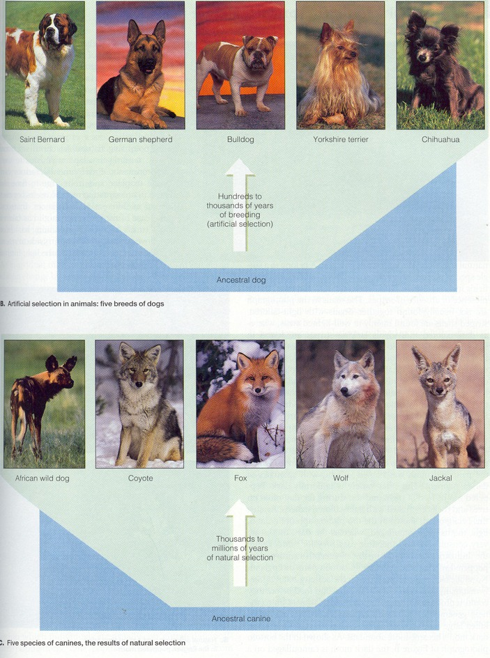

---

\begin{figure}
    \begin{minipage}[b]{.3\linewidth}
        \includegraphics{ch-25.images/image43.jpg}
        \subcaption{芸薹(油菜)}
    \end{minipage}
    \hfill
    \begin{minipage}[b]{.3\linewidth}
        \begin{minipage}[b]{1\linewidth}
            \includegraphics[height=0.35\textheight, keepaspectratio]{ch-25.images/image41.jpg}
            \subcaption{大白菜}
        \end{minipage}\\
        \vfill
        \begin{minipage}[b]{1\linewidth}
            \includegraphics[height=0.35\textheight, keepaspectratio]{ch-25.images/image40.jpg}
            \subcaption{小白菜}
        \end{minipage}
    \end{minipage}
    \hfill
    \begin{minipage}[b]{.3\linewidth}
        \begin{minipage}[b]{1\linewidth}
            \includegraphics[height=0.35\textheight, keepaspectratio]{ch-25.images/image42.jpg}
            \subcaption{芜菁}
        \end{minipage}\\
        \vfill
        \begin{minipage}[b]{1\linewidth}
            \includegraphics[height=0.35\textheight, keepaspectratio]{ch-25.images/image39.jpg}
            \subcaption{日本芜菁}
        \end{minipage}
    \end{minipage}
    \caption{人工选择, 植物的例子}
\end{figure}

\note{

Brassica rapa L.

Brassica rapa pekinensis

Brassica rapa chinensis

Brassica rapa subsp. rapa

Brassica rapa nipposinica

}

# 25.2 生物的微进化

---

微进化
:   物种内群体遗传结构发生的变化. 椒花蛾.

宏进化
:   物种及物种以上的分类群是如何演变的. 化石记录, DNA比较.

## 25.2.1 群休是生物微观进化的基本单位

群体
:   在一定的地域中, 一个物种的全体成员构成一个种群.

* 群体的主要特征是群体内的雌雄个体能通过有性生殖而实现基因的交流.
    * 一个湖泊中所有鲤鱼或田螺就是一个群体.

---

\note{

2008, 奥运火炬传递, 深圳

}

---

基因库
:   一个群体全部个体所带有的全部基因的总和就是一个基因库.

基因频率, 群体遗传结构

* 生物的进化都是群体或种群的进化, 个体是谈不上进化的. 个体总是要死的, 而群体能通过繁殖而延续.

## 25.2.2 理想群体的Hardy--Weinberg平衡

1918年, Hardy (英, 数学家) 和 Weinberg (德, 医生) 分别提出基因频率稳定性的见解.

一个有性生殖的自然群体中, 在符合以下5个条件的情况下, 保持着基因平衡:

1. 种群足够大;
2. 和其他群体完全隔离, 没有基因交流;
3. 没有突变发生;
4. 交配是随机的; 
5. 没有自然选择.

---

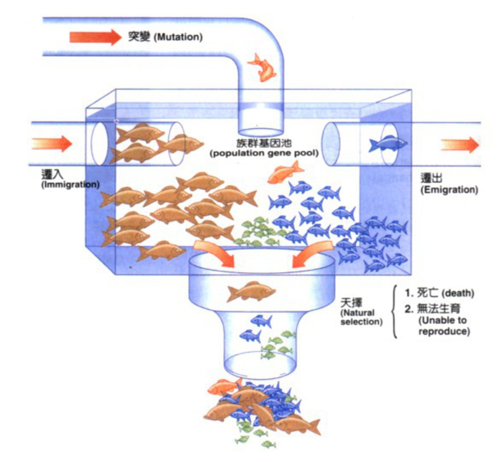

\note{

在自然条件下, 哈迪--温伯格定律所需的五个条件是难以满足的, 因而基因频率总是要发生改变,
也就是说进化在任何群体中都是必然要发生的.

}

## 25.2.3 5种因素导致群体遗传结构的变化

* 遗传漂变
    * 基因频率在小群体里随机增减的现象.
    * 如某一个基因的频率为0.02, 则在100万个体, 有2万个个体有此基因;
      但如只有50个个体, 那么仅有1个含此基因.
    * 偶然死亡或没有机会和异性个体交配, 则在F1代中该基因消失, 仅剩纯合子个体.

* 基因流
    * 种群间往往存在不同程度的基因流动

* 突变
    * 突变是随机的, 无方向性, 仅是选择的材料, 如突变被选择的话, 基因频率就增加.

---

* 非随机交配
    * 在动物中极常见. 在动物中还牵涉到行为, 与植物不同.

* 自然选择
    * 自然选择引起基因频率的改变

## 25.2.4 近交, 远交与杂种优势

# 25.3 自然选择

## 25.3.1 自然选择就是有差别的存活和生殖

选择压
:   在一定条件下, 一种等位基因在选择中的生存优势.

---

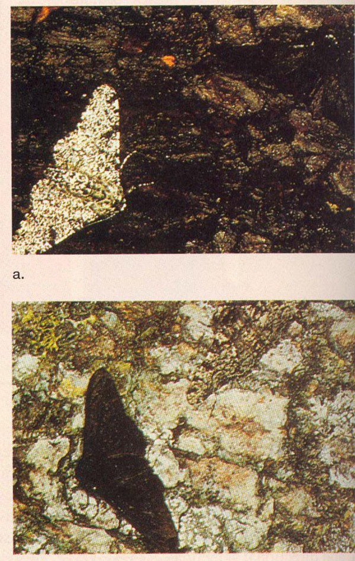

## 25.3.2 一因多效与选择压

选择压是相对的, 依环境而变. 在此条件下有利, 在另一条件可能不利. 

镰刀型贫血病与疟疾.

## 25.3.3 自然选择的靶子是整个生物体

* 任何基因型的适合度依赖于其他基因
* 在重组---选择的反复交替中产生新的遗传聚集

## 25.3.4 自然选择有三个主要模式

* 稳定性选择: 选择中间类型而淘汰两极端类型
    * 新生儿体重, 4.5--8.5 $\rightarrow$ 2--11; 六斤左右存活率最高.
* 定向选择: 选择了种群中的极端类型
    * 英国椒花蛾, 为带斑点的灰白色(与地衣相似).
    * 1845年, 发现第一只暗黑色的椒花蛾. 19世纪末, 则98%为暗黑色.
* 分裂选择: 淘汰中间类, 保持两极端类型. 该选择导致新物种的形成.
    * 海岛上的昆虫.

---

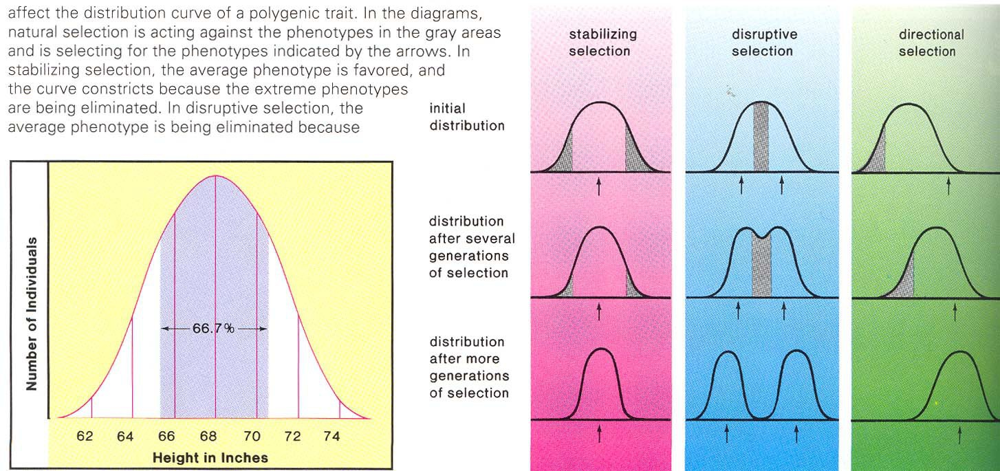

---

## 25.3.5 平行进化彰显自然选择的巨大作用

平行进化
:   两个或多个物种谱系, 因有大体相近的进化方向而分别独立地进化出相似的特征.

如有袋类, 真兽类间的相似特征.

---

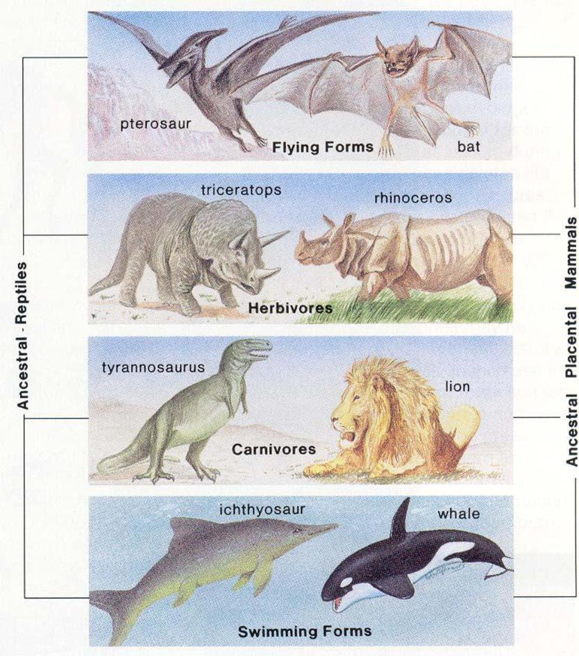

---

##  25.3.6 自然选择与复杂器官的演化

\note{

播放眼睛进化的视频

}

##  25.3.7 自然选择与造就完美生物的可能性
