什么是动物?

* 真核生物: 将动物与原核生物区分
* 多细胞: 将动物与原生生物区分
* 异养营养: 与植物和藻类区分
* 无细胞壁: 与真菌区分

---

动物的其他特征

* 吞食到体内消化管后消化吸收
* 能自由运动, 或至少生活史中有一个自由生活的阶段
* 有性生殖, 复杂的胚胎发育过程

---

* 动物的分类: 34 个门, 已知 150 万种

* 中国是世界上野生动物种类最多的国家之一, 仅脊椎动物就有 4400 多种, 占世界总数的 10% 以上. 

\note{

* 无脊椎动物主要类群的进化特征及代表种类

* 脊椎动物的主要特征及各纲特征

}

# 32.1 动物种系的发生

---

动物可能从一个共同祖先 --- 远古的共同祖先进化而来, 是一个单系群

* 动物的 5S 和 18S rRNA 相同
* 共有的其它生物大分子
* 都有相同的细胞外基质分子 (胶原蛋白等), 构成结缔组织, 形成上皮细胞的基膜

---

\begin{figure}
    \centering
        \includegraphics{ch-32.images/Opisthokonta.trans.pdf}
    \caption{后鞭毛生物}
\end{figure}

---

动物多样性进化的轮廓, 形态学上的划分依据

1. 是否具有真正的组织
2. 体型的对称性 --- 辐射对称和两侧对称
3. 体腔的出现增加了动物的复杂性
4. 分节的出现使真体腔动物又分出不同的类型
5. \alert{原口与后口的区分}

但是大都被近几年的分子与化石证据所\alert{否定}!

\note{

根据古动物化石, 比较解剖学和胚胎学证据及现代分子生物学方法

寒武纪早期

}

---

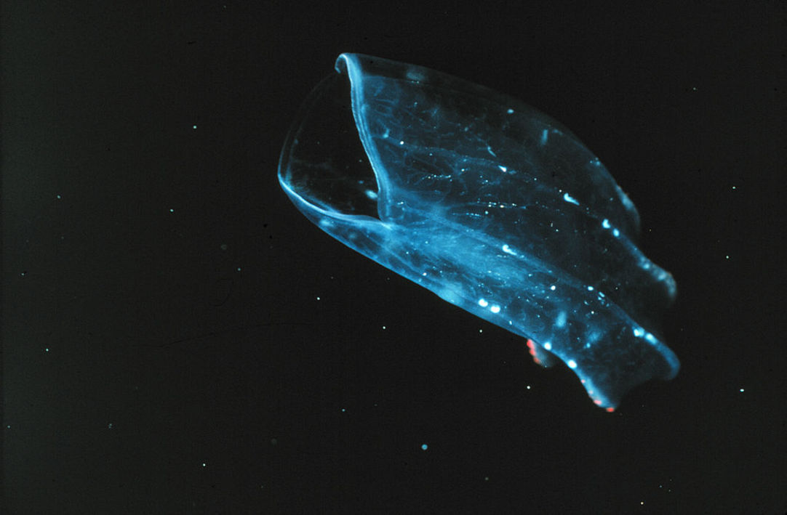

\note{

zhì

栉水母, Ctenophora, 属两侧对称动物, 原和刺胞动物一起分在腔肠动物门, 作为无刺胞亚门, 现分出. 

伞缘下延, 向内收缩, 致身体成球形, 卵圆形, 扁平形等, 体外具有栉板排列成纵行的纤毛带8条, 触手没有刺细胞;
身体\alert{左右对称}或呈辐射对称.

有组织: 三胚层  

新发现的早期栉水母具有刚性的顶辐板/辐条/棘刺等硬化骨骼构造, 原始的八辐射对称体制, 八对栉带及独特的辐翼/辐瓣/口裙构造.

骨骼系统不但可有效支撑躯体, 还有利于防御天敌, 推测为寒武纪大爆发时期巨大生存压力的演化产物.

2014年，遗传学家发现栉水母拥有神经系统，它们似乎忘记了自己的进化路径。

2019, 栉水母居然有肛门

Time intervals between repeated defecations in individual animals depended on body size, ranging
from ~10 min in small larvae to ~1 hr in large adults.

\url{https://tech.163.com/19/0517/07/EFC4PJ9I000999DH.html}

\url{https://onlinelibrary.wiley.com/doi/full/10.1111/ivb.12236}

}

---

\begin{figure}
    \centering
        \includegraphics{ch-32.images/animals-simple.trans.pdf}
    \caption{动物多样性的进化}
\end{figure}

\note{

Animal Phylogeny and Its Evolutionary Implications

Black dots denote clades that have broad consensus across studies. Red dots denote clades that have
poor or conflicting support or whose exact composition is uncertain.

}

# 32.2 无脊椎动物的多样性和进化

## 32.2.1 多孔动物

身体结构简单, 又称海绵动物

* 多细胞动物:  

* 身体由皮层, 胃层 (领鞭毛细胞) 和中胶层组成;
* 针状骨骼, 由胶原蛋白, 碳酸钙/二氧化硅组成

* 原始、低等的多细胞动物, **多细胞动物进化中的一个侧枝**. 

\note{

结构与机能的原始性: 具有与原生动物领鞭毛虫相同的领细胞, 有人认为它是与领鞭毛虫有关的群体原生动物. 

新的分类系统将多孔动物分成了两个门

}

---

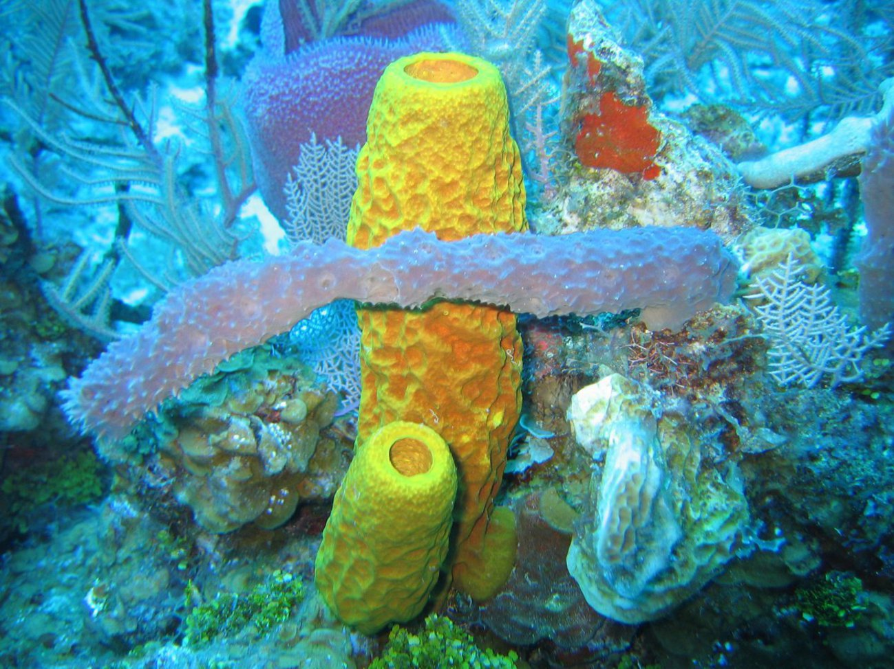

\note{

Sponge biodiversity and morphotypes at the lip the wall site in 60 feet of water.

Included are the yellow tube sponge, Aplysina fistularis, the purple vase sponge, Niphates
digitalis, the red encrusting sponge, Spiratrella coccinea, and the gray rope sponge, Callyspongia
sp. Caribbean Sea, Cayman Islands.

}

---

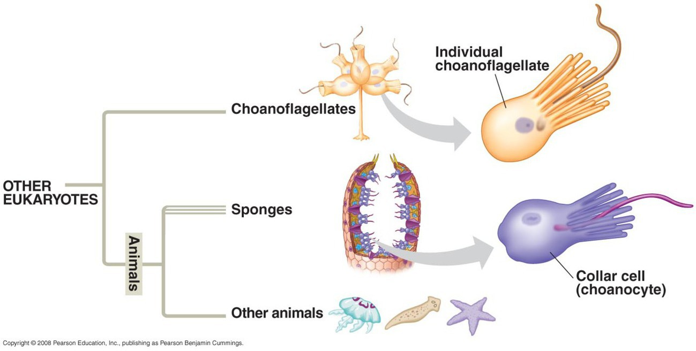

## 32.2.2 刺胞动物

两胚层辐射对称的动物

* 体型呈辐射对称: 
* 开始出现组织分化和简单的器官
* 体壁: 外, 内胚层, 中胶层
* 出现感觉器官, 有神经细胞和网状神经系统
* 水母, 珊瑚, 海葵都被归类为刺丝胞动物. 

\note{

绝大多海产, 少数淡水

* 水螅型 (圆桶型, 口向上)

* 水母型 (伞型, 口向下)

水螅型适应固着生活, 水母型适应漂浮生活, 身体可自由运动. 

}

---

\begin{figure}
    \begin{minipage}[b]{.4\linewidth}
        \includegraphics{ch-32.images/Hydra.jpg}
        \subcaption{固着生活}
    \end{minipage}
    \hfill
    \begin{minipage}[b]{.56\linewidth}
        \includegraphics{ch-32.images/image15.jpg}
        \subcaption{结构}
    \end{minipage}
    \caption{水螅}
\end{figure}

\note{

水螅一般很小, 只有几毫米

可以长生不老, 回到幼年状态再长回来

Hydra showing sessile behaviour

}

---

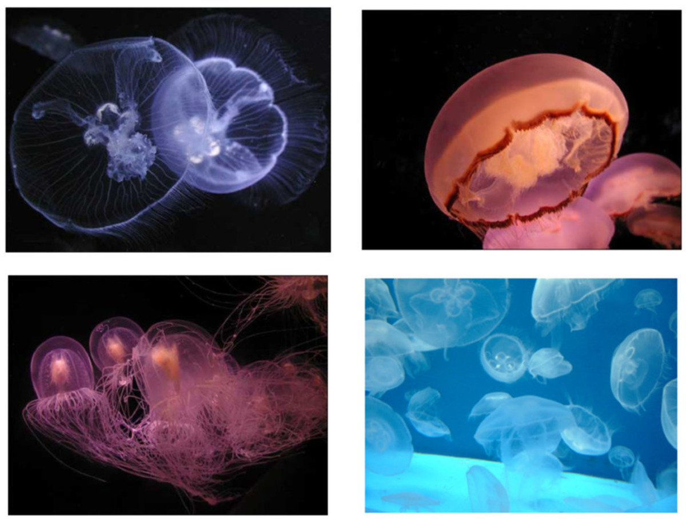

## 32.2.3 扁形动物

最简单的两侧对称动物, 三胚层无体腔

* 两侧对称: 适应自由生活; 
* 3个胚层: 外, 内, 中胚层; 
* 无体腔: 体壁, 消化管紧贴; 
* 身体出现器官系统
    * 消化系统, 包括口, 咽, 肠, 无肛门
    * 中枢神经系统
    * 感觉器官: 眼点, 耳突
* 背腹扁平 --- 故名;  

\note{

两侧对称使动物运动定向，机体各部分结构和机能分化: 出现明显的前、后、左、右、背、腹之分，背部司保护，腹部司运动，神经和感官向前方集中——机体的机能和效率明显提高。

出现中胚层的意义：
 引起组织、器官、系统的分化，为动物体结构的发展和各器官生理的复杂化提供必要条件，使动物达到器官系统水平。
 促进新陈代谢。中胚层形成复杂的肌肉层，增强运动机能，使动物有可能在更大范围内摄取更多食物；同时肠壁上的肌肉增强消化能力。

新陈代谢加强，产生的代谢废物增多，促进排泄系统的形成，开始有了原始的排泄系统——原肾管系统。
       运动机能提高，促进神经系统和感觉系统的进一步发展，成为较集中的梯形神经系统。

}

---

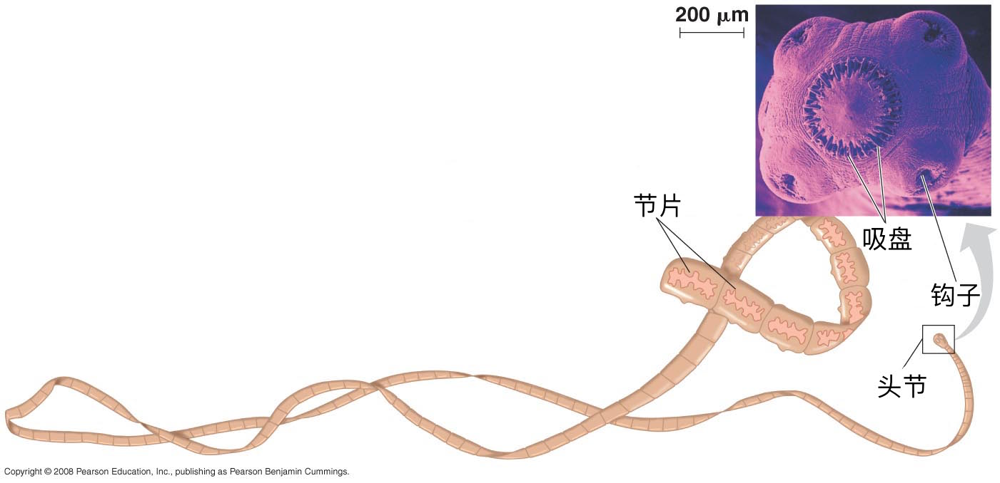

---

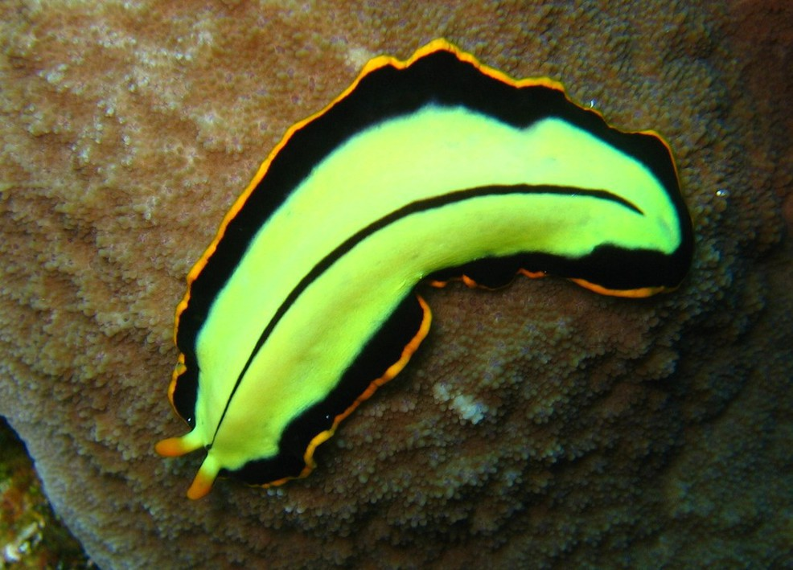

## 32.2.4 线虫动物

具有假体腔和完整消化管的动物

假体腔: 肠道与体壁之间有了空腔

* 体壁有中胚层形成的肌肉层, 运输能力加强
* 运输, 流动循环功能出现
* 有肛门的完全消化管, 消化能力加强
* 无循环系统和呼吸器官. 

蛔虫, 蛲虫, 钩虫, 旋毛虫等

\note{

图 32.2 体腔

}

---

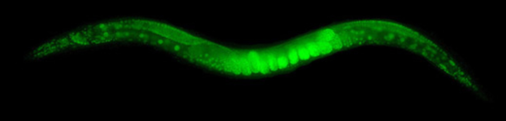

## 32.2.5 软体动物

出现真体腔的动物, 是动物界第二大门

1. 两侧对称 (螺类不对称)
2. 三个胚层, 不发达的真体腔
3. 中枢神经系统, 循环系统, 消化系统, 呼吸器官, 头部感官
4. 壳: 石灰质, 外套膜分泌
      * 多数: 1 个 (螺类); 2个 (蚌类)
      * 少数: 多个 (石鳖); 无壳 (蚰蜒)
      * 头足类: 内壳;

\note{

共约13万种, 5个纲. 大多数软体动物具有贝壳, 俗称“贝类”. 

鳖 biē

}

---

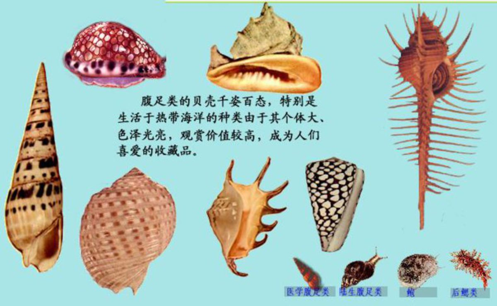

---

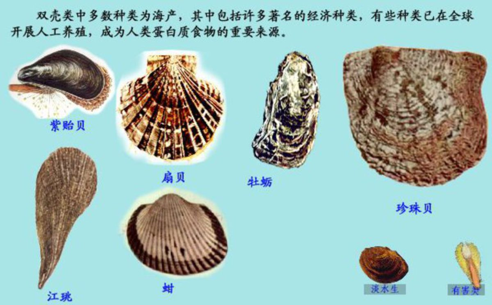

---

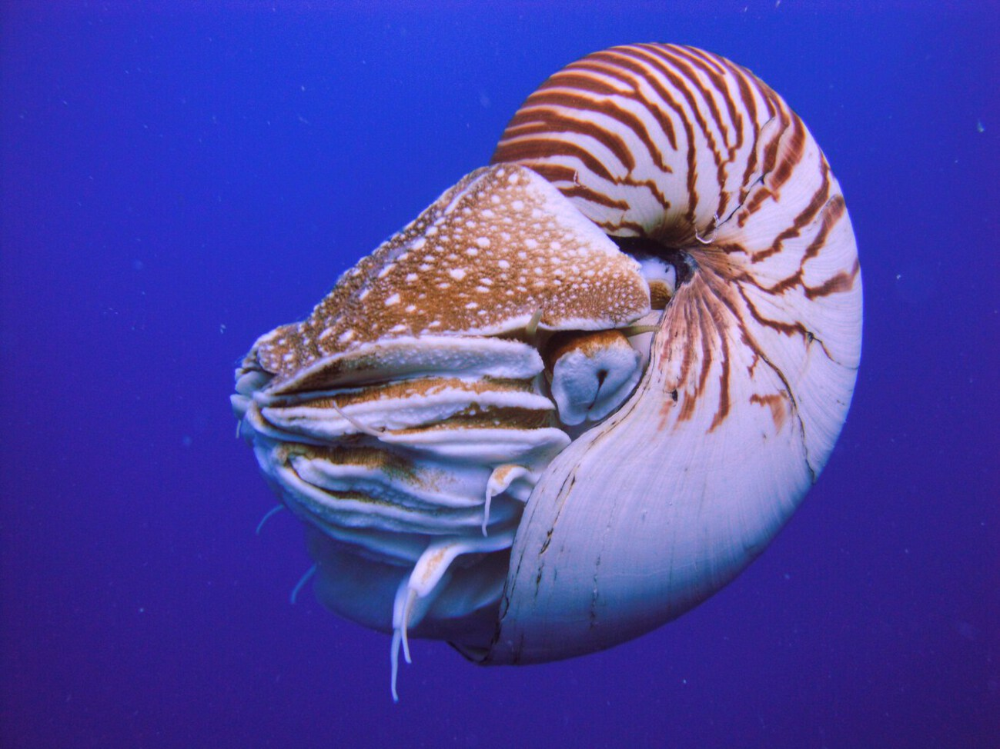

\note{

眼, 小孔成像

5亿年前，它们的祖先曾是海洋中最顶级的猎食者，彼时它们的体长足足有11米. “角石”（平壳鹦鹉螺，可以理解为直壳的鹦鹉螺）

会游泳的贝壳, 借由水流不断通过外套膜，然后经管状肌肉本身以及动物体膨胀而喷射，往后方推进，提供向前的动力

人类模仿鹦鹉螺排水，吸水的上浮、下沉方式，制造出了第一艘潜水艇——1954年，世界第一艘核潜艇“鹦鹉螺”号诞生。

}

---

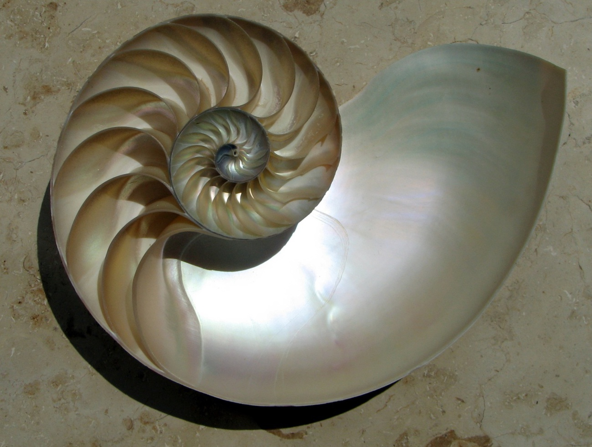

\note{

等角螺线, 等角螺线的臂的距离以几何级数递增

阿基米德螺线, 等速螺线, 当一点P沿动射线 OP 以等速率运动的同时，这射线又以等角速度绕点 O 旋转

鹦鹉螺的贝壳像等角螺线

菊的种子排列成等角螺线

鹰以等角螺线的方式接近它们的猎物

昆虫以等角螺线的方式接近光源

蜘蛛网的构造与等角螺线相似

旋涡星系的旋臂差不多是等角螺线。银河系的四大旋臂的倾斜度约为 12°。

低气压(热带气旋、温带气旋等)的外观像等角螺线
    
}

---

头足纲

* 四腮亚纲
    *  鹦鹉螺目
* 二腮亚纲
    * 八腕总目
        * 章鱼目
    * 十腕总目
        * 乌贼目
        * 枪形目

---

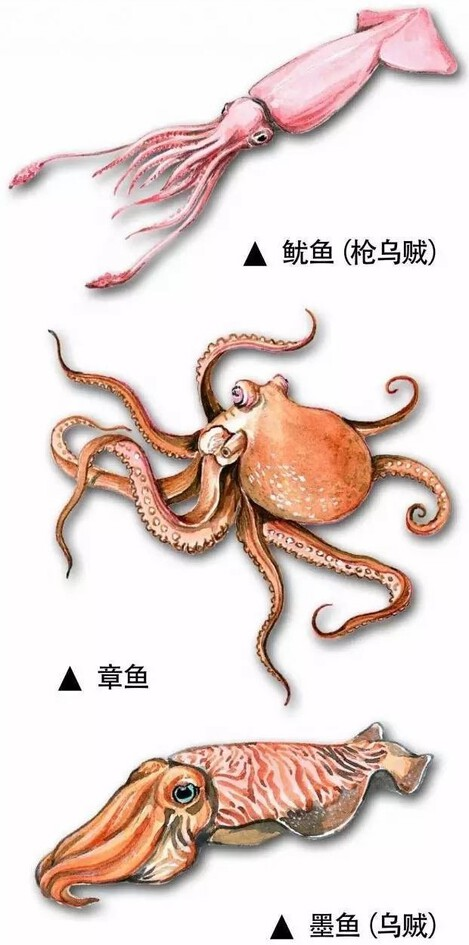

\note{

\url{https://zhuanlan.zhihu.com/p/21277695}

鱿鱼是锥形，章鱼是球形，墨鱼是袋形

章鱼属于八腕总目，有八条比较长的腕足，所以也经常被叫做八爪鱼；而鱿鱼和墨鱼属于十腕总目，拥有十只腕足，所以通过数脚就可以分辨它们和章鱼。

至于鱿鱼和墨鱼，有人认为会喷墨的是墨鱼，不会喷墨的是鱿鱼。事实上，鱿鱼的喷墨能力虽然不如墨鱼，但还是有墨囊在的。

墨鱼有一层内壳，为石灰质，学名为海螵鞘，一般称为墨鱼骨; 而鱿鱼的内壳薄而透明，尾部有一块类似塑料片一样的“骨头”;  
至于章鱼，内壳已经完全退化

}

## 32.2.6 环节动物

身体\alert{异律分节}的动物

* 两侧对称, 三胚层, 具发达的真体腔

* 身体开始分节 
    * 身体沿纵轴分成许多相似的体节, 称为分节现象
    * 同律分节: 除头外, 每节外形, 内脏相同
* 出现原始闭管式循环系统, 但无心脏

* 具有链索状神经系统

\note{

身体分节的意义: 体节的出现使动物运动更加灵活, 且不同部位的体节进一步出现功能上的分工, 对动物进化形成头, 胸,
腹和有关节的附肢等十分必要.

}

---

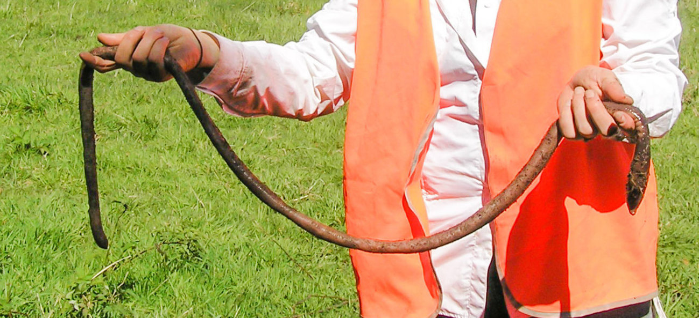

## 32.2.7 节肢动物

身体分节附肢也分节的动物

* \alert{异律分节}
* 节肢: 带关节的附肢, 口器, 触角和足
* 几丁质外骨骼, 蜕皮
* 呼吸: 鳃, 书鳃, 书肺, 气管

---

* 三叶虫纲
* 肢口纲: 鲎
* 蛛形纲: 蜘蛛
* 甲壳纲: 虾, 蟹
* 多足纲: 蜈蚣
* 昆虫纲: 蝗虫

\note{

鲎 hòu

}

## 32.2.8 棘皮动物

具有内骨骼和五辐对称的后口动物

棘皮动物属后口动物, 体型为辐射对称 (多为五辐射对称), 具内骨骼, 体腔发达, 体腔的一部分形成独有的水管系统, 另一部分形成围血系统.

---

* 原口动物: 绝大多数无脊椎动物; 
    * 胚孔 (原肠孔, 原口) $\rightarrow$ 成体的口;
* 后口动物: 棘皮, 脊索动物等; 
    * 胚孔 (原肠孔, 原口) $\rightarrow$ 成体肛门;

---

\begin{figure}
    \begin{minipage}[b]{.48\linewidth}
        \includegraphics{ch-32.images/SeaStar.jpg}
        \subcaption{海星}
    \end{minipage}
    \hfill
    \begin{minipage}[b]{.48\linewidth}
        \includegraphics{ch-32.images/SeaUrchin.jpg}
        \subcaption{海胆}
    \end{minipage}
    \hfill
    \begin{minipage}[b]{.48\linewidth}
        \includegraphics{ch-32.images/SeaCucumber.jpg}
        \subcaption{海参}
    \end{minipage}
    \hfill
    \begin{minipage}[b]{.48\linewidth}
        \includegraphics{ch-32.images/FeatherStar.jpg}
        \subcaption{海百合}
    \end{minipage}
\end{figure}

# 32.3 脊索动物的多样性和进化

## 32.3.1 脊索动物的特征

脊索动物属于脊索动物门, 动物界中最高等的门, 形态结构复杂, 生活方式多样; 

三大主要特征: 具有脊索, 背神经管和鳃裂. 

已知的脊索动物约有 70000 余种, 分别属于三个亚门: 

* 头索动物亚门
* 尾索动物亚门
* 脊椎动物亚门

---

1. 脊索: 位于身体背部, 消化道和神经管之间, 是一条支持身体纵轴, 柔软具弹性的结缔组织组成的棒状结构, 外被脊索鞘. 
2. 背神经管: 脊索动物神经系统的中枢部分呈管状, 位于身体的背中线上, 脊索 (或脊柱) 就在它的下面.
    * 高等种类中分化为脑和脊髓两部分. 
3. 鳃裂: 位于消化道前端的两侧壁上, 左右成对的裂孔直接或间接与外界相通, 又称咽鳃裂, 是一种呼吸器官. 
4. 次要特征: 尾在肛门之后, 闭管式循环系统, 心脏位于身体腹面.

---

## 32.3.2 低等脊索动物

无上下颌

* 头索动物
    脊索、背神经管和咽鳃裂这三个基本特征终生保留, 脊索前端超出神经管之前. 代表动物是文昌鱼.

* 尾索动物
    脊索和背神经管只存在于幼体, 脊索仅存尾部. 成体包围在被囊中，一般为雌雄同体, 异体受精. 代表动物如海鞘.
    
尾索动物和头索动物无真正的头和脑, 称无头类. 

---

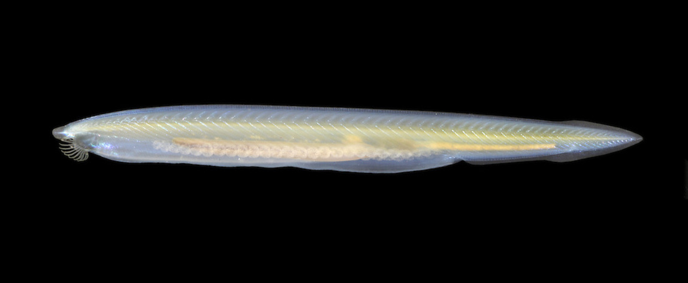

---

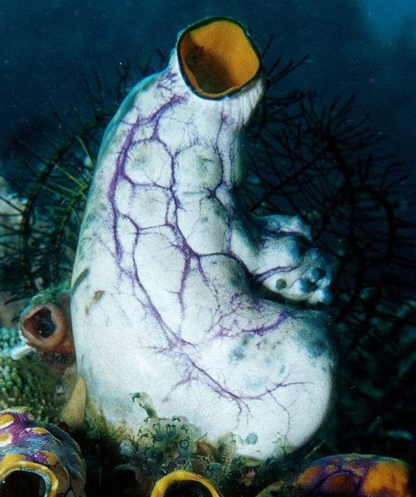

---

圆口纲: 脊椎动物中最低等, 最原始的类群, 没有上下颌, 又称无颌类. 

---

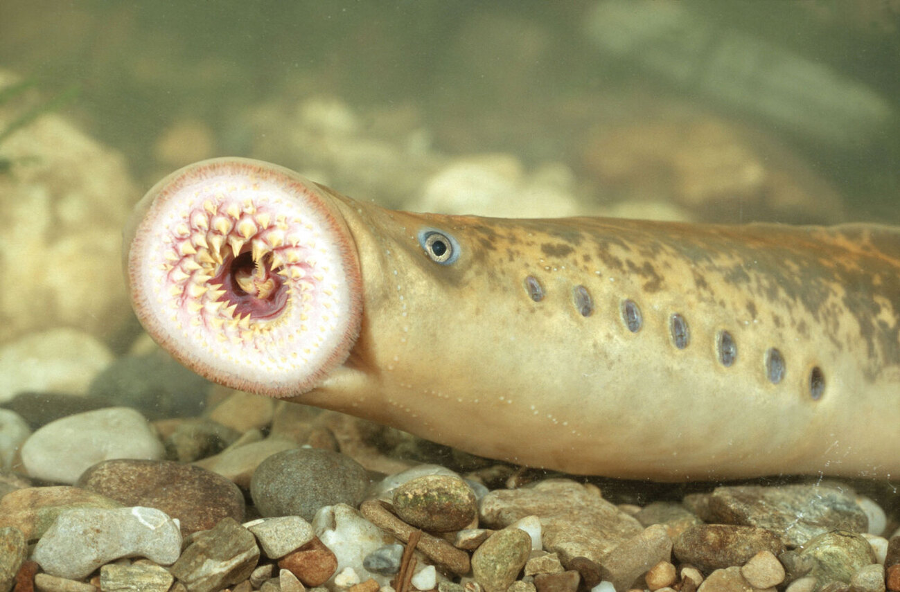

\note{

鳃鳗的得名，就是因为它们双眼后方各有7个鳃孔（曾被人误认为是8对眼睛，所以也有“八目鳗”之名）。

}

## 32.3.3 鱼类

有颌并适应水生生活

## 32.3.4 两栖动物

从水生向陆生转变的过渡动物

## 32.3.5 爬行动物

适应陆生生活的变温动物

## 32.3.6 鸟类

适应飞翔的恒温动物

## 32.3.7 哺乳动物

高等脊椎动物

---

: 脊椎动物特征

| 脊椎动物 | 生活习性 | 呼吸  |  体表   | 恒温 |    生殖受精    |
|:------:|:-------:|:----:|:------:|:---:|:------------:|
|  鱼类   |  水生   |  鳃   |  鳞片   |  否  | 卵生, 水中受精 |
|  两栖类  |  两栖   | 鳃/肺 |  裸露   |  否  | 卵生, 水中受精 |
|  爬行类  |  陆生   |  肺   | 鳞片/甲 |  否  | 卵生, 外有硬壳 |
|  鸟类   |  陆生   |  肺   | 被羽毛  |  是  | 卵生, 外有硬壳 |
|  哺乳类  |  陆生   |  肺   |  被毛   |  是  |   胎生, 哺乳   |

---

\begin{figure}
    \centering
        \includegraphics{ch-32.images/chordates.trans.pdf}
    \caption{脊索动物多样性的进化}
\end{figure}
