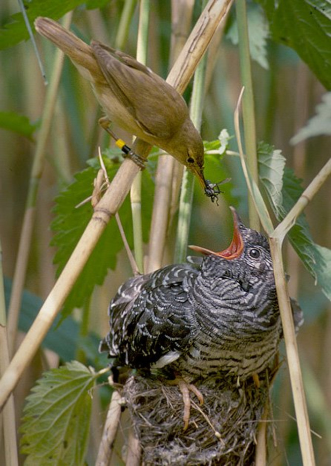
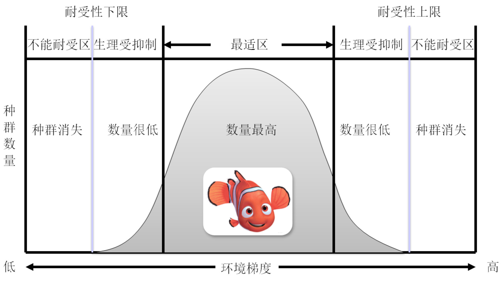
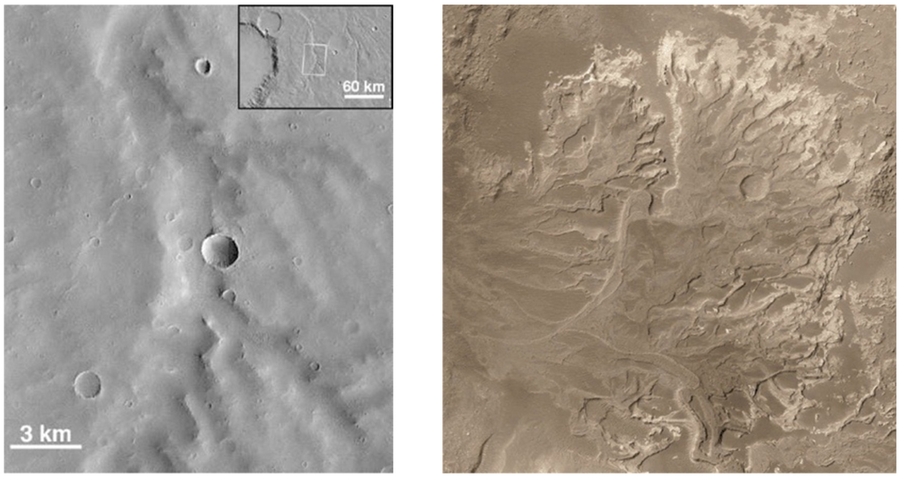
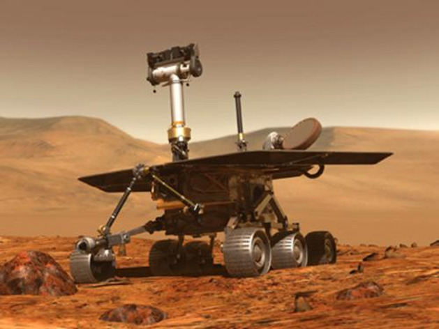
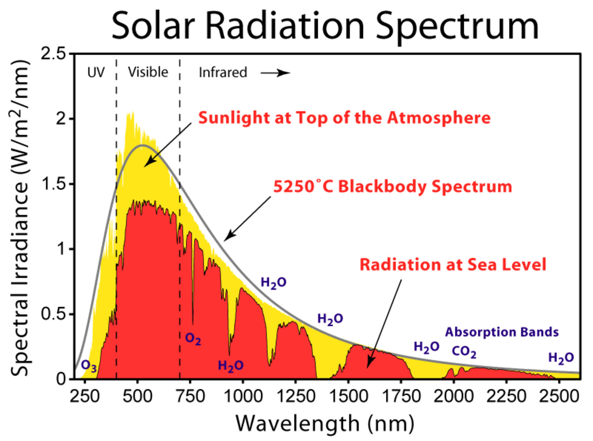
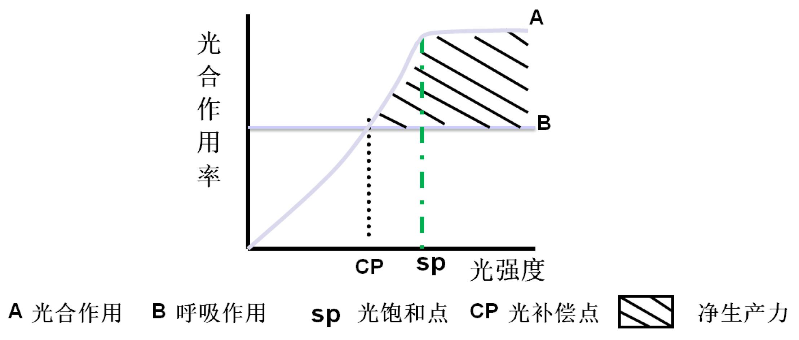
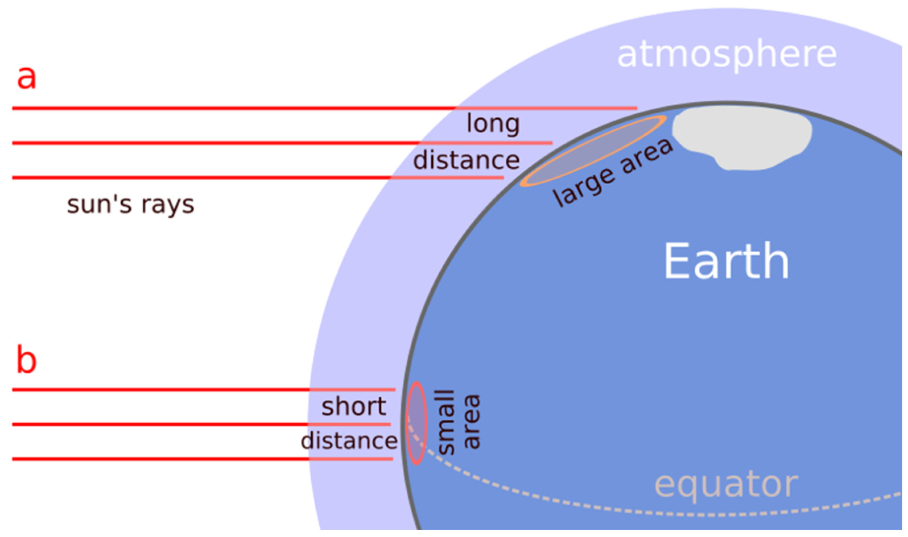
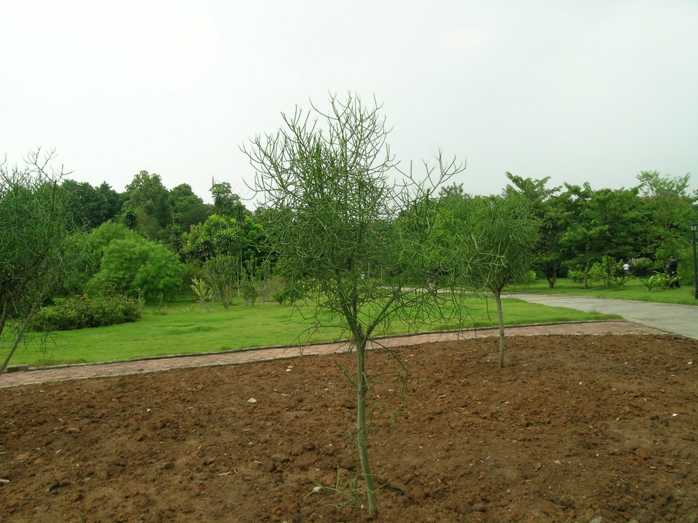
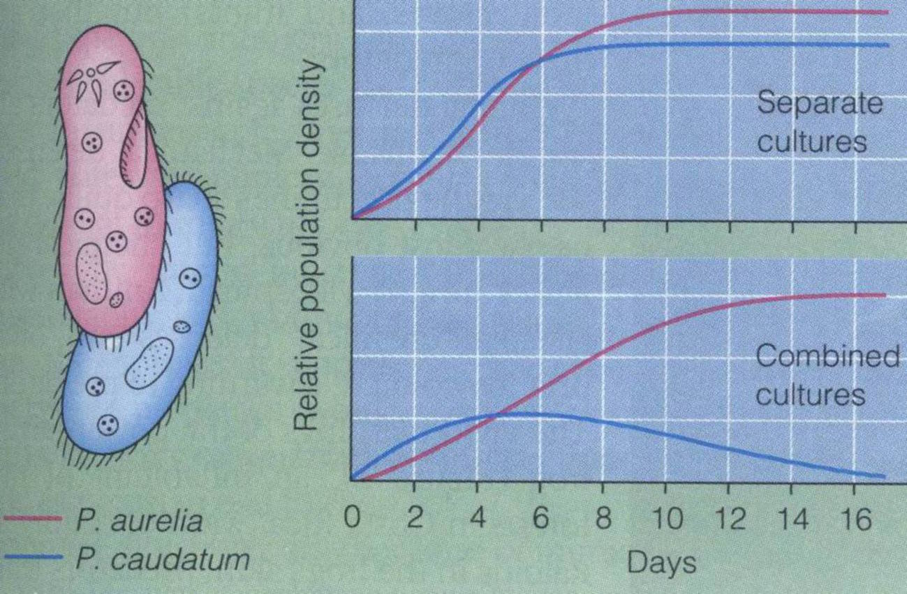
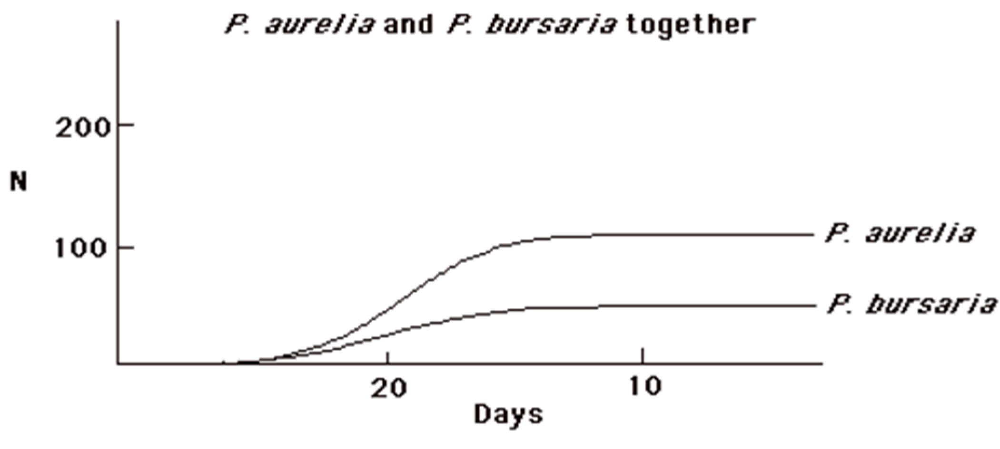

\note{
苇莺

大杜鹃, 别名布谷鸟

寄主通常只在宿主巢内产一枚卵, 有时也会产下多枚.

寄主多是在宿主开始孵卵前产卵, 如果宿主的卵已开始孵化, 寄主常常会把这些卵吃掉或扔掉, 如牛鹂会用喙和爪在宿主卵上打孔,
使宿主卵孵化失败并延长宿主的孵卵时间.

寄主产卵的时间往往十分短暂, 如斑翅风头鹃(Clamator jocobinus)在宿主的巢中产一枚卵仅需5秒.

}

# 34.1  环境与生态因子

## 34.1.1 环境与生态因子是两个重要的概念

环境
:   某一特定生物体以外的空间及直接和间接影响该生物生存的一切事物的总和.

---

\begin{columns}[onlytextwidth]
    \column{0.7\textwidth}
        \begin{itemize}
            \item 语言中的环境定义: 是指环绕着某一中心事物的周围事物
            \item 环境是一个相对的概念, 相对于特定的研究主体对象
                \begin{itemize}
                    \item 生物科学: 以生物为主体.
                    \item 环境科学: 以人类为主体.
                    \item ``宪法''
                    \item ``环境保护法''
                \end{itemize}
        \end{itemize}
    \column{0.3\textwidth}
        \begin{tikzpicture}
            \shade[top color=gray!50,bottom color=gray!30] (0,0) circle (2);
            \draw[black, line width=0.3mm] (0,0) circle (2);
            \shade[top color=gray!30,bottom color=gray!50] (0,0) circle (0.8);
            \draw[black, line width=0.3mm] (0,0) circle (0.8);
            \node[auto] at (0,0) {主体};
            \node[below=1] at (0,0) {环境};
        \end{tikzpicture}
\end{columns}

\note{
环境科学以人类为研究对象
环境指围绕着人群的空间, 以及其中可以直接、间接影响人类生存和发展的各种天然的和经过人工改造过的自然因素的总体.
即人类环境.

环境指环绕着生物界并影响其生存和发展的外部空间和无生命物质, 如大气、水、土壤、阳光和其他无机物质.
生态学所称的环境包括人类环境, 但范围要比人类环境广泛得多.

《宪法》第二十六条规定: “国家保护和改善生活环境和生态环境, 防治污染和其他公害.

《环境保护法》第二条的规定: “本法所称环境, 是指:影响人类生存和发展的各种天然的和经过人工改造的自然因素的总体,
包括大气、水、海洋、土地、矿藏、森林、草原、野生生物、自然遗迹、人文遗迹、自然保护区、风景名胜区、城市和乡村等.

}

---

生态因子
:   指环境中对生物的生长、发育、生殖、行为和分布有直接影响的环境要素.

* 按因子的理化性质
    + 气候因子: 光, 水(降雨), 温度
    + 土壤因子: 质地, 结构, 理化性质等
    + 地形因子: 地貌, 海拔, 坡度, 坡向等
    + 生物因子
    + 人类因子: 其影响超过了自然因子, 具特殊性

---

* 按因子是否有生命
    + 非生物因子
    + 生物因子

* 按因子变动情况
    + 稳定因子: 如地磁, 太阳辐射等
    + 变动因子
        - 周期性变动因子: 气候日变化, 潮汐等
        - 非周期变动因子: 风, 降水, 捕食等

## 34.1.2 生物对生态因子的耐受性是有限度的

最小因子法则
:   指各种生物的生长速度受它所需的环境因素中最低量因素的限制.

耐受性法则
:   每一种生物对每一个环境因素都有一个能耐受范围.

+ 最适区, 生理抑制区, 不能耐受区.
+ 对同一生态因子, 不同种类生物的耐受范围不同.

---

\note{
据Smith, 1980

}

# 34.2  生物与非生物环境之间的关系

## 34.2.1 没有水就没有生物

水对生物生长的重要性:

* 水是生物个体重要组成部分: 60--90%.
* 生物的一切代谢活动都必须以水为介质.
* 水在3.98°C时密度最大, 利于低温条件下生存.
    + 冰作为绝热体阻止冰下水进一步降温
* 水的热容量大, 为生物创造了稳定的温度环境.

---

\note{
河谷网

三角洲
}

---

\begin{figure}
    \centering
    \begin{minipage}[b]{.48\linewidth}
        \includegraphics{ch-34.images/image6.jpg}
        \subcaption{凤凰号}
    \end{minipage}
    \hfill
    \centering
    \begin{minipage}[b]{.48\linewidth}
        \includegraphics{ch-34.images/image5.jpg}
        \subcaption{冰的升华}
    \end{minipage}
    \caption{第一个直接证据}
\end{figure}

\note{
凤凰号在火星上的第157个火星日, 最后的日出. 此为艺术家想象画.

版权: C. WASTE/JPL.

在第20个火星日挖出的白色小块（左图）于4天后消失了.

版权: NASA/JPL-CALTECH/UNIV. ARIZONA/TEXAS A\&M UNIV.

}

---

\note{
90天变成了1700天

自从2004年1月25日机遇号登陆火星, 到周四, 他已经运行了2307个地球日, 超过六年. 也就是2246个火星日.

这打破了1976年7月20日登陆火星的``海盗1号''登陆车创下的2245个火星日的存活纪录, 它在1982年11月与地球失去了联系.
``我当时认为他们会坚持六个月. ''火星漫游者 探测器的首席研究员, 科奈尔大学的天文学教授斯蒂芬·W.·斯奎尔基斯（Steven W. Squyres）说,
``六年? 不, 谁会想到他们能坚持六年？''

}

## 34.2.2 阳光是生命的能量源泉

* 阳光是地球上一切生物的最终能源.
    + 植物的光合作用, 利用的日光不过0.1%
* 光的性质与组成:
    + 可见光: 380--760nm (40--50%)
    + 光合作用: 红光(620--760nm), 蓝光(435--490nm)
* 光对海洋植物的影响
    + 光的穿透性限制植物在海洋中分布
    + 光补偿点: 呼吸作用与光合作用平衡(透光带下部)

\note{
海洋植物 --- 光合作用色素对光谱变化具有明显的适应性:

海水表层植物色素吸收蓝, 红光;

深水植物光合色素有效地利用绿光

}

---

\begin{figure}
    \includegraphics{ch-34.images/image8.jpg}\\
    \vfill
    \includegraphics{ch-34.images/image9.jpg}
    \caption{1665年, 艾萨克·牛顿发现光的色散}
\end{figure}

---

\note{
his figure shows the solar radiation spectrum for direct light at both the top of the Earth's
atmosphere and at sea level. The sun produces light with a distribution similar to what would
be expected from a 5525 K (5250 °C) blackbody, which is approximately the sun's surface
temperature. As light passes through the atmosphere, some is absorbed by gases with specific
absorption bands. Additional light is redistributed by Raleigh scattering, which is
responsible for the atmosphere's blue color.

These curves are based on the American Society for Testing and Materials (ASTM) Terrestrial
Reference Spectra, which are standards adopted by the photovoltaics industry to ensure
consistent test conditions and are similar to the light that could be expected in North
America. Regions for ultraviolet, visible and infrared light are indicated.

整个地球接收到的能量是$1.740\times10^17$瓦特, 每平方米大约1366瓦特.

}

---

\note{
Emberlin, 1983

光补偿点与光饱和点:

光合作用强度和呼吸作用强度相当处的光强度为光补偿点;

当光照强度达到一定水平后, 光合产物不再增加或增加得很少, 该处的光强度即为光饱和点.

}

---

* 生物的光周期现象
    + 各类生物所特有的对日照长度变化的反应方式.
* 光是生物节律性活动最可靠的信号系统, 对生物的生活史, 生殖周期起重要的调控作用.
    + 季节变化: 植物开花, 休眠等; 动物迁移, 冬眠
    + 昼夜变化: 含羞草叶片开/合, 生物发光等

---

\note{
不同纬度

}

## 34.2.3 温度限制着生物的分布

* 地表温度的高度变异性.
    + 空间: 纬度, 海拔高度, 小生境.
    + 时间: 季度变化, 昼夜变化.
* 温度对生物的影响: 适宜温度和最适温度.
    + 大多数生物的有效温度区: 0--45°C.
        - 例外: 轮虫, 线虫(-253°C); 极端嗜热嗜酸菌
    + 低温: 冰晶形成使质膜破裂, 蛋白失活、变性.
    + 高温: 植物-光合减弱、呼吸增强, 水分平衡被破坏, 蛋白质凝固, 有害物质积累; 动物-酶、蛋白失活.

## 温度与生物的地理分布（北半球）

* 温度限制动物的地理分布(极端温度):
    + 北限: 最低温度
    + 南限: 最高温度, 例: 菜粉蝶, 26°C
* 温度限制植物的地理分布:
    + 水平分布北界, 垂直分布上限: 低温
    + 水平分布南界（向赤道）, 低海拔分布: 高温
* 温度和降水共同决定地球生物分布的总格局.

# 34.3 生物与生物之间的相互关系

## 34.3.1 食植和捕食

食植关系
:   动物以植物为食.

* 食植关系是自然界食物链的基础
* 食植关系决定了植物和动物(昆虫)的协同进化
    + 植物: 机械防御和化学防御，次生代谢物质
    + 动物: 适应, 对抗植物的防御机制
* 食植关系的存在不影响群落成分和结构的稳定

---

---

捕食关系
:   动物以动物以食.

* 捕食关系构成复杂食物链的必要环节, 使群落中的物质循环和能量流动变得多样化.
* 捕食关系提高群落中能量的利用率.
* 捕食者和被捕食者间的协同进化.
    + 形态: 警戒色, 拟态等
    + 行为: 变色, 排放恶臭气体等

---

\begin{figure}
    \begin{minipage}[b]{.58\linewidth}
        \includegraphics{ch-34.images/image17.jpg}
        \subcaption{保护色}
    \end{minipage}
    \hfill
    \begin{minipage}[b]{.38\linewidth}
        \includegraphics{ch-34.images/image18.jpg}
        \subcaption{拟态}
    \end{minipage}
    \caption{被捕食者的防御}
\end{figure}

## 34.3.2 竞争

草履虫实验：高斯，1934。

竞争排除原理
:   生态要求完全相同的两个物种在同一群落中无法共存.

生态位
:   一个物种(种群)的生存条件的总集合体.

---

\begin{figure}
    \begin{minipage}[b]{.3\linewidth}
        \includegraphics{ch-34.images/image21.jpg}
        \subcaption{大草履虫\\\textit{P. caudatum}}
    \end{minipage}
    \hfill
    \begin{minipage}[b]{.3\linewidth}
        \includegraphics{ch-34.images/image20.jpg}
        \subcaption{双小核草履虫\\\textit{P. aurelia}}
    \end{minipage}
    \hfill
    \begin{minipage}[b]{.3\linewidth}
        \includegraphics{ch-34.images/image19.jpg}
        \subcaption{袋状草履虫\\\textit{P. bursaria}}
    \end{minipage}
    \caption{草履虫}
\end{figure}

---

---

\note{
P. aurelia and P. caudatum feed on suspended bacteria - they feed in the same
microhabitat on the same things.

P. bursaria feeds on bacteria adhering to the glass of the culture flasks.

}

## 34.3.3 互惠共生

互惠
:   指对双方都有利的一种种间关系.

+ 特点：解除这种关系双方均能正常生存.
+ 举例：海葵和寄生蟹; 鳄鱼和小鸟.

共生
:

+ 特点：解除这种关系双方不能正常生存
+ 举例：
    - 地衣: 单细胞藻类和真菌的共生体, 植物界的开拓者.
    - 白蚁和多鞭毛虫: 多鞭毛虫分泌纤维素酶.

## 34.3.4 寄生与拟寄生

寄生
:   一方获利并对另一方造成损害而不把对方杀死.

+ 寄生物以寄主的体液, 组织或已消化好的食物为食, 常阻碍寄主的生长, 降低寄主的生殖力, 但不引起寄主的死亡.
+ 分类: 体内寄主和体外寄主; 终寄主和中间寄主.
+ 生物类型: 病毒, 细菌, 原生动物等.

拟寄生
:   导致寄主死亡, 更接近捕食关系.

+ 昆虫对昆虫的寄生都属于拟寄生, 如寄生蝇和寄生蜂.

---

Table: 总结

|-|有利(+)|有害(-)|无作用(0)|
|:---:|:---:|:---:|:---:|
|有利(+)|互惠共生|捕食/寄生|偏利共栖|
|有害(-)|捕食/寄生|竞争|偏害共栖|
|无作用(0)|偏利共栖|偏害共栖|---|
