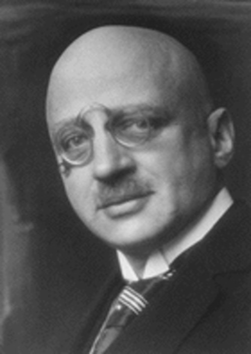

---

\begin{figure}
    \begin{minipage}[b]{.58\linewidth}
        \includegraphics{ch-35.images/image2.png}
    \end{minipage}
    \hfill
    \begin{minipage}[b]{.38\linewidth}
        \includegraphics{ch-35.images/image3.png}
    \end{minipage}
    \caption{另一个生态系统的例子}
\end{figure}

---

生态系统
:   一定空间内, 生物成分与非生物成分通过物质循环和能量流动(信息传递)而互相作用, 互相依存构成的生态学功能单位.

* 生态系统的基本组成
    + 非生物环境
    + 生产者
    + 消费者
    + 分解者

\note{
生态系统的基本概念

}

# 35.1  生态系统的基本结构

## 35.1.1 食物链相互交叉形成食物网
食物链
:   生产者所固定的能量通过一系列的取食和被取食的关系在生态系统中传递，生物之间的这种单向的营养关系称为食物链。

+ 捕食食物链: 以活的生物为起点的食物链(水生)
+ 腐食食物链: 以死亡的动植物或腐败有机物为起点(陆地)

食物网
:   食物链的每一个环节都与周围的很多生物有着错综复杂的普遍联系。

+ 食物网越复杂，生态系统越稳定

---

---

\begin{figure}
    \begin{minipage}[b]{.48\linewidth}
        \includegraphics{ch-35.images/image5.jpeg}
    \end{minipage}
    \hfill
    \begin{minipage}[b]{.48\linewidth}
        \includegraphics{ch-35.images/image6.png}
    \end{minipage}
    \caption{不太常见的取食关系}
\end{figure}

---

---

\begin{figure}
    \begin{minipage}[b]{.68\linewidth}
        \includegraphics{ch-35.images/image9.png}
    \end{minipage}
    \hfill
    \begin{minipage}[b]{.28\linewidth}
        \begin{minipage}[b]{1\linewidth}
            \includegraphics[height=0.25\textheight, keepaspectratio]{ch-35.images/image10.png}
        \end{minipage}\\
        \vfill
        \begin{minipage}[b]{1\linewidth}
            \includegraphics[height=0.5\textheight, keepaspectratio]{ch-35.images/image11.png}
        \end{minipage}
    \end{minipage}
    \caption{脆弱食物网的例子\footnotemark}
\end{figure}

\footnotetext{\fullcite{Estes1998}}

\note{
J A Estes et al. Science 1998;282:473-476

海獭 巨藻

Figure 1

(A) Changes in sea otter abundance over time at several islands in the Aleutian archipelago
and concurrent changes in (B) sea urchin biomass, (C) grazing intensity, and (D) kelp density
measured from kelp forests at Adak Island.

Error bars in (B) and (C) indicate 1 SE. The proposed mechanisms of change are portrayed
in the marginal cartoons—the one on the left shows how the kelp forest ecosystem was
organized before the sea otter's decline and the one on the right shows how this ecosystem
changed with the addition of killer whales as an apex predator. Heavy arrows represent
strong trophic interactions; light arrows represent weak interactions.

}

## 35.1.2  生态学家为什么要提出营养级和生态金字塔的概念

营养级
:   处于食物链某一环节上的全部生物种的总和。

* 营养级越高，归属于这个营养级的生物种类和数量越少

生态金字塔
:   指各营养级之间的某种数量关系。

* 单位：个体数量单位，生物量单位，能量单位
* 生物量（Biomass）

\note{
Bio=life             Mass=weight
Bio + Mass = Weight of living things within an ecosystem.

}

---

\begin{figure}
    {\begin{minipage}[b]{.48\linewidth}
        \includegraphics{ch-35.images/image13.png}
    \end{minipage}}
    \hfill
    \begin{minipage}[b]{.48\linewidth}
        \includegraphics{ch-35.images/image14.jpeg}
    \end{minipage}\\
    \begin{minipage}[b]{.48\linewidth}
        \includegraphics{ch-35.images/image15.jpeg}
    \end{minipage}
    \hfill
    \begin{minipage}[b]{.48\linewidth}
        \includegraphics{ch-35.images/image16.jpeg}
    \end{minipage}%
    \caption{生态金字塔}
\end{figure}

## 35.1.3 生物圈是地球上最大的生态系统

生物圈
:   指地球有生物存在的部分，是地球表面不连续的一个薄层。

* 分布：高，10000m；深，海底深火山。
* 生物圈与人类
    + 陆地生物圈：占地球表面不足1/4
    + 意义：人类的生命维持系统，生产氧气，制造食物，处理废物和维持其他所有生物的生存
    + 生物圈的稳定性与生态系统的稳定性：自我调节

# 35.2  生态系统中的生物生产力

## 35.2.1  初级生产量是生态系统的基石

初级生产量
:   指绿色植物借助光合作用所制造的有机物质。单位时间/面积。

GP(总初级) = NP(净初级) + R(呼吸作用)

生物量
:   用于植物生长和繁殖的NP的积累。

* $GP - R > 0$，生物量增加
* $GP - R < 0$，生物量减少
* $GP - R = 0$，生物量不变

---

\includegraphics[height=0.3\textheight, keepaspectratio]{ch-35.images/image17.png}
\hfill
\includegraphics[height=0.3\textheight, keepaspectratio]{ch-35.images/image18.png}

* 光合作用

\ce{6CO2 + 6H2O + 阳光 + 叶绿素 -> C6H12O6 + 6O2}

* 细胞呼吸

\ce{C6H12O6 + 6O2 ->  6CO2 + 6H2O + 能量}

---

* 全球初级生产量的分布
    + 陆地比水域（海洋）的初级生产量大；
    + 陆地初级生产量随纬度增加而逐渐降低
* 初级生产的生产效率：植物的生产量占总入射光能的比例。
    + 自然条件下，总初级生产效率很难超过3％

## 35.2.2 次级生产量是消费者生产的有机物质
次级生产量
:   指动物靠吃植物、吃其他动物和吃一切现成有机物质而生产出来的有机物。

* 次级生产者: 异养生物，消费者，分解者

次级生产量的全球分布特点

* 次级生产量比初级生产量要少得多
* 海洋次级生产量要比陆地高：取食效率极

# 35.3  生态系统中能量流动和物质循环

## 35.3.1 能量在流动过程中的传递效率很低

生态系统(营养级)层次的能流分析:

* 能量流动是单方向, 且不可逆
* 能量在流动过程急剧减少: 资源利用率低, 呼吸损耗大
* 林德曼效率(能量转换效率): 十分之一定律

---

## 35.3.2 物质循环可分为3种不同类型

生物物质循环的3种基本类型

* 水循环：其他物质循环的基础
* 气体型循环：全球性循环
    + 储存库：大气圈，海洋，
* 沉积型循环：全球性特征不明显
    + 储存库：土壤，沉积层，岩石圈
    + 过程：岩石风化，沉积物的分解
* 人类活动与物质循环过程

## 35.3.3  水的全球循环带动着所有其他物质的循环

* 水循环作用：是营养物质循环的重要介质。
* 主要途径：地表－（蒸发）大气圈（降水）－地表。
    + 生物的作用：植物的蒸腾作用，影响很小
    + 其他途径：地表径流（陆地—海洋）
* 水循环与人类生活：
    + 过度利用地下水（地面下沉）
    + 水资源的分布与利用

---

## 35.3.4  碳的全球循环对生命至关重要

* 碳循环的主要形式：二氧化碳。
    + （生物学积极作用）两个碳库：水圈（海洋），大气圈
* 碳循环基本路线:大气圈－动植物－分解者－大气圈。
    + 光合作用（固定）；呼吸作用，分解作用
    + 非生物的燃烧过程使二氧化碳含量增加
* 碳循环的自我调节控制：
    + 水圈和大气圈通过扩散作用相互交换，调整恢复
* 碳循环与人类生活：温室效应。

---

## 35.3.5  大气中的氮不能直接被植物利用

* 氮循环基本路线:大气圈－动植物－分解者－大气圈。
* 氮循环基本过程:　最为复杂。
    + 固氮：物理化学固氮和生物固氮（氮气－氨）
    + 硝化作用：氨－硝酸盐
    + 反硝化作用：硝酸盐－氮气
* 氮循环的平衡控制：硝化作用和反硝化作用。
    + 存在问题：工业固氮量的日益增长
* 氮循环与人类生活：大气污染等。

---

# 35.4 人类活动对生物圈的影响

## 35.4.1  大量排放二氧化碳导致全球变暖

* 近100年来大气二氧化碳浓度变化:0.028--0.035％。
* 温室效应原理：
    + 对来自太阳的短波辐射高度通透；平流层变冷（高）
    + 对来自地球的长波辐射高度吸收；对流层变暖（低）
* 全球气候变暖的危害：
    + 海平面上升；大气环流变化等。
* 保护措施：《京都议定书》。

## 35.4.2  臭氧减少是潜在的全球性灾难

* 臭氧的保护作用：吸收紫外线，X射线，γ射线等。
* 臭氧层的破坏：氟利昂。
* 臭氧层减少的危害：皮肤癌患者增多。
* 保护措施：《蒙特利尔议定书》。

---

\note{
The "hole" expanded to a record size of approximately 28.3 million square kilometers on Sept. 3, 2000.

The blue and purple colors are where there is the least ozone, and the greens, yellows,
and reds are where there is more ozone.

\url{http://earthobservatory.nasa.gov/IOTD/view.php?id=817&eocn=image&eoci=related_image}

}

## 35.4.3  全球各地普降酸雨

* 酸雨的形成：
    + 煤，石油，天然气燃烧后的\ce{SO2}和\ce{NO}与大气中水结合形成的产物（硫酸，硝酸），雨水pH下降
* 酸雨的危害：
    + 破坏水体平衡；破坏土壤；伤害动植物
* 防治措施：
    + 限制\ce{SO2}和\ce{NO}排放

---

\note{
Effects of acid rain, woods, Jizera Mountains, Czech Republic

}

## 35.4.4  江河湖海受到普遍污染

* 水体污染物：8类。
* 水体污染的危害
    + 水质变差
    + 水体富营养化
* 保护措施：严格控制污染源。

\note{
罗马帝国由于精英的铅中毒而没落。

帽商用汞盐来软化毡帽，引起神经损伤，容易爆怒。Alice in wonderland，发神经的帽商。

}

---

\begin{figure}
    \begin{minipage}[b]{.58\linewidth}
        \includegraphics{ch-35.images/image25.png}
    \end{minipage}
    \hfill
    \begin{minipage}[b]{.38\linewidth}
        \includegraphics{ch-35.images/image26.png}
    \end{minipage}
    \caption{水俣病}
\end{figure}

\note{
1932年，新日本窒素肥料（窒素，即氮）于水俣工场生产氯乙烯与醋酸乙烯，其制程中需要使用含汞的
催化剂。由于该工厂任意排放废水，这些含汞的剧毒物质流入成海，被水中生物所食用，并转成甲基氯汞
（化学式CH3HgCl）与二甲汞（化学式(CH3)2Hg）等有机汞化合物。

当人类捕食海中生物后，甲基汞等有机汞化合物通过鱼虾进入人体，被肠胃吸收，侵害脑部和身体其他部分，造成生物累积。

水俣病实际为有机水银中毒，分为有急性、亚急性、慢性、潜在性和胎儿性。患者手足麻痹，甚至步行困难、
运动障碍、失智、听力及言语障碍；重者例如痉挛、神经错乱，最后死亡，至今仍无有效的治疗法。

发病起三个月内约有半数重症者死亡，怀孕妇女亦会将这种水银中毒遗产给胎中幼儿。

}

---

\note{
美國加州外海的赤潮

有害赤潮发生后，导致海洋食物链的局部中断；有些赤潮生物分泌毒素被海洋食物链中的某些生物摄入，会导致中毒甚至死亡。
這些赤潮破坏海洋生态结构；
這些赤潮生物的分泌物妨碍海洋鱼类、虾类、贝类的正常呼吸而导致窒息死亡；
含有毒素的赤潮生物被海洋生物摄食后能引起中毒死亡；人类食用含有毒素的海产品也会导致食物中毒；
這些赤潮生物死亡后尸骸的分解过程中要大量消耗海水中的溶解氧，造成缺氧环境，引起虾、贝类的大量死亡。

}

## 35.4.5 物种灭绝速度加快和生物多样性下降

* 人类活动对生物多样性的破坏
* 生物多样性的丰富内涵：
    + 生态系统多样性：生物群落、生境和生态过程多样性　
    + 物种多样性：生物有机体的多样化
    + 遗传多样性：生物个体遗传信息总和
* 保护生物多样性的意义
    + 野生生物的遗传资源的保护
    + 野生生物的美学价值

---

\begin{figure}
    \begin{minipage}[b]{.48\linewidth}
        \includegraphics{ch-35.images/image29.png}
    \end{minipage}
    \hfill
    \begin{minipage}[b]{.48\linewidth}
        \includegraphics{ch-35.images/image28.png}
    \end{minipage}
    \caption{多样性经典研究之一\footnotemark}
\end{figure}

\footnotetext{\fullcite{Tilman1997}}

\note {
289 plots, each 169 m2, were planted and weeded to have either 0, 1, 2, 4, 8, 16, or 32 perennial savanna-grassland species representing 0, 1, 2, 3, 4, or 5 plant functional groups.
Grassland-savanna plants were classified into functional groups on the basis of intrinsic physiological and morphological differences, which influence differences in resource requirements, seasonality of growth, and life history.

1) Legumes fix nitrogen, the major limiting nutrient at our site (7).

2) Grasses with the three-carbon photosynthetic pathway (C3) grow best during the cool seasons and have higher tissue N than do

3) grasses with the C4 pathway, which grow best during the warm season.

4) Woody plants have high allocation to perennial stem and low growth rates

5) forbs do not fix N and often have high allocation to seed.

Figure 1 (A) Dependence of 1996 aboveground plant biomass (that is, productivity) (mean and SE) on the number of plant species seeded into the 289 plots.
(A) Dependence of 1996 aboveground plant biomass (that is, productivity) (mean and SE) on the number of plant species seeded into the 289 plots. (B) Dependence of 1996 aboveground plant biomass on the number of functional groups seeded into each plot. Curves shown are simple asymptotic functions fitted to treatment means. More complex curves did not provide significantly better fits.

}

---

\begin{figure}
    \includegraphics{ch-35.images/image30.png}
    \caption{多样性经典研究之二\footnotemark}
\end{figure}

\footnotetext{\fullcite{Zhu2000}}

\note{
Figure 1: Planting arrangements in rice variety mixture and monoculture survey plots in 1999 and patterned after those used by farmers in Yunnan Province.
Each symbol represents a hill of susceptible (O) or resistant (X) rice. Distances between hills within rows were 15 cm for glutinous monocultures, 30 cm for hybrid monocultures and 30 cm for mixtures. Spacings and arrangements were the same in 1998, except that the distance between rows of glutinous rice in monoculture was 13 cm.

云南农业大学 Nature 文章

}