群落
:   占有一定空间和时间的多种生物种群的集合体.

    有一定的结构, 种类构成和种间关系.

# 36.1 群落的结构和主要类型

## 36.1.1 不同生长型植物自下而上配置形成了群落的垂直结构

* 群落的垂直结构结构由植物的生长型决定. 

* 森林群落的垂直结构
    * 从上到下: 林冠层, (下木层), 灌木层, 草本层和地表层
    * 植物的垂直结构为不同种类动物提供栖息环境

* 其他群落的垂直结构
    * 草原群落: 草本层, 地表层和根系层
    * 水生群落: 表水层, 斜温层, 静水层和底泥层
        * 层次性: 由光穿透性, 温度 和氧气的垂直分布决定

* 群落结构与物种多样性: 
    * 分层越多, 生物对环境的利用越充分, 多样性越丰富

## 36.1.2 从赤道到北极分布着多种多样的陆地生物群落

* 地球各地因气候, 地形和其他环境条件的不同而分布着不同类型的生物群落. 

* 陆地生物群落的分布规律: 
    * 水平分布规律
        * 纬向地带性: 温度, 热量带的分布
        * 经向地带性: 海陆位置, 大气环流, 地形
    * 垂直分布规律: 
        * 垂直地带性: 温度, 光照, 风力, 湿度等

## (1) 热带森林

* 热带森林包括热带雨林, 热带季相林, 热带干旱林. 
* 热带雨林的分布: 
    * 地理位置: 北纬 10° 到南纬 10° 之间的赤道气候带
    * 气候特点: 终年炎热, 天天有雨
* 热带雨林的物种多样性: 
    * 含有多种多样的小生境和生态位, 物种多样性极高
    * 生态位: 每个生物种群在群落中的时空位置和功能关系 (生物对各种资源的利用, 在环境中占据的地位)
    * 生物种类占全球已知动植物种类的一半和已知节肢动物的 20--25％ 左右

---

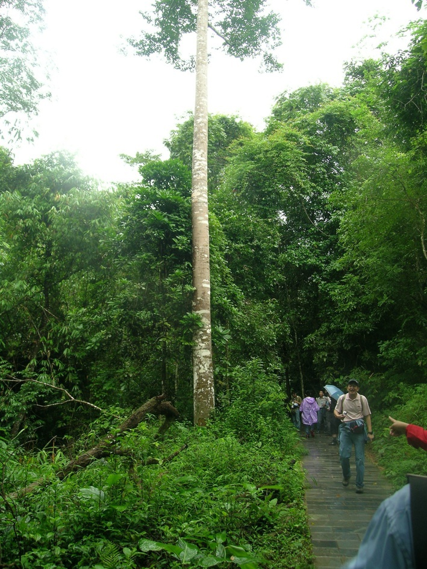

## (2) 温带森林

* 温带森林包括温带针叶林和温带阔叶林两种. 

* 温带针叶林: 
    * 特点: 垂直分层不明显, 林下植物发育较弱
    * 生物类群: 螨类, 昆虫, 灰喜鹊, 红松鼠等

* 温带阔叶林
    * 特点: 垂直分层明显, 树冠层, 下木层, 灌木层, 地面层
    * 生物类群: 动物多样性与森林的层次性和植物的生长型密切相关

---

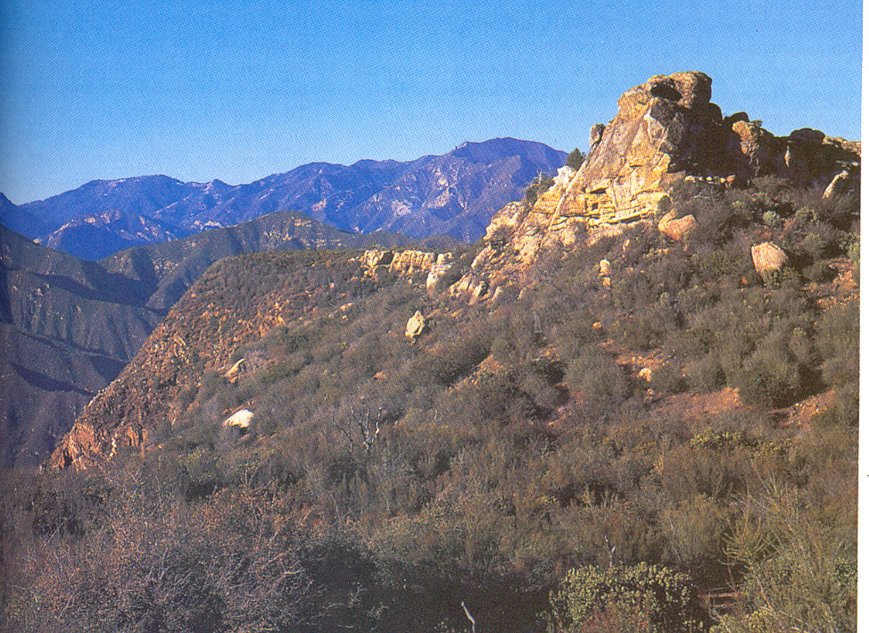

## (3) 寒温带针叶林

* 寒温带针叶林又称泰加林, 覆盖陆地地表面积 11％.
* 分布: 欧亚大陆和北美的北部. 
    * 气候特征: 严寒大陆气候, 季节变化明显
    * 中国: 大小兴安岭, 长白山
* 树种: 云杉, 松树, 和少量的阔叶树. 
    * 水分条件的适应: 永冻层, 气孔, 角质层等
* 动物类群: 
    * 植食动物: 驯鹿, 驼鹿等, 红松鼠, 雪兔等
    * 经济鸟类: 榛鸟, 雷鸟等
    * 植食性昆虫: 松叶蜂, 云杉卷叶蛾等

## (4) 草原和热带稀树草原

* (温带) 草原:
    * 气候特征: 年降水量在 250--800 mm 之间
    * 特征: 由绿色的牧草组成, 草高大但生长期短
    * 生物类群: 无脊椎动物物种多样性丰富

---

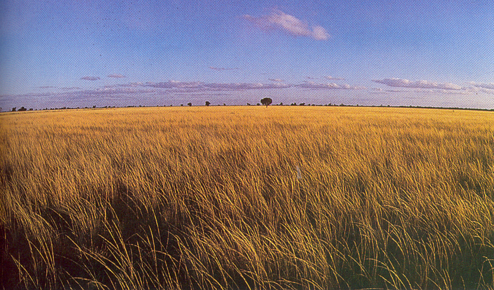

---

* 热带稀树草原: 散生旱生乔木. 
    * 气候特征: 温暖的大陆气候, 年降水量 500－2000 mm, 降雨有明显的季节波动.
    * 特征: 垂直结构不明显, 水平结构明显 (斑块).

---

\begin{figure}
    \begin{minipage}[b]{.38\linewidth}
        \includegraphics{ch-36.images/image4.jpg}
    \end{minipage}
    \hfill
    \begin{minipage}[b]{.58\linewidth}
        \includegraphics{ch-36.images/image5.jpg}
    \end{minipage}
    \caption{热带稀树草原}
\end{figure}

## (5) 荒漠

* 特征: 雨量少, 蒸发量大, 年降水量不足 150 mm.

* 优势植物: 蒿属植物, 藜属植物, 肉质旱生植物等. 

* 生物在干旱条件下的生活史对策: 短命植物. 

## (6) 苔原

* 分布: 寒温带针叶林以北的环北冰洋地带. 
* 特点: 严寒, 生长季短,雨量少和没有树木. 
* 生物类群: 
    * 植物: 结构简单, 种类稀少, 无性繁殖
    * 动物: 草食动物, 鸟类等

# 36.2 物种在群落中的生态位

## 36.2.1 生态位

生态位
:   一个物种 (种群) 的生存条件的总集合体.

生态位
:   物种利用群落中各种资源的总和, 以及该物种和群落中其他物种相互关系的总和, 它表示物种在群落中的地位, 作用和重要性.

基本生态位和实际生态位

## 36.2.2 生态位重叠和同域物种的资源分配

竞争排除原理
:   生态要求完全相同的两个物种在同一群落中无法共存.

# 36.3 群落的演替及其实例

## 36.3.1 群落的演替是有规律的, 有一定方向的和可以预测的

群落的演替
:   一些植物取代另一些植物, 一个群落取代另一个群落的过程, 直到出现一个稳定群落才会终止. 

* 特点: 有规律, 有一定方向, 可预测. 
* 演替系列: 草本植物 $\rightarrow$ 灌木 $\rightarrow$ 森林 $\rightarrow$ 稳定群落

\note{

就像个体在成熟过程中发生变化一样, 生态系统形成新特征, 并逐渐以新种群代替原有的群落.

生境内群落组成的这种缓慢变化就是常规.

}

---

原生演替
:   演替地点从没有生长过任何植物

* 特点: 时间长, 基质和环境极为贫瘠和严酷

次生演替
:   在毁灭群落的基质上进行的演替

* 特点: 时间相对短, 基质和环境比较肥沃和温和
* 次生林: 原始森林砍伐后通过次生演替而生长起来的森林

## 原生演替的实例

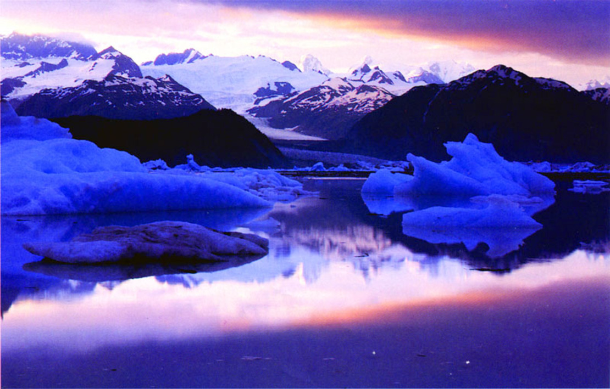

\note {

for i in {14..22}; do
    echo \$i;
    convert -auto-level -auto-gamma image\$i.jpg image\$i.jpg
done;

}

---

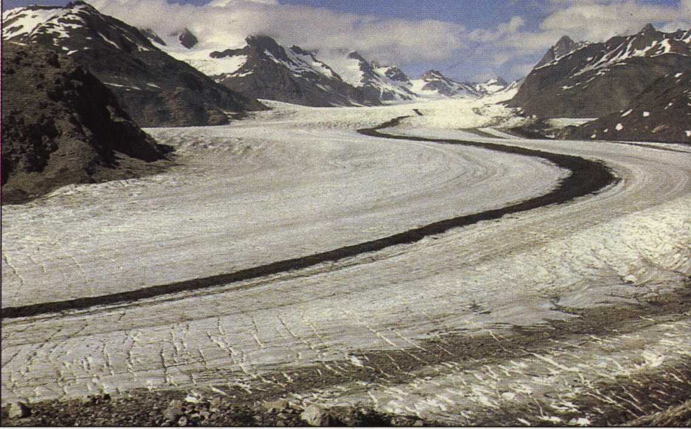

---

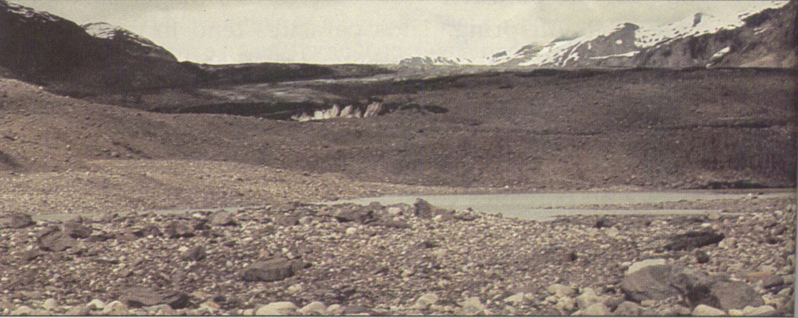

---

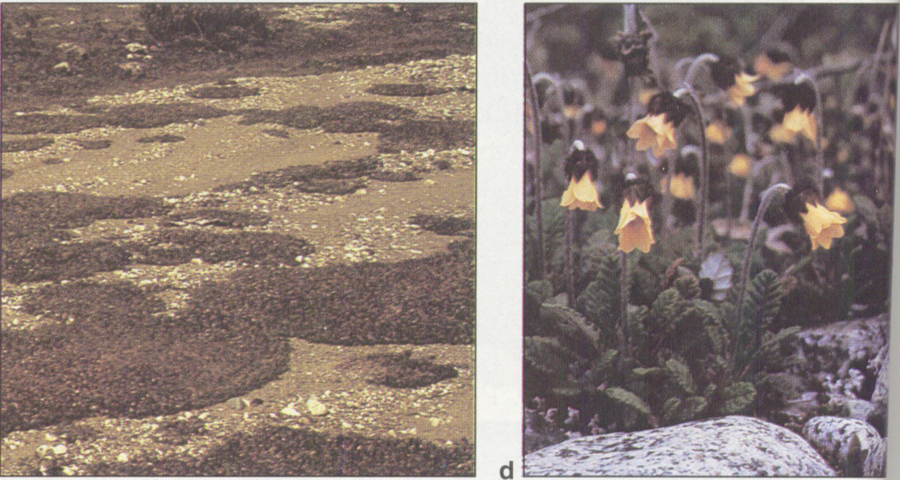

---

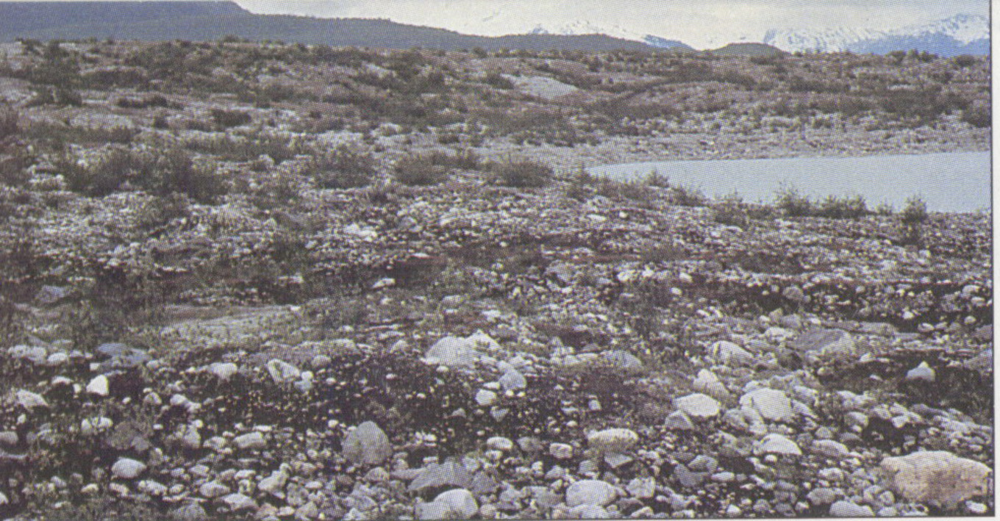

\note{

桤 qī

}

---

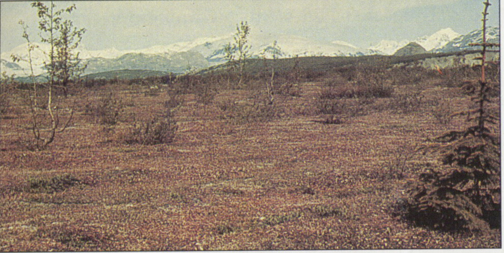

---

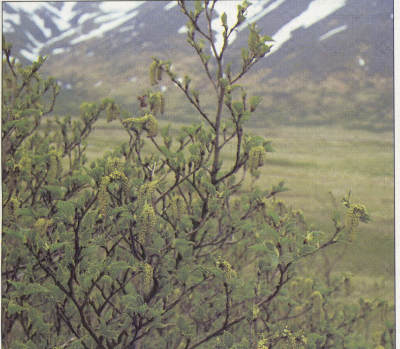

---

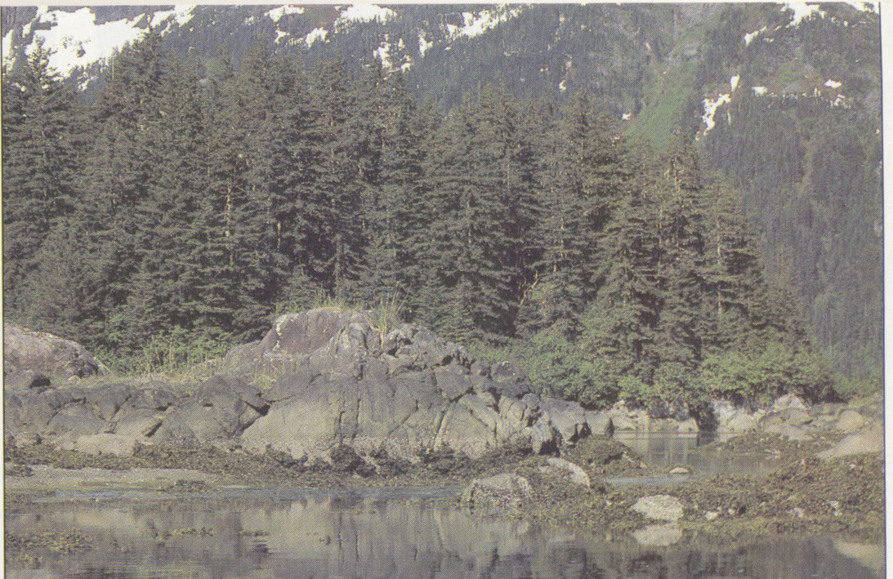

---

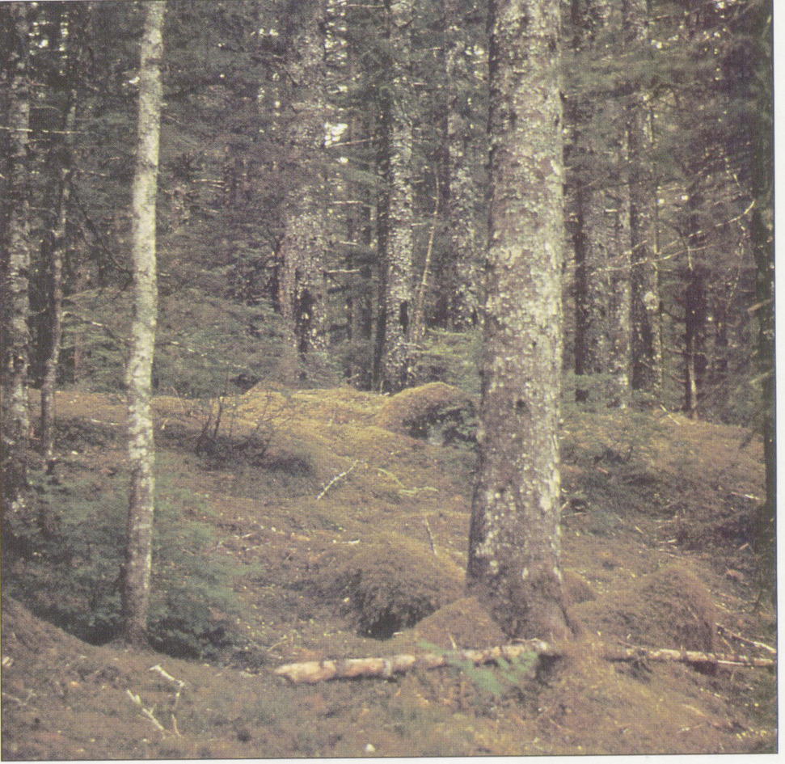

---

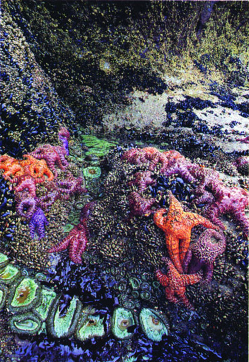

---

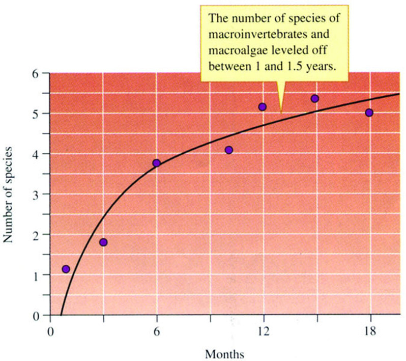

---

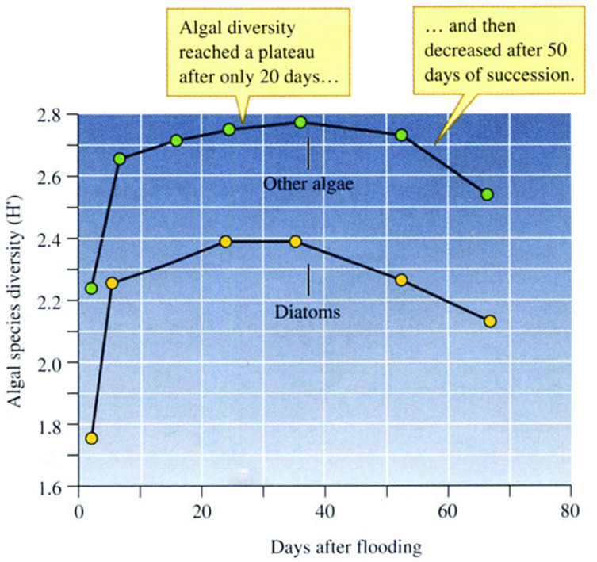

\note{

一条河流流经美国Arizona沙漠地区, 水量少且分布不均, 有洪水发生.

洪水冲走沙石和河底的沉积物从而导致大量生物消亡

Fisher在1979年观测的一次洪水使得98％的藻类和无脊椎动物消亡

50天后河流的群落即可重新建立

}

## 36.3.2 从湖泊到森林要经历5个演替阶段

1. 裸底阶段: 浮游生物, 小鱼等(湖底有机质出现). 
2. 沉水植物阶段: 轮藻, 眼子菜等(继续垫高湖底). 
3. 浮叶根生植物阶段:睡莲, 荇菜等(抑制沉水植物). 
4. 挺水植物阶段: 芦苇, 香蒲, 泽泻等(根系密集). 
5. 森林群落阶段: 
    * 湿生草本植物群落(沼泽):苔草, 莎草科(土壤形成)
    * 森林植物群落: 山毛榉, 雪松等

演替特点: 群落发展, 环境改变, 不利于原群落的生存和发展, 为下一群落形成创造条件.

## 36.3.3 群落演替的终点是顶极群落

顶极群落
:   当一个群落演替到同环境平衡的状态, 演替就不再进行. 在这个平衡点, 群落结构最复杂, 最稳定, 是生态演替的最终阶段.
