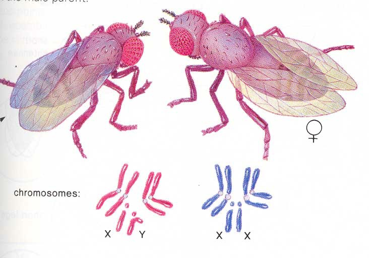

# 6.1 性状的孟德尔式遗传

## 6.1.1 性状的颗粒式遗传与孟德尔第一定律


\note{

本书第二版还是由陈阅增先生主导的大纲, 后续的编者对于某些生命科学领域的发展进程并不是十分了解.

为了加上一些新的重要的科学进展, 同时又不能增加同学们的负担, 他们将陈先生很多关于科学家们的背景与简介删除了.

本课程幻灯片的版式

介绍孟德尔背景以及奥地利历史.

捷克以前是神罗的一部分

\emph{提问:} 生物学以前是一个学科的分支, 你们知道是哪个吗?

}

---

> 要是在生活中有了苦恼和烦忧, 那就像现在这样睁开双眼到树林中去吧. 从每棵树上, 每丛灌木上, 从每朵花中, 每只动物身上,
> 你都会感受到造物主的\underline{全知全能}, 并从中获得慰藉与力量.

\begin{exampleblock}{}
    \hspace*\fill{\small--- \textit{《茜茜公主》} }
\end{exampleblock}

\note{

博物学与自然神学.

}

---


\note{

豌豆是自交的, 纯合体

}

---


\note{

单独一个性状没有混合的样式

遗传学有自己独特的研究方法.

两种研究方法: 1 与 N-1.

以青蒿素为例讲解寻找单一因素的方法

举例, 遗传学家观察汽车生产

}

## 一对性状的遗传分析


\note{

旁氏表 (Punnett square), 又称棋盘法.

}

---

\alert{分离定律}:

1. 遗传性状由遗传因子决定;
2. 每个植株有一对遗传因子控制花 (冠) 颜色;
3. 每一生殖细胞 (花粉或卵细胞) 只含有每对遗传因子中的一个;
4. 每个植株的每对遗传因子中, 一个来自父本雄性生殖细胞, 一个来自母本雌性生殖细胞;
5. 植株形成生殖细胞时, 每对遗传因子相互分开 (即分离), 分别进入生殖细胞中;
6. 生殖细胞的结合 (形成一个新个体或合子) 是随机的;
7. 紫花因子和白花因子是同一遗传因子的两种形式, 其中紫花因子对白花因子为显性, 反之, 白花因子对紫花因子为隐性.

## 6.1.2 自由组合与孟德尔第二定律


---

自由组合定律

:   决定不同对相对性状的遗传因子, 在遗传传递过程中, 各对因子间的分离和组合互不干扰, 各自独立分配到配子中.


## 颗粒遗传理论

孟德尔定律的精髓

: 代表一对相对性状 (如红花对白花) 的遗传因子在同一体内各别存在, 互不沾染, 不相混合的遗传方式.

## 6.1.3 人类性状的孟德尔式遗传


---


---


\note{

额头发际

指背毛发

雀斑

大拇指指节

耳垂

提一下系谱图

}

---

新近产生的表型:

* 大汗腺
* 乳糖耐受
* 喝酒脸红

\note{

板书 "显隐性是什么"?

等位基因上的差异.

Red face 基因的效率是普通的 100 倍, 自然就是显性

留在黑板上等下面两小节补画.

}

## 6.1.4 孟德尔定律的扩展

表面看起来似乎不符合孟德尔定律, 不是 3:1, 也不是 9:3:3:1, 但本质上还是属于孟德尔式遗传的一些现象.

## 不完全显性的中间表型


## 复等位基因的遗传

指一个基因有两个以上的等位形式, 如人类ABO血型就是由复等位基因 $I^A$, $I^B$ 和 $i$ 决定.

\note{

补画显隐性, 两个等位基因都起作用

}

---


\note{

补画显隐性, 有三个等位基因, 其中两个等位基因表现出它们自己的作用

}

---

## 单个基因影响多种表型


---


\note{

细胞内容积变小

运输氧气能力变差

}

## 6.1.5 数量性状的孟德尔式遗传

多基因决定的数量性状

---

\includegraphics{biostat.images/10-Mark.jpg}

中心极限定理
:   在适当的条件下, 大量相互独立随机变量的均值经适当标准化后依分布收敛于正态分布.

---

\alert{绝大多数生物学表型特征}, 都由多个基因及环境条件决定

* 身高
* 新生儿体重
* 药物对疾病的效果
* 种子的大小
* 光合作用的速率
* ...

\alert{服从正态分布或者可以转化为正态分布}

\note{

人有两万个基因, 大多数植物有三到四万个基因

}

# 6.2 遗传的染色体学说与遗传第三定律

## 6.2.1 伴性遗传与遗传的染色体学说

细胞生物学的发展

* 1870s, Walther Flemming, 动物细胞有丝分裂的染色体与染色质
* Eduard Strasburger, 植物有丝分裂与染色体

* 1876, Oscar Hertwig, 减数分裂
* 1883, Edouard Van Beneden, 以染色体角度再次描述减数分裂

## 萨顿和博韦里的假说

* 1900 年, 孟德尔定律被重新发现
* Sutton 和 Boveri 于 1902 年分别独立地提出
* 孟德尔的遗传因子 (基因) 与性细胞在减数分裂过程中的染色体行为有着平行关系

\note{

图 6.9

}

---

1. 过程（略）
2. 特点
    * DNA 复制一次, 细胞连续分裂两次, 形成的细胞是单倍体的;
    * 有联会, 因而有交叉, 重组等. ^[联会: 同源染色体配对成四分体, 发生在前期 I.]

---


---


---

遗传因子与减数分裂过程中的染色体行为有着\alert{平行关系}:

* 两者在体细胞中都成对存在, 而在生殖细胞中则是单独存在的
* 成对的染色体或遗传因子在细胞减数分裂时彼此分离，进入不同的子细胞中
* 不同对的染色体或遗传因子可以自由组合

并不能完全证明两者之间的\alert{直接联系}.

需要有\alert{遗传因子位于染色体上}的证据.

\note{

板书平行线, 展示平行关系

其它可能: 1) 共同的上游调控; 2) 共同的下游负反馈

留下这个图, 说明需要一个直接的证据, 两者之间是直接联系的

春风杨柳万千条, 六亿神州尽舜尧.

}

## 性染色体与性别决定


---


\note{

XO

XXY

性别很难看成是单一性状

}

## 黑腹果蝇的伴性遗传


\note{

1908 年, 摩尔根发现黑腹果蝇是理想的遗传学研究的模式生物

1933 年, 第一位遗传学方面的诺奖得主

\url{https://www.lindahall.org/about/news/scientist-of-the-day/thomas-hunt-morgan/}

}

---

* 果蝇
    * 生活周期短;
    * 易培养;
    * 繁殖力强;
    * 染色体数目少且形态特点十分分明.

\note{

\emph{提问:} 自然状态的果蝇都是杂交的, 那么它们就都是杂合体, 但遗传学的研究需要纯合体.

怎么让果蝇成为纯合体? 怎么实现 $N - 1$?

}

---



---


---


\note{

画 XX, XY, 并用红色在 X 上标记

}

## 6.2.2 人类的性连锁遗传


---


---


## 6.2.3 连锁交换与遗传第三定律


\note{

1908年, 香豌豆花色和花粉形状两对性状的遗传不符合孟德尔的自由组合定律.

豌豆的染色体数为 2n=14, Genome Size ~4.3 Gbp.

孟德尔发现的 7 个性状恰好位于 7 条不同的染色体上.

\url{https://www.coolseasonfoodlegume.org/organism/Pisum/sativum}

}

---


## 摩尔根与遗传的第三定律

* 1912 年, 摩尔根与他的学生提出连锁交换定律.
* 同一染色体上的两对或两对以上的基因遗传时, 联合在一起共同出现的频率大于重新组合的频率,
  重组类型的产生是由于配子形成过程中, 同源染色体的非姐妹染色单体间发生局部交换的结果.
* 重组频率的大小与连锁基因在染色体上的位置有关.

\note{

注意重组的几重涵义

}

---


## 6.2.4 基因定位与连锁作图

同时揭示了基因在染色体上的分布情况.

```text
b <-  9  -> cn <- 9.5 -> vg
  <-        17        ->
```

\note{

基因的数量要远大于染色体的数量, 一条染色体上会分布有很多基因, 那么基因在染色体上是怎么分布的呢?

最简单的是直线型, 但为什么不能是多个环状的, 膛线状的, 平行线段等等?

$9+9.5 > 17$, 这不是测量误差, 而是数学模型的预期!

举例: 小概率事件发生的次数 (泊松分布)

被鸟屎碰到, 人, 伞, 南大这么大面积

当遗传距离增大时, 两次重组同时发生的概率也在增大, 就降低了观察到的重组率

总结: 遗传一、二定律只是染色体在减数分裂中的行为, 并不能推理出后续 Morgan 和他的学生们归纳出来的第三定律.

}
