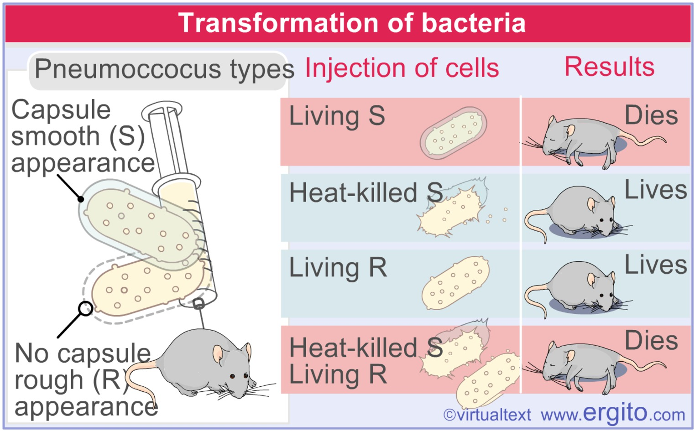

# 7.1 DNA 是遗传物质

## 肺炎链球菌转化实验

\note{

板书四种主要的生物分子: DNA, Protein, Sugar, Fat

S, R 指的是菌落的表型

播放单菌落视频

黑板上画平板上划菌落过程

异想天开的实验

\alert{完成一个表型的转换}

}

---

---

## T2 噬菌体感染实验

\note{

\alert{完成一个类生命体}

}

---

---

\note{

播放噬菌体视频

}

---

## 部分病毒以 RNA 作为遗传物质

* 烟草花叶病毒
* SARS / SARS-CoV-2

# 7.2 DNA 复制

## DNA 与 RNA 是多核苷酸的聚合体

1. Chargaff 法则
    * **[A]=[T] [G]=[C]**

2. DNA 与 RNA 是多核苷酸的聚合体
    * 核苷
    * 核苷酸
    * DNA 分子的**一级**结构

---

\note{

回到第一篇

}

---

\note{

30 min

展示基因组 fasta 文件

}

## DNA --- 不朽的双螺旋

* Watson 和 Crick.
* DNA 分子由两条\alert{互补}核苷酸单链组成; 两条核苷酸链总是按碱基 A 与 T, G 与 C 互补配对,
  成\alert{反向平行}, 通过氢键形成稳定的双螺旋结构.

---

\note{

板书高中学的内容, 波的干涉实验, NaCl 晶体

}

---

\note{

The famous Photo 51

激光, 弹簧, 干涉图像

}

---

\begin{figure}
    \begin{minipage}[b]{.48\linewidth}
        \includegraphics{ch-7.images/image13.jpg}
        \subcaption{Rosalind Franklin}
    \end{minipage}
    \hfill
    \begin{minipage}[b]{.48\linewidth}
        \includegraphics{ch-7.images/image14.jpg}
        \subcaption{Maurice Wilkins}
    \end{minipage}
    \caption{研究 DNA 晶体的科学家}
\end{figure}

---

\note{

Crick 已经去世.

Waston 还在, 曾经是哈佛生物系的主任, 同是是 CSHL 的主任.

我们 (西方人) 的社会政策主要基于他们 (非洲人) 的智力与我们一样 (的前提), 但实验表明并非如此.

}

---

\note{

展示 Watson 和 Crick 原始论文

}

---

---

---

\note{

用纸和纸筒来演示大沟和小沟

60 min

}

## DNA 复制依赖于碱基配对

A 与 T, G 与 C 配对.

## DNA 复制是半保留式的

DNA 复制形成的两个 DNA 分子, 每个都由一条新链和一条旧链组成.

---

---

\note{

EB, 溴化乙锭, 嵌入到 DNA 链中, 在紫外线的辐射下发出红光.

画离心管, 稳定同位素 \ce{^{15}N} 标记

提问, 有实验方法, 有三种假说, 预测假说能得到的实验结果

}

---

\begin{figure}
    \includegraphics[height=0.75\textheight, keepaspectratio]{ch-7.images/image22.jpg}
    \caption{大肠杆菌中的 DNA 复制\footnotemark}
\end{figure}

\footnotetext{\fullcite{meselson1958}}

---

---

---

\note{

人工合成 DNA 加入新的遗传编码 (New Letters Added to the Genetic Alphabet)

两种合成的核苷酸 P 和 Z 能无缝的整合到 DNA 的螺旋结构中，维持 DNA 的自然形态.

人工增强的 DNA 序列能像传统的 DNA 那样演化. 新的核苷酸甚至在某些方面比天然的核苷酸表现的更出色.

在外星球上未必需要类似地球的 DNA、RNA 和蛋白质的标准生物基本组件系统.

DOI:10.1021/jacs.5b03482

DOI:10.1021/jacs.5b02251

2019 年又加入两种新的碱基形式, 达到了 8 种

}

## 复制的半不连续性

* DNA 聚合酶**只能**使核苷酸按 \alert{$5^{\prime} \rightarrow 3^{\prime}$ 方向}连接成链
* 而 DNA 的两条链的方向相反, 这相反的一条链,
  DNA 聚合酶是通过\alert{冈崎片段}来合成它的互补链的.

---

\note{

放视频

板书 10K rpm, 每圈 (rotation) 是 10 个碱基对

细菌的基因组复制为双向复制, 大肠杆菌基因组为 5M, 复制一次的时间与细菌富营养条件下生长的时间, 30 min,
相符合

}

---

---

\note{

板画詹天佑修建京张铁路

90 min

}

# 7.3 基因的概念与演变

## 遗传学世纪的大事件 {.allowframebreaks}

* 1865 Genes are particulate factors
* 1903 Chromosomes are hereditary units
* 1910 Genes lie on chromosomes
* 1913 Chromosomes are linear arrays of genes
* 1931 Recombination occurs by crossing over
* 1944 DNA is the genetic material
* 1945 A gene codes for protein
* 1951 First protein sequence
* 1953 DNA is a double helix
* 1958 DNA replicates semiconservatively
* 1961 Genetic code is triplet
* 1977 Eukaryotic genes are interrupted
* 1977 DNA can be sequenced
* 1995 Bacterial genomes sequenced
* 2001 Human genome sequenced

* 蛋白质是表型特征的分子基础
* DNA 与蛋白质的合成
* 遗传信息在细胞质中被翻译
* 中心法则

\note{

本书第五版在第 9 章详细讲这部分内容

}

# 7.4 基因组

## 基因组及基因组学

基因组
:   一个生物个体中, DNA 分子所携带的遗传信息总和.

* genome
* 核基因组
* 叶绿体基因组
* 线粒体基因组
* 病毒基因组
* 人的基因组 (22+X+Y)

基因组学
:   研究生物体的基因和基因组的结构, 组成和功能.

\note{

* 结构基因组学: 研究基因和基因组的结构, 各种元件的序列特征, 基因定位和基因组作图等.
* 功能基因组学: 在基因组水平上阐明 DNA 序列的功能,
  着重研究不同的序列结构所具有的不同功能, 基因的表达与调控, 基因和环境之间的相互作用等.
* 多种生物和病毒的基因组全序列测定.

}

---

---

人类基因组计划

* 1985 年, 美国能源部正式提出人类基因组测序.
* 1990 年, 正式启动人类基因组测序.

1. 绘制人类基因组连锁图
2. 绘制物理图
3. 人类基因组测序
4. 其他物种基因组分析

---

---

---

---

---

## 基因专利

* Myriad genetics 公司拥有 *BRCA1* 和 *BRCA2* 基因的国际专利, 乳腺癌与卵巢癌的相关基因.
* Myriad 的测试费为 \$869.
* 现在有更便宜的方法, 只要 \$100, 但都侵犯了 Myriad 的专利.

\note{

朱莉检查之后, 切除了乳腺

}

---

\begin{figure}
    \begin{minipage}[b]{.48\linewidth}
        \includegraphics{ch-7.images/venter.jpg}
    \end{minipage}
\hfill
    \begin{minipage}[b]{.48\linewidth}
        \includegraphics{ch-7.images/celera.jpg}
    \end{minipage}
\caption{文特尔, J. Craig Venter}
\end{figure}

---

---

\note{

Then order scaffolds on the chromosomes using the HGP clone map and
other publicly available maps.

}

---

## 基因组草图, 2001

* International Human Genome Sequencing Consortium
    * **公共项目**
    * \fullcite{lander2001}
* Celera Genomics, Venter JC *et al.*
    * **私有项目**
    * \fullcite{venter2001}

---

\begin{figure}
    \begin{minipage}[b]{.48\linewidth}
        \includegraphics{ch-7.images/nature-cover.jpg}
        \subcaption{Nature}
    \end{minipage}
\hfill
    \begin{minipage}[b]{.48\linewidth}
        \includegraphics{ch-7.images/science-cover.jpg}
        \subcaption{Science}
    \end{minipage}
\caption{基因组草图, 2001}
\end{figure}

---

## 基因组研究成果

* $3.2\times10^9$ bp
* 约 2 万个基因

测序已完成; 进一步的工作是确定各个基因的功能及他们之间的相互关系.

\note{

Informatics is to biology what mathematics is to physics.

费曼: Physics is to math what sex is to masturbation.

}

---

---

---

---

\note{

\url{http://www.ebiotrade.com/newsf/2010-3/2010315172205631.htm}

}

## Personal Genomes

\begin{columns}[onlytextwidth]
\column{0.5\textwidth}
    \begin{itemize}
        \item Craig Venter
        \item James Watson
        \item Stephen Quake
        \item George Church
        \item Marjolein Kriek
        \item Hermann Hauser
        \item Han Chinese
        \item Seong-Jin Kim
        \item Korean AK1
        \item Yoruban African NA18507
    \end{itemize}
\column{0.5\textwidth}
    \begin{itemize}
        \item 14 others sequenced by Complete Genomics
        \item Unknown number sequenced by Knome
        \item 6 genomes sequenced at high depth by the 1000 Genomes Project
        \item 180 genomes sequenced at low coverage by the 1000 Genomes Project
        \item Two acute myeloid leukemia patients
    \end{itemize}
\end{columns}

\note{

People Who’ve Had Their Genomes Sequenced

Stephen Quake, A Stanford engineer

Marjolein Kriek, a clinical geneticist at LUMC

Dr. Hauser, Partner, Amadeus Capital Partners Ltd, is the first consumer
to purchase Illumina's individual genome sequencing service.

}

---

\begin{figure}
    \begin{minipage}[b]{.48\linewidth}
        \includegraphics{ch-7.images/image29.jpg}
        \subcaption{脊椎动物}
    \end{minipage}
\hfill
    \begin{minipage}[b]{.48\linewidth}
        \includegraphics{ch-7.images/image31.jpg}
        \subcaption{英国人健康计划}
    \end{minipage}\\
    \begin{minipage}[b]{\linewidth}
        \includegraphics{ch-7.images/image30.jpg}
        \subcaption{拟南芥}
    \end{minipage}%
\caption{其它计划}
\end{figure}

\note{

奥巴马卸任总统后，下一步考虑做风投.

"我与硅谷以及风投的交流， 极大地满足了我对科学和组织的兴趣 ……
你可以只花几千美元，而不是十万美元,就可以把个人的基因绘制出来，你可以有能力辨识自己的（基因）倾向，
去生产对你这个个体而言最有效的药物，这只是可以让我坐下来，与别人谈几个小时的科技创业的例子之一."

在最近与彭博社的一次采访中，奥巴马透露了自己想要进入科技风投界的想法.

}

---

\note{

Remember when you used to think that GenBank was ‘big’? The NCBI
Sequence Read Archive (SRA) now dominates the NCBI FTP site and accounts
for 1.14 Petabytes of storage (perhaps explaining why it is to be phased
out). In comparison, the Genome and GenBank directories on the FTP site
account for less than a tenth of one percent of all sequences. Sequences
from ‘traditional’ sequencing methods now contribute less and less to
genome projects. The so called ‘short’ reads – which are getting longer
all the time –  dominate the scene.

}

---

\begin{figure}
    \includegraphics[height=0.75\textheight, keepaspectratio]{ch-7.images/image34.jpg}
    \caption{追踪罕见遗传疾病的致病基因\footnotemark}
\end{figure}

\footnotetext{\fullcite{lupski2010}}

\note{

研究人员首次通过测序有罕见遗传疾病的人的全部基因去追踪致病基因.

休斯顿 Baylor 医学院遗传学家 James Lupski 和他的三个兄弟姐妹生来就有腓骨肌萎缩症, 这种遗传病会影响神经系统,
使腿部和手臂肌肉变得虚弱. 因为基因测序费用已大幅下降, Baylor 医学院的研究人员测序了 Lupski 的 DNA, 然后将 注意力集中在
40 个已知与神经疾病有关的基因. 他们在 SH3TC2 基因的两个副本上发现了突变, 该基因导致了腓骨肌萎缩症, 并可能参与了神经传递.
其中一个突变之前从未报告过, Lupski 的三个兄弟姐妹也有相同的突变, 而他健康的双亲和 其他兄弟姐妹只有一个突变基因.
报告发表在《新英格兰医学杂志》上. 测序费用总共花了 5 万美元.

}

## 人类基因组各组成成分的基本特征

1. 基因
    * 断裂基因
2. 基因外 DNA
    * 单拷贝序列和低拷贝数序列占 70--80%
    * 中度和高度重复序列占 20--30%
3. 分散重复序列
4. 簇状重复序列

# 7.5 非孟德尔式遗传

## 高等植物的细胞质遗传

* 细胞质中的遗传物质控制的遗传, 质体和线粒体.
* 非孟德尔式.
* 母本贡献遗传物质, 而且是随机分配给子细胞.
* F1 通常只表现母本的性状, 后代一般不出现一定比例的分离.

---

: 紫茉莉绿白斑植株的细胞质遗传

| 母本枝条的类型 | 父本枝条的类型 |   子代的类型   |
|:-----------:|:-----------:|:------------:|
|      白      |     白      |      白      |
|      绿      |     白      |      绿      |
|    绿白斑    |     白      | 绿, 白或绿白斑 |
|      白      |     绿      |      白      |
|      绿      |     绿      |      绿      |
|    绿白斑    |     绿      | 绿, 白或绿白斑 |
|      白      |    绿白斑    |      白      |
|      绿      |    绿白斑    |      绿      |
|    绿白斑    |    绿白斑    | 绿, 白或绿白斑 |

