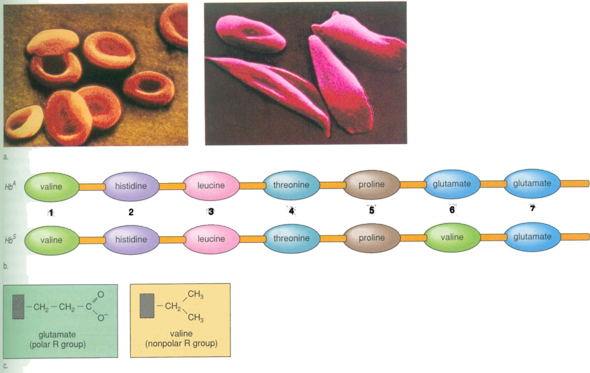
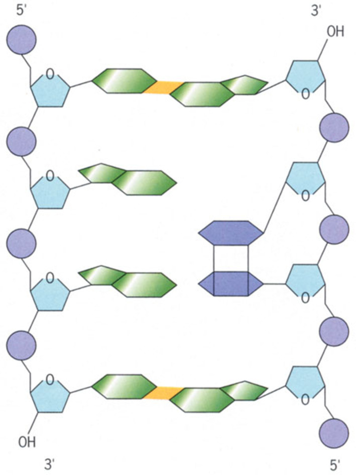
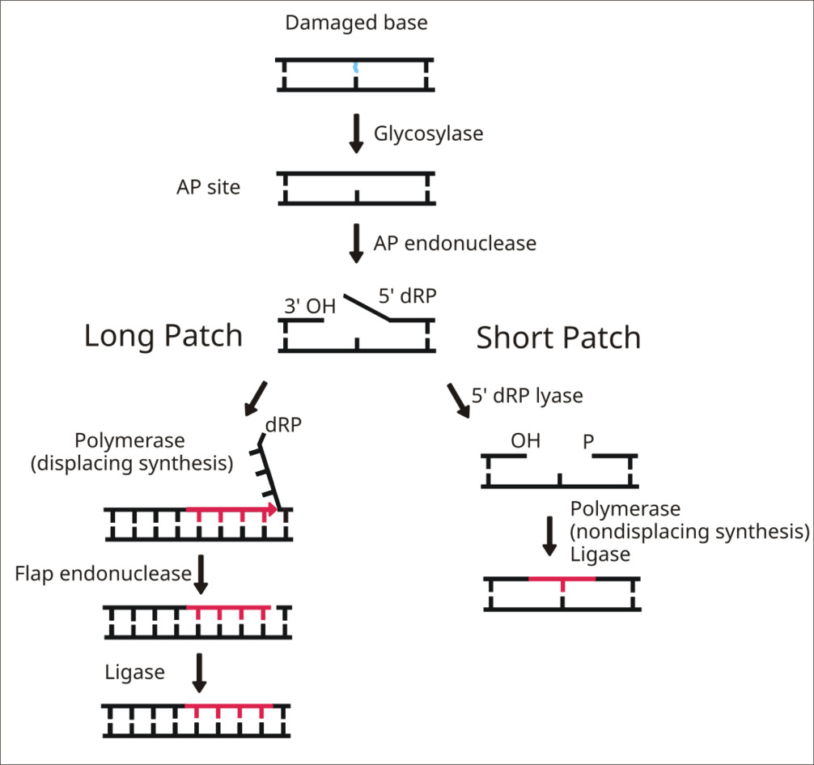
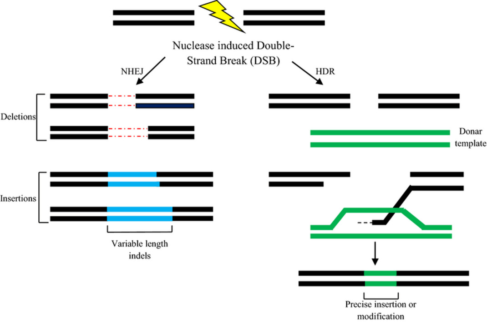
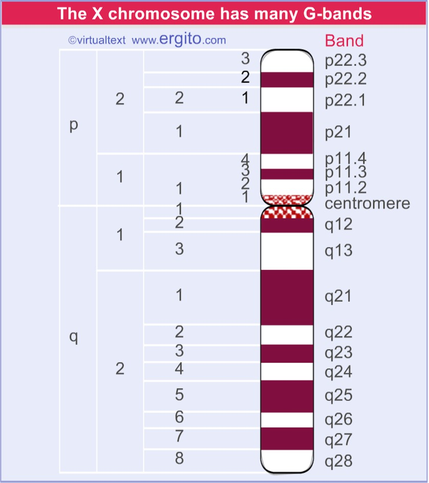
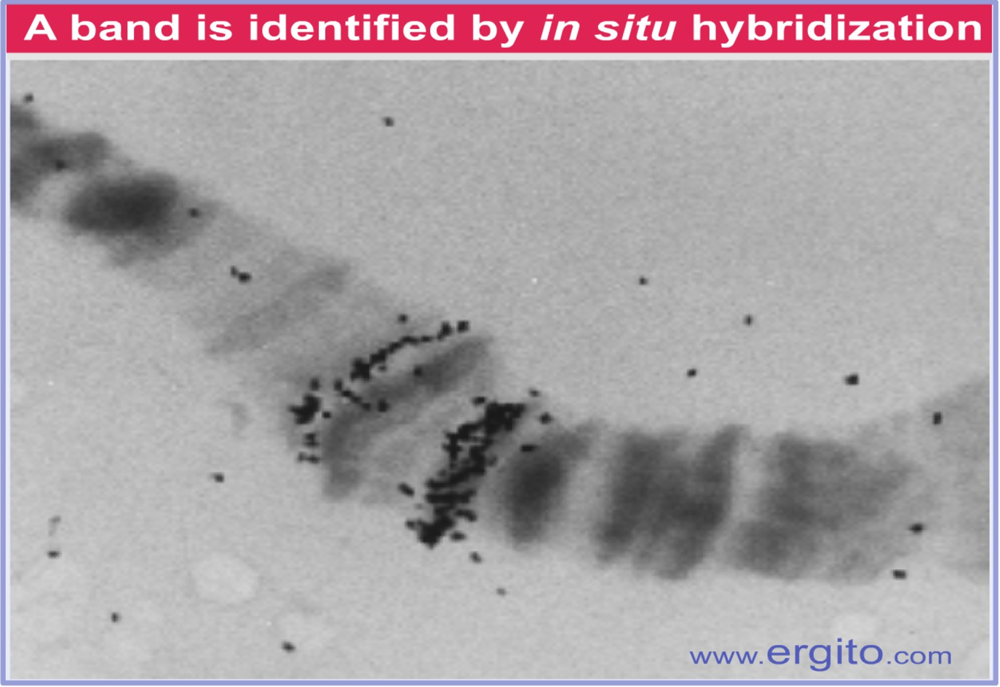
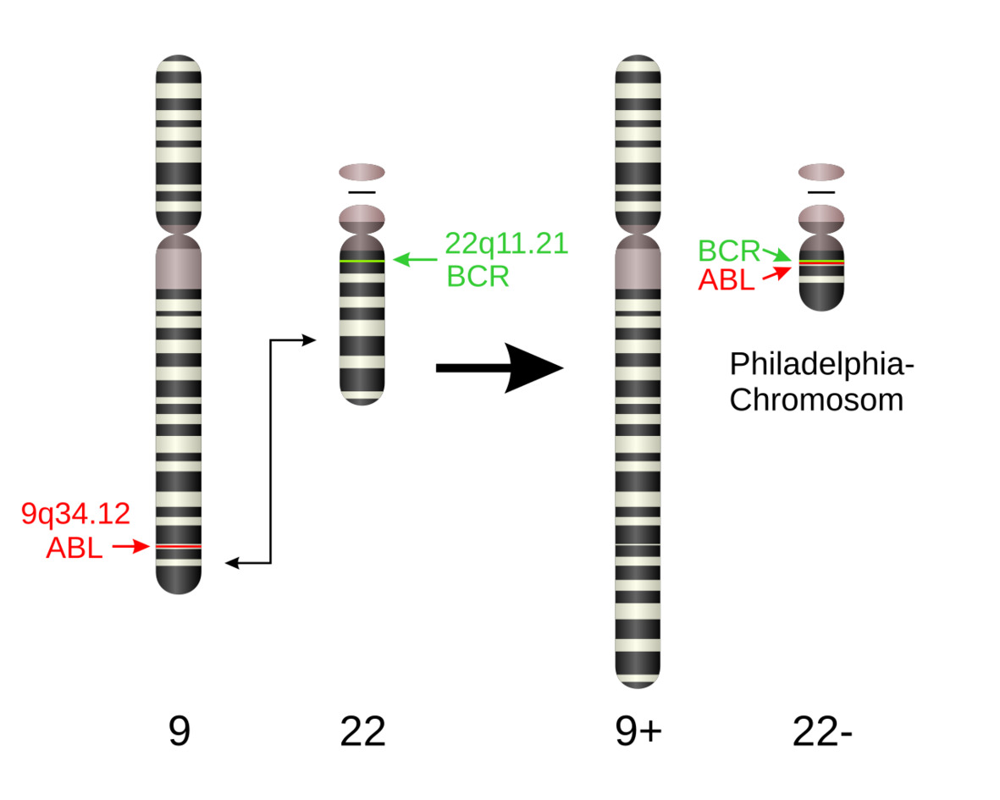
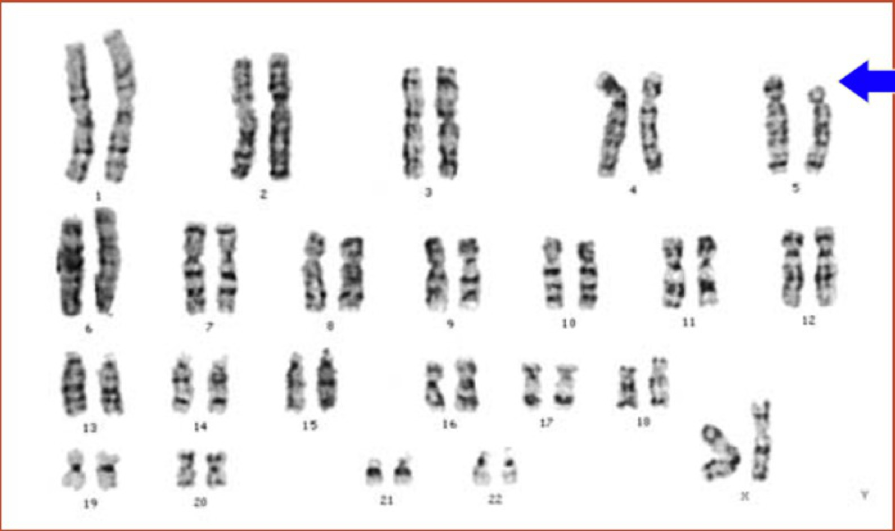
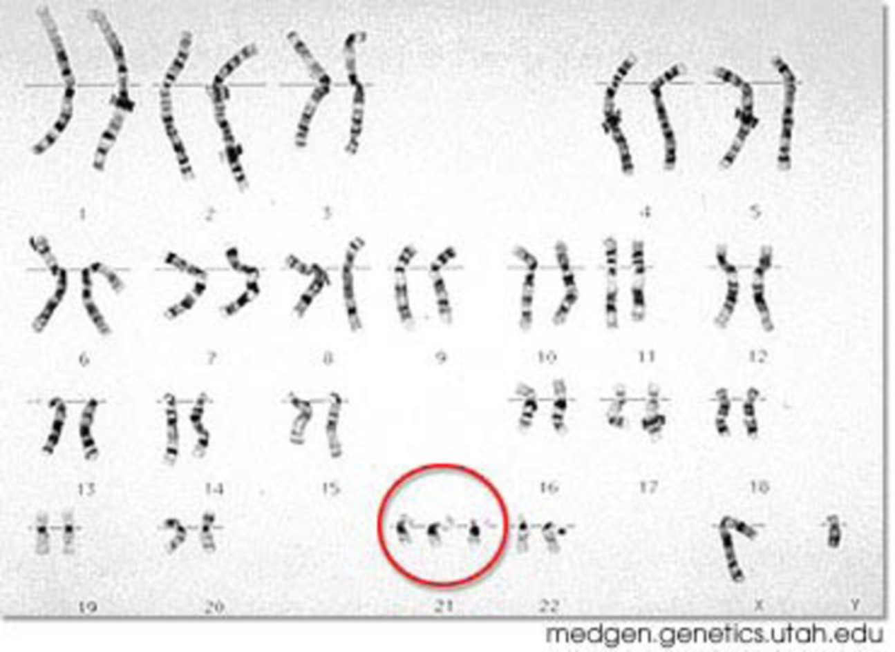

* DNA 作为遗传物质, 需兼具 \underline{稳定性} 与 \underline{灵活性}
* \underline{遗传} 与 \underline{变异}

\note{

没有稳定性, 生命无法延续; 没有灵活性, 生命无法适应环境

}

# 8.1 基因突变

## 8.1.1 点突变

* 置换 (substitution)
  * 转换 (transition)
  * 颠换 (transversion)

* 镰刀形贫血症 (GAG $\rightarrow$ GUG)

---

---

* 同义突变
* 错义突变/非同义突变
* 无义突变

## 8.1.2 插入/缺失突变

* 插入 (insertion)
* 缺失 (deletion)
* 基因的编码区非3的整倍数插入/缺失, 称为移码突变

## 突变的诱发

* 辐射
* 化学诱变剂
* 其他诱变因素
    * 温度
    * DNA 修复系统发生错误

---

\note{

A pyrimidine dimer that has formed within a DNA duplex following UV irradiation.

}

---

---

\note{

ch-16, p. 278

}

# 8.2 染色体畸变

## 8.2.1 染色体的结构畸变

\begin{figure}
    \includegraphics[height=0.75\textheight, keepaspectratio]{ch-8.images/image39.jpg}
    \caption{果蝇的多线染色体}
\end{figure}

---

---

---

* 缺失
* 重复
* 倒位
* 易位

\note{

倒位环

}

---

\note{

白血病: 急性/慢性; 淋巴母细胞/髓细胞

慢性髓细胞白血病, CML, 15%

1960年, 两位美国费城的科学家: 宾夕法尼亚大学教授彼得·诺维尔 和 Fox Chase 癌症中心的大卫·亨格福德首次发现此类染色体变异.

1973年, 芝加哥大学的珍妮特·罗利确认了费城染色体的形成机制来自于染色体易位.

伊马替尼 (Imatinib), 中文商品名 格列卫, 酪氨酸激酶抑制剂

慢性粒细胞白血病患者的五年生存率提高了近一倍, 从1993年的31%, 到2003年至2009年的59%

}

---

\note{

儿童的猫叫综合症

}

## 8.2.2 染色体的数目畸变

* 整倍体
    * 三倍体无籽西瓜
* 非整倍体
    * Turner 综合症 (XO)
    * Klinefelter 综合症 (XXY)
    * 唐氏综合症 (21 三体)

---

\note{

唐氏综合症发病率为千分之一

唐氏综合症的筛查

}

