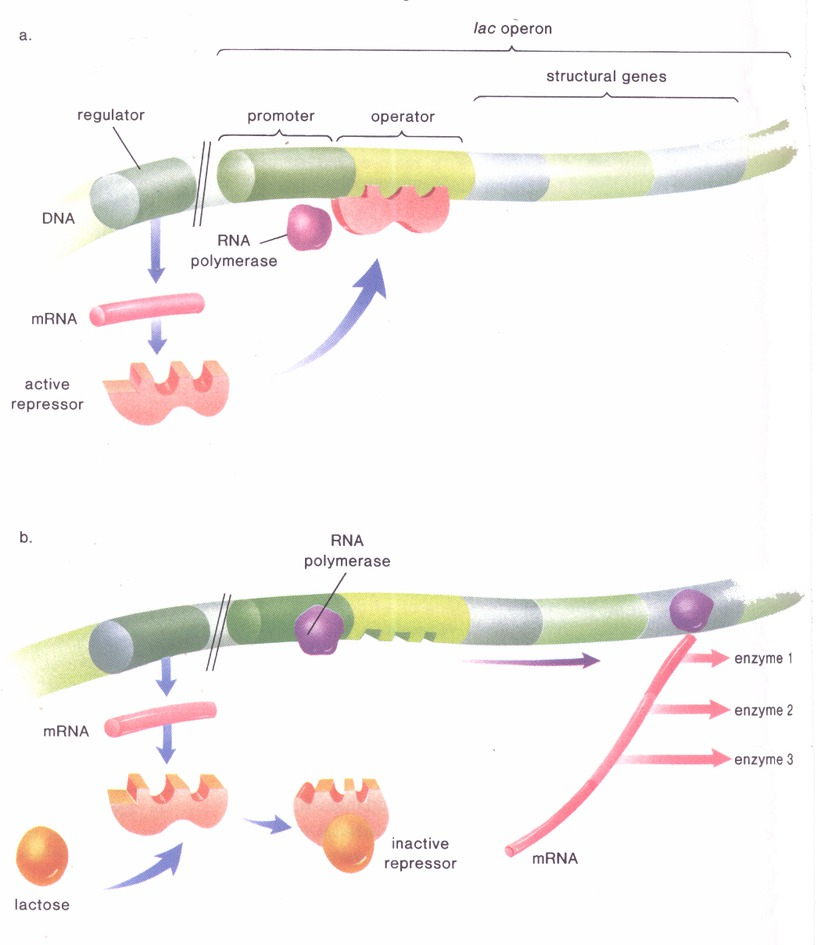

# 9.1 遗传信息解读的中心法则

## 9.1.1 性状决定的分子基础 --- 基因主要通过其产物决定性状

信息流是从 \alert{DNA} 到 \alert{RNA} 到 \alert{蛋白质}

蛋白质是表型特征的分子基础

* 1909 年, A. Garrod 尿黑酸症
    * 黑色尿 (性状) --- 酶 --- 基因
* 1940 年代, George Beadle 和 Edward Taturm
    * 一个基因一个酶
    * 一个基因一条多肽

\note{

遗传信息就像硬盘上的文件, 光是自己没有办法展示出来. 需要 CPU, 内存, 屏幕等等来表现.

DNA 就像是文件, 而 RNA 和蛋白质是电脑里其它的东西.

修正了基因型与表型之间的联系

一个基因多个表型

多个基因一个表型

}

---

: 粗糙脉孢菌 3 种精氨酸依赖型

| 突变型 |    生长所需氨基酸    |
|:-----:|:-----------------:|
|   1   | 精氨酸或瓜氨酸或鸟氨酸 |
|   2   |    精氨酸或瓜氨酸    |
|   3   |       精氨酸       |

\begin{figure}
    \centering
    \includegraphics[page=1]{../tikz/ch-21.pdf}
\end{figure}

\note{

营养缺陷型突变体

丰富培养基与基本培养基

}

## 9.1.2 性状决定的分子机制 --- 从基因到蛋白质的中心法则

中心法则 (central dogma)

\begin{figure}
    \centering
    \includegraphics[page=2]{../tikz/ch-21.pdf}
\end{figure}

---

\begin{figure}
    \centering
    \includegraphics[page=3]{../tikz/ch-21.pdf}
\end{figure}

\note{

1. 反转录酶的发现

2. DNA翻译

}

## RNA 的结构与功能

* 与 DNA 相比较, 其结构特点:
    * 单链
    * 戊糖是核糖
    * 尿嘧啶代替胸腺嘧啶
* 功能
    * 信使 RNA (mRNA)
    * 核糖体 RNA (rRNA)
    * 转运 RNA (tRNA)
    * ...

\note{

已经发现多达 10 余种的 RNA

}

---

## 遗传密码

* 三联体密码子
* 密码是连续的
* 密码的简并性

---

---

---

---

## 9.1.3 基因的转录与 RNA 的加工

转录 --- 从 DNA 到 RNA

* 以 DNA 为模板, 通过 RNA 聚合酶使碱基互补配对合成 RNA 的过程.
* 过程: 转录启始, 延伸和终止.

\note{

转录: 转换形式地录入

板书:

DNA 4 nt

RNA 4 nt

Protein 20 aa

}

---

---

\note{

提问: RNA 聚合酶在转录延伸的过程中孤零零的, 解开双链, 把单体的核苷酸加入长链都需要能量, 这能量从哪里来?

NTP

}

## 真核细胞的 RNA 转录后的加工

断裂基因

* 外显子 (编码功能)
* 内含子 (无编码功能)
* 内含子边界保守: $5^{\prime}$ GT ... AG $3^{\prime}$

---

---

RNA 剪接

* RNA 转录后加工
    * 加帽
        * $7^{\prime}$-甲基化鸟苷
        * 保护前体 RNA 免受外切核酸酶的降解, 与 40S 核糖体亚基识别.
    * 加尾
        * 多聚腺苷酸化 (100--200 个腺苷酸)
        * 免受核酸酶降解, 与 mRNA 从核内输入细胞质有关.
* RNA剪接
    * 剪接体 (splicesome), snRNP 和 snRNA.

---

---

---

## 9.1.4 蛋白质的合成

1. tRNA 携带氨基酸
2. 核糖体 "阅读" 密码子, 氨基酸连成多肽
    * 核糖体
    * 翻译的起始和连接
    * 翻译的终止

---

---

---

* 朊粒与中心法则
    * 新型克 -- 雅氏病 (nv--CJD), 库鲁病 (Kuru), 牛海绵状脑病 (BSE), 羊摩擦症 (scrapie）
    * 朊粒 (prion)
    * *PrP*
    * $\text{PrP}^\text{c}, \text{PrP}^\text{sc}$

# 9.2 基因表达的调控

---

基因表达
:   是指基因组中特定的基因上所携带的遗传信息, 经转录, 翻译等信息转化系统, 指导合成具特定氨基酸序列的蛋白质分子,
或转录后直接形成 RNA 产物的过程.

---

\note{

不同的细胞有不同的形状, 不同的功能, 其关键因素是它们含有不同的蛋白.

}

---

* 同一个细胞的生命周期的不同阶段, 表达不同的蛋白.
* 多细胞生物中, 不同类型的细胞表达不同的蛋白.
* 一个个体的所有的细胞都有一套相同的基因, 为什么蛋白的表达会有差异?

\note{

制造蛋白要消耗很多物质与能量, 对于细胞是一种负担.

很多蛋白不能稳定地存在于细胞中. 因此, 在需要的时候再表达蛋白, 是生物有效地生存下去的一个策略.

}

---

* 对基因表达过程的调节控制被称为基因表达调控.
  基因表达调控研究可以从分子水平上揭示生命活动的本质.
* 基因是在对环境因子和遗传发育程序的反应中, 在时间和空间上选择性表达.
* 转录水平调控与翻译水平调控.

\note{

转录水平调控是最主要地环节, 这也是效率的反映: 在最初的步骤就调控, 细胞消耗的物质与能量比较少.

图 9.8 里, 最大的阀门就是基因的转录

}

## 9.2.1 原核生物的基因表达调控

大肠杆菌的乳糖操纵子模型

\note{

杆菌.

人和动物肠道中的共生菌.

}

---

\note{

最喜欢葡萄糖, 也可以利用复杂一些的糖, 例如乳糖 (牛奶).

}

---

\begin{figure}
    \begin{minipage}[b]{.48\linewidth}
        \includegraphics{ch-9.images/image5.jpg}
        \subcaption{Francois Jacob}
    \end{minipage}
    \hfill
    \begin{minipage}[b]{.48\linewidth}
        \includegraphics{ch-9.images/image6.jpg}
        \subcaption{Jacques Monod}
    \end{minipage}
    \caption{1965 年诺贝尔生理学或医学奖}
\end{figure}

\note{

弗朗索瓦·雅各布 方斯华·贾克柏

贾克·莫诺

}

---

---

* 三个结构基因
    * \textit{lacZ}, 编码 $\beta$-galactosidase (LacZ), 位于细胞内,
      将乳糖水解为葡萄糖与半乳糖.
    * \textit{lacY}, 编码 $\beta$-galactoside permease (LacY), 位于细胞膜上,
      将乳糖转运到细胞内.
    * \textit{lacA}, 编码 $\beta$-galactoside transacetylase (LacA),
      将乙酰基转移到 $\beta$-galactosides上.
* 一个调节基因
    * \textit{lacI} 编码阻遏蛋白.
* 诱导物
    * 乳糖

\note{

\textit{lacA} 功能清楚, 只是在这里没有它也能行

突变体筛选

Z, Y,  a loss of function

These mutations fit into the expected pattern: A mutation in a gene
causes a coding error that produces a dysfunctional protein, which
cannot do its job.

lacI, a gain of constant function

A third kind of mutant always produced lactose-digesting enzymes.

this third type of mutant must have a mutation in some protein involved
in controlling gene expression, not in the genes coding for the enzymes
themselves.

Monod and Jacob’s idea was revolutionary at the time, because it pointed
to a protein whose sole function was to regulate the expression of other
genes.

}

---

\note{

西拉德, 匈牙利籍犹太人

奥匈帝国的修补军官

洪堡大学, Einstein, Planck, and Max von Laue 学习物理

1938 Fermi nuclear chain reaction

Einstein-Szilárd letter

}

---

---

* 操纵子: 只存在于原核生物中, 由功能上彼此相关的几个结构基因和控制区所组成.
    1. 结构基因: 编码蛋白质或 RNA 的基因;
    2. 调节基因: 参与其他基因表达调控的 RNA 或蛋白质的编码基因;
    3. 启动子: RNA聚合酶识别和结合的核苷酸序列, 与转录启始相关;
    4. 操纵基因: 调节基因所编码的阻遏蛋白的结合序列.

---

---

## 其它类型的操纵子

* 色氨酸操纵子
    * 负调控
    * 色氨酸存在时关闭

* 阿拉伯糖操纵子
    * 正调控

---

---

---

## 9.2.2 真核生物的基因表达调控

---

* 对于每一真核生物基因组来说, 有成千成万个基因构成. 这些基因并不是在任何发育阶段,
  任何组织器官中均处于活化的阶段, 只有少数看家基因始终处于活化状态.
* 多细胞生物的生长发育能够有条不紊地进行, 是由于组成生物体的基因, 在时间上和空间上顺序选择表达的结果.

---

---

Table: 不同的细胞有特异的基因表达方式

|             | 胰腺细胞 | 眼晶状体细胞 | 神经细胞 |
|:-----------:|:-------:|:---------:|:-------:|
|  糖酵解酶基因  |    +    |     +     |    +    |
| 晶状体蛋白基因 |    -    |     +     |    -    |
|  胰岛素基因   |    +    |     -     |    -    |
|  血红蛋白基因  |    -    |     -     |    -    |

\note{

不同的细胞有特异的基因表达方式

真核细胞的特异性是他们表达特定的基因而造成的.

}

## DNA 的包装影响基因的表达

* 在细胞周期的不同阶段遗传物质的包装形式在发生变化.
  只有处在特定染色质结构变化区的基因才能表达.
* 染色质: DNA, 组蛋白, 非组蛋白和少量的 RNA.
* 染色体
    * 常染色质: 转录 (念珠状结构) 或不转录 (30nm 纤维凝缩的染色质环组成). 凝缩程度低.
    * 异染色质: 不转录. 高度凝缩, 卫星 DNA 组成.

---

---

---

## 异染色质化与基因的表达失活

* 性染色质体 (巴氏小体)
* 玳瑁猫

---

\note{

Shown here at 7 weeks, cc ("copy cat": above, right) was produced by
nuclear transplantation of ovarian cumulus cells from Rainbow, a
tri-colour (orange / black / white) calico female (above, left), into
enucleated cat ova from an (unnamed) donor.

The surrogate mother, Allie, is a bi-colour tortoiseshell (orange and
black only) (below, with cc). Analysis of seven polymorphic
microsatellite loci confirmed that cc is a genetic clone of Rainbow.

}

## 基因表达失调与肿瘤的产生

肿瘤
:   正常的细胞增殖和凋亡失控, 扩张性增生的细胞群形成肿块.

恶性肿瘤 (癌症).

部分患者可以归因于遗传因素.

\note{

G1 $\rightarrow$ S $\rightarrow$ G2 $\rightarrow$ M

Up to 35% of interindividual variability in CRC risk has been attributed to genetic factors

}

## 原癌基因和抑癌基因

1. 病毒癌基因和原癌基因
    * 1910年, Peyton Rous, 鸡肉瘤的无细胞的抽提液, 诱发新的肉瘤
    * 1970年, Martin 等确定反转录病毒病毒基因与细胞癌变有关
    * 1976年, 分离出该基因 *src*
2. 抑癌基因
    * 使细胞不癌变或机体不长癌

\note{

多细胞生物有抗御肿瘤的机制. p53 在细胞周期之外检验, 动物体型越大, p53 拷贝越多

}

## 癌症的遗传学基础

1. 基因突变
2. 多次遗传改变的致癌作用
    * 结肠癌: 内璧细胞非正常分裂 $\rightarrow$ 良性肿瘤 $\rightarrow$ 癌

\note{

2009年12月, 桑格研究所在《自然》杂志上刊文宣布, 他们率先在世界上破译了肺癌, 皮肤癌和乳腺癌的全部基因密码,
并绘制出相应的肿瘤基因图谱.他们发现, 肺癌细胞的基因中含有22910个突变, 导致皮肤癌的恶性黑色素瘤的基因中则含有33345个突变.
这些突变中的大多数是“被动的”, 不会导致癌变, 小部分是“主动的”, 会导致癌变发生.

“比如肿瘤病人是否需要化疗, 就可以通过基因检测来决定.” 在化疗中, 有些人对药物反应非常敏感, 有些人反应却非常迟钝.
如果检查中发现病人体内的DNA修复基因呈阳性, 那么目前临床中最常用到的化疗药物“顺铂”就很可能对这个病人无效,
必须换用其他的药物. 而如果某个肺癌病人体内的一种名为“表皮生长因子受体”的基因发生了突变,
那么对这个病人使用“吉非替尼”和“厄罗替尼”两种药物, 则可以取得很好的疗效.

}

---

\note{

The lineage of mitotic cell divisions from the fertilized egg to a
single cell within a cancer showing the timing of the somatic mutations
acquired by the cancer cell and the processes that contribute to them.

化疗就是毒药, 杀敌 1000, 自伤 800

}

---

能够改变 DNA 的结构, 引起 DNA 损伤的物质, 可以使细胞癌变.

在生活中应该避免接触或摄入这些物质.

\note{

补充个人基因组与癌症基因组.

补充可传染的癌症.

MHC (主要组织相容性复合体) 阻断外界侵入的癌细胞 (器官移植配型).

种群的数量太少, 导致近亲繁殖增多的时候, MHC的组合数量也大大减少.

}

## 9.2.3 基因表达的表观遗传调控

* 真核生物基因表达调控是多层次的, 包括基因组水平, 转录水平, 转录后, 翻译水平, 翻译后.
  但主要机制是转录水平的调节.

## 基因表达的转录调控

* 转录水平的调控主要涉及3个组成成分的相互作用:
    * RNA 聚合酶
    * 顺式作用元件 (cis-)
    * 反式作用因子 (trans-)

\note{

第四版图 22.1

}

## 基因表达的转录后调控
