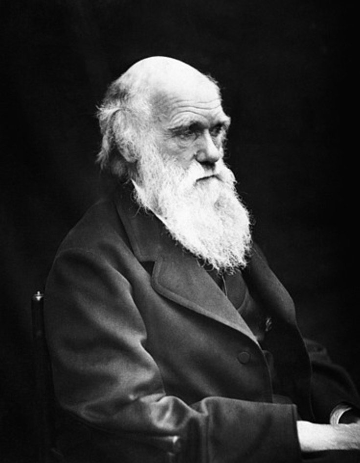
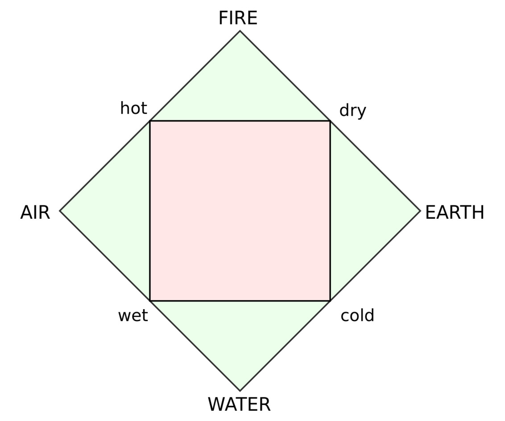
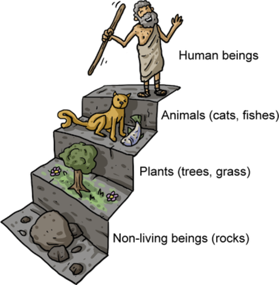

# 开篇

---

\note{

这是达尔文最为著名的照片, 那深邃的眼神就告诉我们他是个睿智的人.

然后, 睿智的人做出了突破性的创新工作.

哇, 这个人好厉害! 我们把他的工作写到教科书里, 让大家背下来.

并没有那么简单.

}

---

* 每个人都有他自己所处的时代背景, 伟大的科学家也不例外

* 只是记忆知识点不足以让人成长

* 从中学到大学的转变中的重要一环就是从 \alert{"是什么"} 到 \alert{"为什么"}

\note{

了解伟大科学家所处的背景, 能够使我们能更好地理解科学家所解决的问题, 理解它的重要性及其内容的涵义.

为什么他能做出如此伟大的发现?

悦读计划, 让新生阅读经典著作. 著作一般会带有详细的前因后果, 而不仅仅只是结论性的内容.
有助于培养同学们的独立思考的能力.

}

---

\begin{figure}
    \begin{minipage}[b]{.48\linewidth}
        \includegraphics{darwin/Young_Darwin.jpg}
        \subcaption{年青时的达尔文}
    \end{minipage}
    \hfill
    \begin{minipage}[b]{.48\linewidth}
        \includegraphics{ch-25.images/image26.jpg}
        \subcaption{贝格尔号}
    \end{minipage}
\end{figure}

\note{

1831--1836 年, 达尔文 (22 岁) 乘 "Beagle" 军舰作了 5 年环球探险航行. 观察采集动, 植物和化石标本.

战列舰, 将大炮换成科学仪器

博物学, 自然神学

无薪博物学家

}

## 欧洲的历史

* 古典时代
    * 5 世纪西罗马帝国灭亡
    * 希腊--罗马
    * 苏格拉底 --- 柏拉图 --- \alert{亚里士多德}
* 中世纪
    * 1453 年拜占庭帝国灭亡
    * 拜占庭帝国与封建基督教王国, 东西教会分裂
* 文艺复兴
    * 1500 至 1800 年
    * 文艺复兴, 宗教改革, 地理大发现, 启蒙运动
* 工业时代 --- 现代

\note{

大略地给大家看一下欧洲的历史.

很可惜, 我们中国在世界历史上是相对孤立的, 科学史上更是如此. 我们没有独立发展出自己的科学体系.

希腊有多到数不清的哲学家

拜占庭帝国就是东罗马帝国, 他们并不用这个名字, 而只自称罗马人.

血统中断过非常多次, 并不能对应我们中国的王朝.

中世纪是神权时代, 也是科学相对停滞的时代.

达尔文出生于工业革命开端的年代.

因此, 达尔文所处的时代背景, 与希腊时代直接相连.

}

# 古典时代: 亚里士多德

---

\note{

中学阶段已经在多次看到亚里士多德倒霉了, 好像他是个反面人物似的.

}

---

亚里士多德的思想与著作, 开创或拓展了多个学科

* 逻辑学
* 哲学
* 物理学
* \alert{生物学} (分类学)
* 政治学, 伦理学, 美学, 心理学等

\note{

亚里士多德不只研究了当时几乎所有的学科, 他也对这些学科做出极大的贡献.

}

---

理性精神
:   亚里士多德的方式是从最简单的现象开始, 多层次, 多方面地阐述, 最后用归纳, 演绎和推理导出一个基本严格的结论.

\note{

他的作品很多都是以讲课的笔记为基础, 有些甚至是他学生的课堂笔记.

大多数人认为他的著作现已失散, 只有大约三分之一的原创作品幸存了下来.

能够推翻亚里士多德的任意一项观点的人, 都是伟人

}

## 逻辑

经典的三段论

> 所有人都是必死的;

> 苏格拉底是人;

> 苏格拉底是必死的.

于十九世纪末, 传统逻辑被弗雷格和罗素提出的
[数理逻辑](https://zh.wikipedia.org/wiki/%E6%95%B0%E7%90%86%E9%80%BB%E8%BE%91) 所取代.

\note{

三段论

他的逻辑体系指导了我们人类 2200 年

}

## 哲学

metaphysics
: 通过理性的推理和逻辑去研究不能直接透过感知而得到答案的问题.

> 根本上有什么存在?

> 它是什么样的?

\note{

希腊语原文意思是之后或之上.

metaphysica 的出现其实由于亚里斯多德在他的作品集中把他对逻辑,
含义和原因等抽象知识的讨论编排在他讨论物理学的书册《自然学》之后, 并给这些讨论一个标签: "在自然学之后",
意即在《自然学》之后的书册.

而这个用语被拉丁语注解家错误地理解为 "超越于自然学的科学".

}

---

[形而上学](https://zh.wikipedia.org/wiki/%E5%BD%A2%E8%80%8C%E4%B8%8A%E5%AD%A6),
是对存在本质的非经验性哲学研究.

\begin{exampleblock}{}
    {\large "形而上者谓之道, 形而下者谓之器."}
    \vskip5mm
    \hspace*\fill{\small--- 易经$\cdot$系辞上传}
\end{exampleblock}

\note{

日本人井上哲次郎 (明治时代) 由 metaphysics 翻译而来

}

## 物理学

伽利略去了比萨斜塔
: 两个铁球同时落地.

\pause{石头和羽毛. 亚里士多德忽略了空气阻力吗?}

\pause{亚里士多德之后, 伽利略之前的学者都是笨蛋.}

---

\note{

亚里士多德认为火, 水, 土, 气四种元素具有可被人感觉的两两对立的性质.

进而推论世界上的万物的本原乃是四种原始性质：冷, 热, 干, 湿, 而元素则由这些原始性质依不同比例组合而成。

亚里斯多德构想出五元素说, 在柏拉图的四种元素中再加上以太 (精质, 永恒).

}

---

对质量与重力的解释:

* 每个元素都会处在相对于地心的不同位置，地心也是宇宙的中心.

* 土的自然位置是地心, 气的自然位置是天球. 所有物体都向其自然位置移动.

* 质量大的物质, 比如铁和其他金属, 主要是由土以及少量其他元素构成. 质量小的物体是由少量土以及更多的其他元素构成.

* 因此, 重物会下落, 蒸汽会溢出并向天空扩散.

\note{

亚里士多德认为, 事物都是由形式和质料组成的. 形式是一类事物的原则, 是使一类事物成为一类事物的东西.
而质料在与形式结合之前什么也不是, 因为与形式结合才有了区分, 才能形成个体事物.

举例来说, 人是理性动物, 理性就是人的形式, 而身体在这里可以说是人的质料（注意这不同于唯物主义精神和物质的二分）.

}

---

介质:

* 介质对于运行其中的物体有阻滞, 这种阻滞称为粘度
* 物体在介质中的速度与介质的粘度成反比
* 真空粘度为 0, 物体在真空中的速度是无穷大, 因此真空不存在

速度:

* 亚里士多德著作中的 \alert{速度} 其实更好地对应的是现代流体动力学中的 \alert{终端速度}.
* 形状不一样的物体, 讨论他们的下落, 是没有意义的

\begin{equation*}
    V_t = \sqrt{\frac{2 m g}{\rho A C_d}}
\end{equation*}

\note{

Terminal velocity

$V_{t}$ 为终端速度，
m 为物体重量，
g 为地球所引起的加速度，
$C_{d}$ 为阻力系数，
$\rho$ 为物体落下时所处的流体密度，
A 为物体的投影面积。

https://www.zhihu.com/question/24208167

普通人平时会忽略空气阻力, 他老人家也会忘记吧.

轻的东西和重的东西栓在一起, 这个表达并不明确; 我们必须要知道它们有没有被融合成一个个体.

关键是, 怎样才算融合成一个个体了, 亚里士多德形而上学有非常系统的处理.

去寻找伟人的不足点吧!

}

---

* 亚里士多德物理体系其实很严密了, 后人根本不敢对这个体系有什么多余的想法
* 物理学只是他体系中的一小部分, 没必要花太多时间. 要追寻更有意义的东西
* 假设错误而非逻辑错误

\note {

亚里士多德太聪明了, 以至于他可以在大脑里模拟整个宇宙, 根本没有把动手做实验这种方法考虑到他的哲学体系中去.

亚里士多德在他自己的假设下得出了一系列的结论. 但在现代, 这些假设已被放弃，结论也失去的存在的依凭.

}

## 分类学

* taxonomy
* 基于共有的相似性, 例如体型或骨骼特征
* 是分等级体系的, 相容性的组

\note{

分类学之父

相对于狗, 猫与狮同组

相对于鸟, 猫, 狮和狗同组

有血的动物, 无血的动物

水生动物, 陆生动物

He grouped the types of creatures according to their similarities:
animals with blood and animals without blood, animals that live on water
and animals that live on land. Aristotle's view of life was
hierarchical. He assumed that creatures could be grouped in order from
lowest to highest, with the human species being the highest.

}

---

\begin{figure}
    \includegraphics{ch-27.images/image50.jpg}
\end{figure}

---

\begin{figure}
    \includegraphics{ch-27.images/image51.jpg}
\end{figure}

---

\begin{figure}
    \includegraphics{ch-27.images/image52.jpg}
\end{figure}

---

\begin{figure}
    \includegraphics{ch-27.images/image53.jpg}
\end{figure}

---

\begin{figure}
    \includegraphics{ch-27.images/image54.jpg}
\end{figure}

---

\begin{figure}
    \includegraphics{ch-27.images/image55.jpg}
\end{figure}

---

# 中世纪: 神学之下的发展

---

\note{

天主教会认为他是史上最伟大的神学家, 将其评为35位教会圣师之一.

}

---

史上最伟大的神学家, [阿奎那](https://zh.wikipedia.org/wiki/%E6%89%98%E9%A9%AC%E6%96%AF%C2%B7%E9%98%BF%E5%A5%8E%E9%82%A3):

* 跟从亚里士多德的哲学方法论, 要建构一种兼具信仰与理性的知识体系, \alert{自然神学}
* 自然神学仅用人所共有的资源, 例如理性, 感知, 内省, 历史, 科学等, 进行宗教, 神学研究
* 神既然造了世界, 让人类有理性, 那么用\alert{中立的理性}来认识上帝就是完全有可能的
* \alert{虽然理性是不足以认识上帝的全貌, 但用其来证明上帝的存在仍是绰绰有余的}

\note{

对亚里斯多德情有独钟, 认定他的理念可以为基督教神学的发展, 提供理性的基础, 也可以用来对抗反对基督教的人士, 护卫基督教信仰.

"自然神学" 通常与 "启示神学" 相对, 先知.

}

## 上帝存在的五个证明 {.allowframebreaks}

1. 第一推动
    * 世界万物都在运动
    * 一个物体要运动必须要有某种力量推动它, 物体是不会自己运动的, 除非有什么力量去推动之
    * 必然会找到这样一个推动, 它是一个推动着, 自己却不为任何别的力量或物体所推动

2. 因果之链
    * 宇宙中任何物质所以存在必有某种原因, 可以说宇宙万物就组成了一个因果之链, 没有任何东西不是这因果之链的一环
    * 必然会找到一个最初的原因

3. 唯一之必然
    * 世间万物虽然存在着, 然而他们的存在并非必然的
    * 不存在能产生存在吗？无中能生有吗？不能.
    * 可有可无的万物已经存在是一个显而易见的事实. 所以, 在世间可有可无的万物之上, 必然存在一个必然之存在

4. 万物之目的
    * 世间万物虽然看上去错综复杂, 但似乎都有某个目的, 仿佛它们是有眼睛有智慧的一样
    * 万物, 除了人, 是没有智慧的
    * 那么是什么令他们看起来像有目的似的生存, 运动着呢?

5. 最高级的存在
    * 万物, 从无生命的物质, 到有生命但不能走不能叫的植物, 到能走能叫但不能说的动物, 直到能走能较能说话的人,
      明显地形成了一个等级结构.
    * 是否有一个最美, 最纯, 最高级的存在呢?

\note{

多个天使是否能同时在同一个地方?

一个针尖上能够站几个天使: 天使是纯形式, 没有质料, 也就是说没有占有空间, 所以即使针尖上能站百亿个天使也丝毫不足为奇

亚里士多德还认为质料是潜在的, 而形式是现实的, 所以最高的存在上帝因为是最具现实性因而是纯粹形式的. 天使也是纯粹形式的,
他与上帝的区别在于天使是被造物.

}

##  存在链条 (Great chain of being)

神
:   存在 + 生命 + 意志 + 理性 + 不朽 + 全知全能

天使
:   存在 + 生命 + 意志 + 理性 + 不朽

人
:   存在 + 生命 + 意志 + 理性

动物
:   存在 + 生命 + 意志

植物
:   存在 + 生命

物质
:   存在

虚无
:   $\emptyset$

链条中任何一环都不可上下移动, 随意移动位置会破坏整个宇宙的秩序条理, 违反天意.

\note{

18世纪欧州神学的概念, 是自上而下万物的分级.

上帝居首, 其下有九个等级的天使, 天使之下是人类, 其下为动物, 植物, 矿物.

In their 1936 work, The Great Chain of Being: The History of an Idea, the scholars E. M. W. Tillyard
and A. O. Lovejoy argued that ancient and medieval thought was shaped by particular ideological
framework known as the "The Chain of Being."

}

---

* 亚里士多德认为, 物种不变, 永存, 并且不会出现新物种

* 亚里士多德的观点对西方文化教育有重大影响, 而犹太--基督文化又以对圣经中创世纪的字面解释强调了这一概念

* 神创论: 生物在某一时刻一次被创造出来的, 一旦形成就永远不变了

* 年轻地球创造论: 根据 "圣经$\cdot$创世纪" 里面的谱系和其他章节的记载推算, 上帝创世的准确时间在公元前 4004 年

\note{

亚里士多德生活的范围比起现代人来说小得多, 他不能像我们一样观察到世界各地不同的物种, 有局限性是可以理解的.

在那个时代, 圣经上的记载是先进的, 反映了当时人们对自然界的最佳认识.

宗教人士对于圣经的字面解释, 束缚了后来人的思想.

爱尔兰总主教詹姆斯·阿什尔(1581--1656) 曾算出上帝创世的准确时间在公元前4004年.

}

---

\begin{exampleblock}{}
    {\large "Plato is dear to me, but dearer still is truth."}
    \vskip5mm
    {\large "吾爱吾师, 吾更爱真理."}
    \vskip5mm
    \hspace*\fill{\small--- 亚里士多德}
\end{exampleblock}

\begin{exampleblock}{}
    {\large "凡是亚里士多德说的就是真理."}
    \vskip5mm
    \hspace*\fill{\small--- 某教会}
\end{exampleblock}

\note{

亚里士多德本人从来没有先贤思想不可改变的想法, 但宗教人士并不是这样.

他们只继承了亚里士多德的观点, 他的理性推理思路, 却没有继承他的突破传统的勇气.

大家可不能这样. 所以说了解时代背景很重要啊.

凡是毛主席作出的决策，我们都坚决维护；
凡是毛主席的指示，我们都始终不渝地遵循。

}

# 文艺复兴: 自然历史 --- 自然哲学 --- 自然科学

---

伽利略

\note{

希腊人没有精确测量的标准, 尺规作图用的尺是没有刻度的.

}

---

由于自然神学不诉诸任何宗教神圣文本, 因此无论有神论者或
[无神论者](https://zh.wikipedia.org/wiki/%E6%97%A0%E7%A5%9E%E8%AE%BA) 皆可参与.

[不可知论](https://zh.wikipedia.org/wiki/%E4%B8%8D%E5%8F%AF%E7%9F%A5%E8%AE%BA)
和 [概率有神论](https://zh.wikipedia.org/wiki/%E6%A6%82%E7%8E%87%E6%9C%89%E7%A5%9E%E8%AB%96).

---

* [自然历史](https://zh.wikipedia.org/wiki/%E8%87%AA%E7%84%B6%E5%8E%86%E5%8F%B2)

* [自然哲学](https://zh.wikipedia.org/wiki/%E8%87%AA%E7%84%B6%E5%93%B2%E5%AD%A6)

* [自然科学](https://zh.wikipedia.org/wiki/%E8%87%AA%E7%84%B6%E7%A7%91%E5%AD%A6)

---

\begin{figure}
    \includegraphics{ch-27.images/image29.jpg}
    \caption{林奈 (Carl Linnaeus), 1707--1778}
\end{figure}

---

林奈, \alert{现代分类学之父}

* \textit{Species Plantarum} 植物种志

* \textit{Systema Naturae} 自然系统

* 门, 纲, 目, 科, 属, 种

* 精选的特征
    * 叶 - 互生, 对生
    * 根 - 直根, 须根
    * 叶脉 - 网状, 平行
    * 花 - 三出, 四出, 五出

\note{

人为分类系统, 没反映物种间的进化历史

}

---

\note{

拉斐尔 (1483--1520) 名画 \textit{雅典学院}

}

---

* 商: 鬼神崇拜
* 周: 祖宗崇拜

\begin{exampleblock}{}
    {\large "务民之义, 敬鬼神而远之, 可谓知矣."}
    \vskip5mm
    \hspace*\fill{\small--- 论语$\cdot$雍也}
\end{exampleblock}

\note{

樊迟问知. 子曰: "务民之义, 敬鬼神而远之, 可谓知矣." 问仁, 曰: "仁者先难而后获, 可谓仁矣."

樊迟问什么是智. 孔子说: "致力于人世间该做的事情, 对鬼神报敬而远之的态度, 这就可以说是智了."

又问什么是仁. 孔子说: "有仁德的人总是先付出艰苦的努力然后才有所收获. 这就可以说是仁了."

}

---

* 孟子, 法先王
* 荀子, 法后王

\note{

伏羲, 尧, 舜

夏, 商, 周

}
